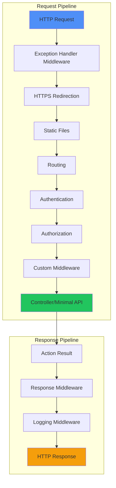
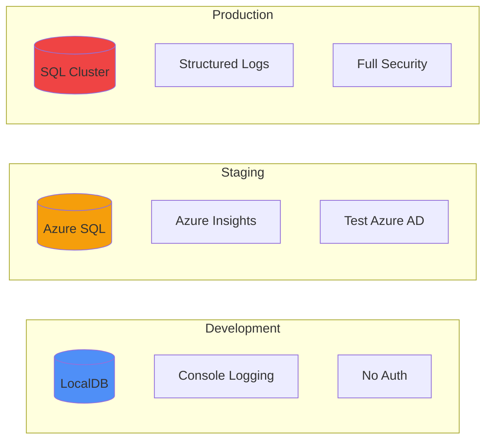

# ASP.NET Core Features & Best Practices

## Middleware Pipeline Components

**Componentes esenciales del pipeline de middleware en ASP.NET Core y su orden de configuración recomendado.**
Esta tabla muestra los middleware más importantes con ejemplos de configuración y su ubicación óptima en el pipeline.
Crítico para configurar correctamente el flujo de processing de requests HTTP en aplicaciones ASP.NET Core.

| **Middleware**        | **Propósito**                       | **Orden Recomendado** | **Ejemplo de Configuración**         |
| --------------------- | ----------------------------------- | --------------------- | ------------------------------------ |
| **ExceptionHandler**  | Manejo global de errores            | 1°                    | `app.UseExceptionHandler("/Error");` |
| **HTTPS Redirection** | Forzar HTTPS                        | 2°                    | `app.UseHttpsRedirection();`         |
| **Static Files**      | Servir archivos estáticos           | 3°                    | `app.UseStaticFiles();`              |
| **Routing**           | Enrutamiento de URLs                | 4°                    | `app.UseRouting();`                  |
| **Authentication**    | Autenticación de usuarios           | 5°                    | `app.UseAuthentication();`           |
| **Authorization**     | Autorización de recursos            | 6°                    | `app.UseAuthorization();`            |
| **Endpoints**         | Mapeo de controladores/minimal APIs | 7°                    | `app.MapControllers();`              |

## Dependency Injection Lifetimes

**Comparación de los diferentes lifetimes de Dependency Injection en ASP.NET Core y sus casos de uso óptimos.**
Esta tabla explica cuándo usar cada lifetime, con ejemplos prácticos y los riesgos asociados a cada configuración.
Fundamental para evitar memory leaks y optimizar el rendimiento de la aplicación.

| **Lifetime**  | **Descripción**                | **Cuándo usar**                      | **Ejemplo**                              | **Riesgo**                          |
| ------------- | ------------------------------ | ------------------------------------ | ---------------------------------------- | ----------------------------------- |
| **Singleton** | Una instancia para toda la app | Servicios sin estado, caché          | `services.AddSingleton<ICacheService>()` | Memory leaks si guarda referencias  |
| **Scoped**    | Una instancia por request HTTP | Contexto de BD, servicios de negocio | `services.AddScoped<IUserService>()`     | Ideal para la mayoría de casos      |
| **Transient** | Nueva instancia cada vez       | Servicios ligeros, helpers           | `services.AddTransient<IEmailSender>()`  | Overhead si es usado frecuentemente |

## Controllers vs Minimal APIs

**Comparación detallada entre Controllers tradicionales y Minimal APIs introducidas en .NET 6.**
Esta tabla ayuda a decidir qué enfoque usar según el tipo de aplicación, complejidad y requerimientos específicos.
Esencial para elegir la arquitectura de API más apropiada para cada escenario.

| **Aspecto**         | **Controllers**                | **Minimal APIs**              | **Recomendación**                          |
| ------------------- | ------------------------------ | ----------------------------- | ------------------------------------------ |
| **Sintaxis**        | Basado en clases, atributos    | Funcional, delegates          | Controllers para apps complejas            |
| **Performance**     | Ligeramente más lento          | Más rápido, menos overhead    | Minimal APIs para microservicios           |
| **Testing**         | Fácil con dependency injection | Requiere más setup            | Controllers más fáciles de testear         |
| **Swagger/OpenAPI** | Automático con atributos       | Requiere configuración manual | Controllers mejor para documentación       |
| **Filtros**         | Soporte completo               | Limitado                      | Controllers si necesitas filtros complejos |

## Authentication & Authorization Strategies

**Estrategias de autenticación y autorización disponibles en ASP.NET Core con sus casos de uso específicos.**
Esta tabla compara los diferentes métodos de autenticación, desde JWT hasta Azure AD, con pros y contras de cada uno.
Crítica para implementar seguridad robusta y elegir la estrategia de autenticación más apropiada.

| **Método**      | **Caso de Uso**            | **Implementación**             | **Pros**                  | **Contras**          |
| --------------- | -------------------------- | ------------------------------ | ------------------------- | -------------------- |
| **JWT Bearer**  | APIs, SPAs                 | `AddJwtBearer()`               | Stateless, escalable      | Revocación compleja  |
| **Cookie Auth** | Apps web tradicionales     | `AddCookie()`                  | Fácil implementación      | Requiere sesiones    |
| **Azure AD**    | Aplicaciones empresariales | `AddMicrosoftIdentityWebApi()` | SSO, gestión centralizada | Vendor lock-in       |
| **API Keys**    | Servicios externos         | Custom middleware              | Simple para B2B           | Menos seguro         |
| **OAuth2**      | Integración terceros       | `AddOAuth()`                   | Estándar, flexible        | Complejidad de setup |

## Configuration Sources Priority

**Orden de prioridad de las fuentes de configuración en ASP.NET Core y cuándo usar cada una.**
Esta tabla muestra cómo ASP.NET Core resuelve conflictos de configuración y las mejores prácticas para cada fuente.
Fundamental para gestionar configuraciones complejas en diferentes entornos (dev, staging, production).

| **Fuente**                 | **Prioridad** | **Ejemplo**                              | **Cuándo usar**           |
| -------------------------- | ------------- | ---------------------------------------- | ------------------------- |
| **Command Line**           | 1 (más alta)  | `--environment Production`               | Overrides temporales      |
| **Environment Variables**  | 2             | `ASPNETCORE_ENVIRONMENT=Development`     | Configuración por entorno |
| **User Secrets**           | 3             | `dotnet user-secrets set "ApiKey" "123"` | Desarrollo local          |
| **appsettings.{env}.json** | 4             | `appsettings.Production.json`            | Configuración específica  |
| **appsettings.json**       | 5 (más baja)  | Archivo base                             | Configuración por defecto |

## Health Checks Implementation

**Implementación de health checks para monitoreo y observabilidad en aplicaciones ASP.NET Core.**
Esta tabla muestra los diferentes tipos de health checks, sus propósitos específicos y cómo implementarlos.
Esencial para sistemas distribuidos y deployment en contenedores donde el monitoreo automático es crítico.

| **Tipo**      | **Propósito**              | **Endpoint**       | **Implementación**                                                               |
| ------------- | -------------------------- | ------------------ | -------------------------------------------------------------------------------- |
| **Liveness**  | ¿La app está viva?         | `/health/live`     | `services.AddHealthChecks().AddCheck("self", () => HealthCheckResult.Healthy())` |
| **Readiness** | ¿Puede recibir tráfico?    | `/health/ready`    | Incluye BD, servicios externos                                                   |
| **Custom**    | Verificaciones específicas | `/health/detailed` | `AddCheck<DatabaseHealthCheck>()`                                                |

## Logging Levels & Best Practices

**Niveles de logging en ASP.NET Core con guías sobre cuándo usar cada uno y su impacto en performance.**
Esta tabla ayuda a elegir el nivel de logging apropiado para diferentes tipos de información y eventos.
Fundamental para implementar logging efectivo sin impactar significativamente el rendimiento de la aplicación.

| **Level**       | **Cuándo usar**           | **Ejemplo**          | **Performance Impact** |
| --------------- | ------------------------- | -------------------- | ---------------------- |
| **Trace**       | Debugging detallado       | Valores de variables | Alto                   |
| **Debug**       | Información de desarrollo | Flow de métodos      | Alto                   |
| **Information** | Eventos importantes       | Usuario logueado     | Medio                  |
| **Warning**     | Situaciones inesperadas   | Retry de operación   | Bajo                   |
| **Error**       | Errores manejables        | Excepción capturada  | Bajo                   |
| **Critical**    | Errores que tumban la app | OutOfMemoryException | Muy bajo               |

## ASP.NET Core Pipeline Flow

**Flujo del pipeline de middleware en ASP.NET Core mostrando el orden de ejecución de cada componente.**
Este diagrama ilustra cómo las requests HTTP pasan por cada middleware en secuencia antes de llegar al controlador.
La comprensión de este flujo es crucial para el debugging y la configuración correcta de middleware personalizado.



## Model Binding & Validation

| **Source** | **Sintaxis**   | **Ejemplo**                   | **Validación**                      |
| ---------- | -------------- | ----------------------------- | ----------------------------------- |
| **Route**  | `[FromRoute]`  | `/users/{id}`                 | `[Range(1, int.MaxValue)]`          |
| **Query**  | `[FromQuery]`  | `?name=John&age=25`           | `[Required, StringLength(50)]`      |
| **Body**   | `[FromBody]`   | JSON payload                  | Data Annotations + FluentValidation |
| **Form**   | `[FromForm]`   | Form data                     | `[FileExtensions(".jpg,.png")]`     |
| **Header** | `[FromHeader]` | `Authorization: Bearer token` | Custom validation attributes        |

## Caching Strategies

| **Tipo**             | **Scope**        | **Implementación**                      | **Caso de Uso**                     |
| -------------------- | ---------------- | --------------------------------------- | ----------------------------------- |
| **In-Memory**        | Single instance  | `services.AddMemoryCache()`             | Datos pequeños, acceso frecuente    |
| **Distributed**      | Multi-instance   | `services.AddStackExchangeRedisCache()` | Microservicios, alta disponibilidad |
| **Response Caching** | HTTP responses   | `[ResponseCache(Duration = 300)]`       | APIs públicas, contenido estático   |
| **Output Caching**   | Rendered content | `app.UseOutputCache()`                  | Pages con contenido dinámico        |

## Performance Monitoring

**Métricas clave para monitorear el rendimiento de aplicaciones ASP.NET Core y sus umbrales recomendados.**
Esta tabla define qué métricas monitorear, las herramientas apropiadas y las acciones correctivas cuando se superan los umbrales.
Esencial para mantener aplicaciones performantes y detectar problemas antes de que afecten a los usuarios.

| **Métrica**        | **Herramienta**      | **Threshold** | **Acción**              |
| ------------------ | -------------------- | ------------- | ----------------------- |
| **Response Time**  | Application Insights | > 500ms       | Optimizar queries       |
| **Memory Usage**   | PerfCounters         | > 80%         | Revisar memory leaks    |
| **CPU Usage**      | dotnet-counters      | > 70%         | Profiling, optimización |
| **Exception Rate** | Structured logging   | > 1%          | Fix bugs críticos       |
| **Throughput**     | Load testing         | < 1000 RPS    | Scaling horizontal      |

## Security Headers Configuration

**Middleware personalizado para configurar headers de seguridad esenciales en respuestas HTTP.**
Este código muestra cómo implementar headers de seguridad críticos para proteger contra ataques comunes como XSS, clickjacking y MIME sniffing.
Fundamental para cumplir con estándares de seguridad web y proteger aplicaciones contra vulnerabilidades del lado cliente.

```csharp
app.Use(async (context, next) =>
{
    context.Response.Headers.Add("X-Content-Type-Options", "nosniff");
    context.Response.Headers.Add("X-Frame-Options", "DENY");
    context.Response.Headers.Add("X-XSS-Protection", "1; mode=block");
    context.Response.Headers.Add("Strict-Transport-Security", "max-age=31536000");
    context.Response.Headers.Add("Content-Security-Policy", "default-src 'self'");
    await next();
});
```

## API Versioning Strategies

| **Método**        | **Ejemplo**                           | **Pros**            | **Contras**        |
| ----------------- | ------------------------------------- | ------------------- | ------------------ |
| **URL Path**      | `/api/v1/users`                       | Claro, cacheable    | URLs cambian       |
| **Query String**  | `/api/users?version=1`                | Backward compatible | Puede ser ignorado |
| **Header**        | `Api-Version: 1.0`                    | Clean URLs          | Menos visible      |
| **Accept Header** | `Accept: application/vnd.api.v1+json` | RESTful             | Complejo           |

## Environment-Specific Configuration

**Configuración específica por ambiente mostrando las diferencias entre Development, Staging y Production.**
Este diagrama ilustra cómo cambian los servicios y configuraciones según el entorno de ejecución.
Es fundamental para entender cómo ASP.NET Core maneja diferentes configuraciones por ambiente usando `appsettings.{Environment}.json`.


