# Azure Service Bus (Avanzado)

## Contexto y Propósito

### ¿Qué es?
**Azure Service Bus** es un servicio de mensajería enterprise-grade en la nube de Microsoft que soporta colas, topics, subscriptions y dead-letter queues. Es ampliamente usado en arquitecturas distribuidas y orientadas a eventos, con soporte para .NET mediante SDK oficial. La versión avanzada incluye filtros de mensajes, sesiones y control de reintentos.

### ¿Por qué?
Porque la mensajería confiable es crítica en sistemas con alta concurrencia y múltiples integraciones. El rol menciona **topics, subscriptions, dead-letter y filtros**, lo que implica que esperan dominio más allá de la configuración básica. Implementar estas capacidades asegura resiliencia y escalabilidad en arquitecturas de misión crítica.

### ¿Para qué?
- **Topics y Subscriptions:** publicar mensajes a múltiples consumidores con filtros basados en reglas.  
- **Dead-letter Queues (DLQ):** manejar mensajes fallidos sin perder información.  
- **Filtros de mensajes:** enrutar dinámicamente a consumidores según condiciones (ej. tipo de evento, prioridad).  
- **Retries y backoff:** controlar reintentos para fallos transitorios sin sobrecargar servicios.  
- **Sesiones:** garantizar orden en escenarios que lo requieran.  

### Valor agregado desde la experiencia
- Usar **topics con filtros por reglas SQL** permitió enrutar eventos de CAD a distintos módulos municipales sin duplicar lógica.  
- Implementar **dead-letter queues con alertas en Application Insights** redujo tiempos de resolución de errores.  
- Con **reintentos + exponential backoff**, APIs de retail soportaron picos de tráfico sin caída de servicios.  
- Aplicar **sesiones en Service Bus** aseguró procesamiento ordenado en transacciones bancarias multi-step.  

## Arquitectura Visual

```mermaid
graph TB
    subgraph "Azure Service Bus Namespace"
        subgraph "Topic: OrderEvents"
            T1[Topic<br/>OrderEvents<br/>📨]
        end
        
        subgraph "Subscriptions & Filters"
            S1[High Priority<br/>📋 Filter: Priority='High']
            S2[US Region<br/>🇺🇸 Filter: Region='US']
            S3[Audit Trail<br/>📝 Filter: TrueFilter]
            S4[EU Processing<br/>🇪🇺 Filter: Region='EU']
        end
        
        subgraph "Dead Letter Queues"
            DLQ1[High Priority DLQ<br/>💀]
            DLQ2[US Region DLQ<br/>💀]
            DLQ3[Audit DLQ<br/>💀]
            DLQ4[EU Processing DLQ<br/>💀]
        end
        
        subgraph "Session Management"
            SE1[Session A<br/>🔗 OrderID: 123]
            SE2[Session B<br/>🔗 OrderID: 456]
            SE3[Session C<br/>🔗 OrderID: 789]
        end
    end
    
    subgraph "Publishers (.NET)"
        P1[Order Service<br/>🏪 Publisher]
        P2[Payment Service<br/>💳 Publisher]
        P3[Inventory Service<br/>📦 Publisher]
    end
    
    subgraph "Subscribers (.NET)"
        SUB1[Priority Processor<br/>⚡ MaxConcurrency: 10]
        SUB2[Regional Processor<br/>🌍 US Handler]
        SUB3[Audit Service<br/>📊 Compliance]
        SUB4[EU Processor<br/>🌍 GDPR Handler]
    end
    
    subgraph "Resilience Patterns"
        CB[Circuit Breaker<br/>🔌 Polly]
        RT[Retry Policy<br/>🔄 Exponential Backoff]
        MT[Metrics<br/>📈 OpenTelemetry]
    end
    
    subgraph "Monitoring & Operations"
        AM[Application Insights<br/>📊 Telemetry]
        HC[Health Checks<br/>❤️ ASP.NET Core]
        AL[Alerts<br/>🚨 Azure Monitor]
    end
    
    %% Publisher connections
    P1 -->|Publish OrderCreated| T1
    P2 -->|Publish PaymentProcessed| T1
    P3 -->|Publish InventoryUpdated| T1
    
    %% Topic to Subscriptions
    T1 --> S1
    T1 --> S2
    T1 --> S3
    T1 --> S4
    
    %% Subscriptions to Subscribers
    S1 --> SUB1
    S2 --> SUB2
    S3 --> SUB3
    S4 --> SUB4
    
    %% Dead Letter Queue connections
    S1 -.->|Failed Messages| DLQ1
    S2 -.->|Failed Messages| DLQ2
    S3 -.->|Failed Messages| DLQ3
    S4 -.->|Failed Messages| DLQ4
    
    %% Session connections
    S1 -.->|Ordered Processing| SE1
    S2 -.->|Ordered Processing| SE2
    S4 -.->|Ordered Processing| SE3
    
    %% Resilience patterns
    SUB1 --> CB
    SUB2 --> RT
    SUB3 --> MT
    SUB4 --> CB
    
    %% Monitoring connections
    T1 --> AM
    SUB1 --> HC
    SUB2 --> AL
    DLQ1 --> AL
    DLQ2 --> AL
    
    classDef topicStyle fill:#1e3a8a,stroke:#60a5fa,stroke-width:3px,color:#ffffff
    classDef subscriptionStyle fill:#581c87,stroke:#c084fc,stroke-width:3px,color:#ffffff
    classDef dlqStyle fill:#991b1b,stroke:#f87171,stroke-width:3px,color:#ffffff
    classDef publisherStyle fill:#14532d,stroke:#4ade80,stroke-width:3px,color:#ffffff
    classDef subscriberStyle fill:#c2410c,stroke:#fb923c,stroke-width:3px,color:#ffffff
    classDef resilienceStyle fill:#365314,stroke:#84cc16,stroke-width:3px,color:#ffffff
    classDef monitoringStyle fill:#be185d,stroke:#f472b6,stroke-width:3px,color:#ffffff
    classDef sessionStyle fill:#134e4a,stroke:#2dd4bf,stroke-width:3px,color:#ffffff
    
    class T1 topicStyle
    class S1,S2,S3,S4 subscriptionStyle
    class DLQ1,DLQ2,DLQ3,DLQ4 dlqStyle
    class P1,P2,P3 publisherStyle
    class SUB1,SUB2,SUB3,SUB4 subscriberStyle
    class CB,RT,MT resilienceStyle
    class AM,HC,AL monitoringStyle
    class SE1,SE2,SE3 sessionStyle
```



### Flujo de Mensajes y Patrones

```mermaid
sequenceDiagram
    participant P as Publisher (.NET)
    participant T as Topic (OrderEvents)
    participant S as Subscription (HighPriority)
    participant SUB as Subscriber (.NET)
    participant DLQ as Dead Letter Queue
    participant CB as Circuit Breaker
    participant RT as Retry Policy
    
    Note over P,RT: Normal Processing Flow
    P->>T: PublishAsync(OrderCreated)
    T->>S: Filter: Priority='High' ✅
    S->>SUB: ProcessMessageAsync()
    SUB->>SUB: Business Logic Success
    SUB->>S: CompleteMessageAsync() ✅
    
    Note over P,RT: Transient Error Flow
    P->>T: PublishAsync(PaymentFailed)
    T->>S: Filter Match ✅
    S->>SUB: ProcessMessageAsync()
    SUB->>SUB: Transient Exception ❌
    SUB->>RT: Trigger Retry Policy
    RT->>RT: Exponential Backoff (1s, 2s, 4s...)
    RT->>SUB: Retry Attempt
    SUB->>SUB: Business Logic Success
    SUB->>S: CompleteMessageAsync() ✅
    
    Note over P,RT: Circuit Breaker Flow
    loop Multiple Failures
        P->>T: PublishAsync(Message)
        T->>S: Filter Match ✅
        S->>SUB: ProcessMessageAsync()
        SUB->>CB: Downstream Service Error ❌
        CB->>CB: Track Failure Count
    end
    CB->>CB: Open Circuit (Stop Calls)
    
    Note over P,RT: Dead Letter Queue Flow
    P->>T: PublishAsync(InvalidMessage)
    T->>S: Filter Match ✅
    S->>SUB: ProcessMessageAsync()
    SUB->>SUB: Max Retries Exceeded ❌
    SUB->>DLQ: DeadLetterMessageAsync()
    DLQ->>DLQ: Store for Analysis
```



# Azure Service Bus (Avanzado)

## 1. Arquitectura Avanzada

### Topics y Subscriptions
| Componente | Descripción | Casos de Uso |
|------------|-------------|--------------|
| **Topic** | Canal de mensajería uno-a-muchos | Eventos de dominio, notificaciones broadcast |
| **Subscription** | Filtro específico de mensajes de un topic | Procesamiento por tipo, región, prioridad |
| **Dead Letter Queue** | Cola para mensajes no procesables | Análisis de errores, reprocesamiento manual |
| **Message Session** | Agrupación de mensajes relacionados | Procesamiento ordenado, transacciones |

### Patrones de Filtrado
```csharp
// Filtros SQL
var sqlFilter = new SqlFilter("Priority = 'High' AND Region = 'US'");

// Filtros de correlación
var correlationFilter = new CorrelationFilter
{
    CorrelationId = "order-processing",
    Properties = { ["EventType"] = "OrderCreated" }
};

// Filtros personalizados
var customFilter = new SqlFilter("CustomProperty > 100 AND Status IN ('Active', 'Pending')");
```

## 2. Configuración Avanzada de Topics

### Creación Programática de Topics
```csharp
public class ServiceBusAdministration
{
    private readonly ServiceBusAdministrationClient _adminClient;
    
    public ServiceBusAdministration(string connectionString)
    {
        _adminClient = new ServiceBusAdministrationClient(connectionString);
    }
    
    public async Task CreateTopicWithSubscriptionsAsync(string topicName)
    {
        // Crear topic con configuración avanzada
        var topicOptions = new CreateTopicOptions(topicName)
        {
            MaxSizeInMegabytes = 5120, // 5GB
            DefaultMessageTimeToLive = TimeSpan.FromHours(24),
            DuplicateDetectionHistoryTimeWindow = TimeSpan.FromMinutes(10),
            EnableBatchedOperations = true,
            EnablePartitioning = true,
            RequiresDuplicateDetection = true
        };
        
        await _adminClient.CreateTopicAsync(topicOptions);
        
        // Subscription para órdenes de alta prioridad
        await CreateHighPrioritySubscriptionAsync(topicName);
        
        // Subscription para auditoría
        await CreateAuditSubscriptionAsync(topicName);
        
        // Subscription para procesamiento regional
        await CreateRegionalSubscriptionAsync(topicName, "US");
        await CreateRegionalSubscriptionAsync(topicName, "EU");
    }
    
    private async Task CreateHighPrioritySubscriptionAsync(string topicName)
    {
        var subscriptionOptions = new CreateSubscriptionOptions(topicName, "high-priority")
        {
            DefaultMessageTimeToLive = TimeSpan.FromHours(1),
            MaxDeliveryCount = 3,
            LockDuration = TimeSpan.FromMinutes(5),
            EnableDeadLetteringOnFilterEvaluationExceptions = true,
            EnableDeadLetteringOnMessageExpiration = true
        };
        
        var ruleOptions = new CreateRuleOptions
        {
            Filter = new SqlFilter("Priority = 'High' OR Priority = 'Critical'"),
            Action = new SqlRuleAction("SET ProcessingQueue = 'FastTrack'")
        };
        
        await _adminClient.CreateSubscriptionAsync(subscriptionOptions, ruleOptions);
    }
    
    private async Task CreateAuditSubscriptionAsync(string topicName)
    {
        var subscriptionOptions = new CreateSubscriptionOptions(topicName, "audit")
        {
            DefaultMessageTimeToLive = TimeSpan.FromDays(30),
            MaxDeliveryCount = 1,
            EnableDeadLetteringOnFilterEvaluationExceptions = false
        };
        
        // Capturar todos los mensajes para auditoría
        var ruleOptions = new CreateRuleOptions
        {
            Filter = new TrueFilter(),
            Action = new SqlRuleAction("SET AuditTimestamp = @utcnow")
        };
        
        await _adminClient.CreateSubscriptionAsync(subscriptionOptions, ruleOptions);
    }
}
```

## 3. Publisher Avanzado con Retry y Circuit Breaker

### Publisher Resiliente
```csharp
public class ResilientServiceBusPublisher
{
    private readonly ServiceBusSender _sender;
    private readonly CircuitBreakerPolicy _circuitBreaker;
    private readonly IAsyncPolicy _retryPolicy;
    private readonly ILogger<ResilientServiceBusPublisher> _logger;
    
    public ResilientServiceBusPublisher(
        ServiceBusClient client, 
        string topicName,
        ILogger<ResilientServiceBusPublisher> logger)
    {
        _sender = client.CreateSender(topicName);
        _logger = logger;
        
        // Política de reintentos con exponential backoff
        _retryPolicy = Policy
            .Handle<ServiceBusException>()
            .Or<TimeoutException>()
            .WaitAndRetryAsync(
                retryCount: 5,
                sleepDurationProvider: retryAttempt => 
                    TimeSpan.FromSeconds(Math.Pow(2, retryAttempt)) + 
                    TimeSpan.FromMilliseconds(Random.Shared.Next(0, 1000)),
                onRetry: (outcome, timespan, retryCount, context) =>
                {
                    _logger.LogWarning("Retry {RetryCount} after {Delay}ms. Exception: {Exception}", 
                        retryCount, timespan.TotalMilliseconds, outcome.Exception?.Message);
                });
        
        // Circuit breaker
        _circuitBreaker = Policy
            .Handle<ServiceBusException>()
            .CircuitBreakerAsync(
                handledEventsAllowedBeforeBreaking: 3,
                durationOfBreak: TimeSpan.FromMinutes(1),
                onBreak: (exception, duration) =>
                {
                    _logger.LogError("Circuit breaker opened for {Duration}. Exception: {Exception}", 
                        duration, exception.Message);
                },
                onReset: () =>
                {
                    _logger.LogInformation("Circuit breaker reset");
                });
    }
    
    public async Task PublishAsync<T>(T message, MessageProperties properties = null)
    {
        var combinedPolicy = Policy.WrapAsync(_circuitBreaker, _retryPolicy);
        
        await combinedPolicy.ExecuteAsync(async () =>
        {
            var serviceBusMessage = CreateMessage(message, properties);
            await _sender.SendMessageAsync(serviceBusMessage);
            
            _logger.LogDebug("Message published successfully. MessageId: {MessageId}", 
                serviceBusMessage.MessageId);
        });
    }
    
    public async Task PublishBatchAsync<T>(IEnumerable<T> messages, MessageProperties properties = null)
    {
        var messageBatch = await _sender.CreateMessageBatchAsync();
        var messageList = messages.ToList();
        var processedCount = 0;
        
        foreach (var message in messageList)
        {
            var serviceBusMessage = CreateMessage(message, properties);
            
            if (!messageBatch.TryAddMessage(serviceBusMessage))
            {
                // Enviar el lote actual
                if (messageBatch.Count > 0)
                {
                    await PublishBatchInternalAsync(messageBatch);
                    processedCount += messageBatch.Count;
                }
                
                // Crear nuevo lote
                messageBatch = await _sender.CreateMessageBatchAsync();
                
                if (!messageBatch.TryAddMessage(serviceBusMessage))
                {
                    throw new InvalidOperationException("Message too large for batch");
                }
            }
        }
        
        // Enviar el último lote
        if (messageBatch.Count > 0)
        {
            await PublishBatchInternalAsync(messageBatch);
            processedCount += messageBatch.Count;
        }
        
        _logger.LogInformation("Published {ProcessedCount} of {TotalCount} messages", 
            processedCount, messageList.Count);
    }
    
    private async Task PublishBatchInternalAsync(ServiceBusMessageBatch batch)
    {
        var combinedPolicy = Policy.WrapAsync(_circuitBreaker, _retryPolicy);
        
        await combinedPolicy.ExecuteAsync(async () =>
        {
            await _sender.SendMessagesAsync(batch);
        });
    }
    
    private ServiceBusMessage CreateMessage<T>(T payload, MessageProperties properties)
    {
        var json = JsonSerializer.Serialize(payload);
        var message = new ServiceBusMessage(json)
        {
            MessageId = Guid.NewGuid().ToString(),
            ContentType = "application/json",
            TimeToLive = properties?.TimeToLive ?? TimeSpan.FromHours(24)
        };
        
        // Propiedades personalizadas
        if (properties != null)
        {
            if (!string.IsNullOrEmpty(properties.CorrelationId))
                message.CorrelationId = properties.CorrelationId;
            
            if (!string.IsNullOrEmpty(properties.SessionId))
                message.SessionId = properties.SessionId;
            
            if (properties.ScheduledEnqueueTime.HasValue)
                message.ScheduledEnqueueTime = properties.ScheduledEnqueueTime.Value;
            
            foreach (var prop in properties.CustomProperties)
            {
                message.ApplicationProperties[prop.Key] = prop.Value;
            }
        }
        
        // Metadata automática
        message.ApplicationProperties["PublishedAt"] = DateTimeOffset.UtcNow;
        message.ApplicationProperties["PublisherVersion"] = Assembly.GetExecutingAssembly().GetName().Version?.ToString();
        message.ApplicationProperties["MessageType"] = typeof(T).Name;
        
        return message;
    }
}

public class MessageProperties
{
    public string CorrelationId { get; set; }
    public string SessionId { get; set; }
    public DateTimeOffset? ScheduledEnqueueTime { get; set; }
    public TimeSpan? TimeToLive { get; set; }
    public Dictionary<string, object> CustomProperties { get; set; } = new();
}
```

## 4. Subscriber Avanzado con Procesamiento Concurrente

### Subscriber con Session Management
```csharp
public class AdvancedServiceBusSubscriber
{
    private readonly ServiceBusProcessor _processor;
    private readonly ServiceBusSessionProcessor _sessionProcessor;
    private readonly IServiceProvider _serviceProvider;
    private readonly ILogger<AdvancedServiceBusSubscriber> _logger;
    private readonly SemaphoreSlim _concurrencySemaphore;
    
    public AdvancedServiceBusSubscriber(
        ServiceBusClient client,
        string topicName,
        string subscriptionName,
        IServiceProvider serviceProvider,
        ILogger<AdvancedServiceBusSubscriber> logger)
    {
        _serviceProvider = serviceProvider;
        _logger = logger;
        _concurrencySemaphore = new SemaphoreSlim(Environment.ProcessorCount * 2);
        
        var processorOptions = new ServiceBusProcessorOptions
        {
            MaxConcurrentCalls = Environment.ProcessorCount * 2,
            AutoCompleteMessages = false,
            MaxAutoLockRenewalDuration = TimeSpan.FromMinutes(5),
            PrefetchCount = 10,
            ReceiveMode = ServiceBusReceiveMode.PeekLock
        };
        
        _processor = client.CreateProcessor(topicName, subscriptionName, processorOptions);
        _processor.ProcessMessageAsync += ProcessMessageAsync;
        _processor.ProcessErrorAsync += ProcessErrorAsync;
        
        // Session processor para mensajes ordenados
        var sessionProcessorOptions = new ServiceBusSessionProcessorOptions
        {
            MaxConcurrentSessions = 5,
            MaxConcurrentCallsPerSession = 1,
            AutoCompleteMessages = false,
            MaxAutoLockRenewalDuration = TimeSpan.FromMinutes(10)
        };
        
        _sessionProcessor = client.CreateSessionProcessor(topicName, subscriptionName, sessionProcessorOptions);
        _sessionProcessor.ProcessMessageAsync += ProcessSessionMessageAsync;
        _sessionProcessor.ProcessErrorAsync += ProcessErrorAsync;
    }
    
    public async Task StartAsync(CancellationToken cancellationToken = default)
    {
        await _processor.StartProcessingAsync(cancellationToken);
        await _sessionProcessor.StartProcessingAsync(cancellationToken);
        
        _logger.LogInformation("Service Bus subscriber started");
    }
    
    public async Task StopAsync(CancellationToken cancellationToken = default)
    {
        await _processor.StopProcessingAsync(cancellationToken);
        await _sessionProcessor.StopProcessingAsync(cancellationToken);
        
        _logger.LogInformation("Service Bus subscriber stopped");
    }
    
    private async Task ProcessMessageAsync(ProcessMessageEventArgs args)
    {
        await _concurrencySemaphore.WaitAsync();
        
        try
        {
            using var scope = _serviceProvider.CreateScope();
            var handler = scope.ServiceProvider.GetRequiredService<IMessageHandler>();
            
            var messageType = args.Message.ApplicationProperties.TryGetValue("MessageType", out var type) 
                ? type.ToString() 
                : "Unknown";
            
            _logger.LogDebug("Processing message {MessageId} of type {MessageType}", 
                args.Message.MessageId, messageType);
            
            var stopwatch = Stopwatch.StartNew();
            
            try
            {
                await handler.HandleAsync(args.Message, args.CancellationToken);
                await args.CompleteMessageAsync(args.Message);
                
                _logger.LogDebug("Message {MessageId} processed successfully in {ElapsedMs}ms", 
                    args.Message.MessageId, stopwatch.ElapsedMilliseconds);
            }
            catch (BusinessLogicException ex)
            {
                _logger.LogWarning("Business logic error processing message {MessageId}: {Error}", 
                    args.Message.MessageId, ex.Message);
                
                // Enviar a dead letter queue por error de negocio
                await args.DeadLetterMessageAsync(args.Message, "BusinessLogicError", ex.Message);
            }
            catch (TransientException ex)
            {
                _logger.LogWarning("Transient error processing message {MessageId}: {Error}", 
                    args.Message.MessageId, ex.Message);
                
                // Permitir reintento
                await args.AbandonMessageAsync(args.Message);
            }
            catch (Exception ex)
            {
                _logger.LogError(ex, "Unexpected error processing message {MessageId}", 
                    args.Message.MessageId);
                
                if (args.Message.DeliveryCount >= 3)
                {
                    await args.DeadLetterMessageAsync(args.Message, "MaxRetriesExceeded", ex.Message);
                }
                else
                {
                    await args.AbandonMessageAsync(args.Message);
                }
            }
        }
        finally
        {
            _concurrencySemaphore.Release();
        }
    }
    
    private async Task ProcessSessionMessageAsync(ProcessSessionMessageEventArgs args)
    {
        using var scope = _serviceProvider.CreateScope();
        var sessionHandler = scope.ServiceProvider.GetRequiredService<ISessionMessageHandler>();
        
        _logger.LogDebug("Processing session message {MessageId} in session {SessionId}", 
            args.Message.MessageId, args.Message.SessionId);
        
        try
        {
            await sessionHandler.HandleSessionMessageAsync(args.Message, args.GetSessionState, args.SetSessionState, args.CancellationToken);
            await args.CompleteMessageAsync(args.Message);
        }
        catch (Exception ex)
        {
            _logger.LogError(ex, "Error processing session message {MessageId} in session {SessionId}", 
                args.Message.MessageId, args.Message.SessionId);
            
            await args.DeadLetterMessageAsync(args.Message, "SessionProcessingError", ex.Message);
        }
    }
    
    private Task ProcessErrorAsync(ProcessErrorEventArgs args)
    {
        _logger.LogError(args.Exception, "Service Bus processing error. Source: {ErrorSource}, Entity: {EntityPath}", 
            args.ErrorSource, args.EntityPath);
        
        return Task.CompletedTask;
    }
}
```

## 5. Dead Letter Queue Management

### Dead Letter Processor
```csharp
public class DeadLetterQueueProcessor
{
    private readonly ServiceBusReceiver _deadLetterReceiver;
    private readonly ServiceBusSender _originalSender;
    private readonly ILogger<DeadLetterQueueProcessor> _logger;
    
    public DeadLetterQueueProcessor(
        ServiceBusClient client,
        string topicName,
        string subscriptionName,
        ILogger<DeadLetterQueueProcessor> logger)
    {
        _deadLetterReceiver = client.CreateReceiver(topicName, subscriptionName, 
            new ServiceBusReceiverOptions { SubQueue = SubQueue.DeadLetter });
        _originalSender = client.CreateSender(topicName);
        _logger = logger;
    }
    
    public async Task<List<DeadLetterMessage>> GetDeadLetterMessagesAsync(int maxMessages = 100)
    {
        var messages = new List<DeadLetterMessage>();
        var receivedMessages = await _deadLetterReceiver.ReceiveMessagesAsync(maxMessages, TimeSpan.FromSeconds(5));
        
        foreach (var message in receivedMessages)
        {
            var deadLetterMessage = new DeadLetterMessage
            {
                MessageId = message.MessageId,
                CorrelationId = message.CorrelationId,
                SessionId = message.SessionId,
                Body = message.Body.ToString(),
                EnqueuedTime = message.EnqueuedTime,
                DeadLetterReason = message.DeadLetterReason,
                DeadLetterErrorDescription = message.DeadLetterErrorDescription,
                DeliveryCount = message.DeliveryCount,
                ApplicationProperties = message.ApplicationProperties.ToDictionary(kv => kv.Key, kv => kv.Value),
                OriginalMessage = message
            };
            
            messages.Add(deadLetterMessage);
        }
        
        return messages;
    }
    
    public async Task<bool> ResubmitMessageAsync(ServiceBusReceivedMessage deadLetterMessage, 
        MessageResubmissionOptions options = null)
    {
        try
        {
            var newMessage = new ServiceBusMessage(deadLetterMessage.Body)
            {
                MessageId = options?.NewMessageId ?? Guid.NewGuid().ToString(),
                CorrelationId = deadLetterMessage.CorrelationId,
                SessionId = deadLetterMessage.SessionId,
                ContentType = deadLetterMessage.ContentType
            };
            
            // Copiar propiedades originales
            foreach (var prop in deadLetterMessage.ApplicationProperties)
            {
                newMessage.ApplicationProperties[prop.Key] = prop.Value;
            }
            
            // Metadata de reenvío
            newMessage.ApplicationProperties["ResubmittedAt"] = DateTimeOffset.UtcNow;
            newMessage.ApplicationProperties["OriginalMessageId"] = deadLetterMessage.MessageId;
            newMessage.ApplicationProperties["ResubmissionReason"] = options?.Reason ?? "Manual resubmission";
            newMessage.ApplicationProperties["ResubmissionCount"] = 
                deadLetterMessage.ApplicationProperties.TryGetValue("ResubmissionCount", out var count) 
                    ? (int)count + 1 
                    : 1;
            
            // Aplicar modificaciones si se especifican
            if (options?.PropertyModifications != null)
            {
                foreach (var modification in options.PropertyModifications)
                {
                    newMessage.ApplicationProperties[modification.Key] = modification.Value;
                }
            }
            
            // Enviar mensaje modificado
            await _originalSender.SendMessageAsync(newMessage);
            
            // Completar el mensaje del dead letter queue
            await _deadLetterReceiver.CompleteMessageAsync(deadLetterMessage);
            
            _logger.LogInformation("Message {MessageId} resubmitted successfully as {NewMessageId}", 
                deadLetterMessage.MessageId, newMessage.MessageId);
            
            return true;
        }
        catch (Exception ex)
        {
            _logger.LogError(ex, "Failed to resubmit message {MessageId}", deadLetterMessage.MessageId);
            return false;
        }
    }
    
    public async Task<int> PurgeOldMessagesAsync(TimeSpan olderThan)
    {
        var cutoffTime = DateTimeOffset.UtcNow - olderThan;
        var purgedCount = 0;
        
        var messages = await GetDeadLetterMessagesAsync(1000);
        
        foreach (var message in messages.Where(m => m.EnqueuedTime < cutoffTime))
        {
            try
            {
                await _deadLetterReceiver.CompleteMessageAsync(message.OriginalMessage);
                purgedCount++;
                
                _logger.LogDebug("Purged dead letter message {MessageId} from {EnqueuedTime}", 
                    message.MessageId, message.EnqueuedTime);
            }
            catch (Exception ex)
            {
                _logger.LogWarning(ex, "Failed to purge message {MessageId}", message.MessageId);
            }
        }
        
        _logger.LogInformation("Purged {PurgedCount} dead letter messages older than {CutoffTime}", 
            purgedCount, cutoffTime);
        
        return purgedCount;
    }
}

public class DeadLetterMessage
{
    public string MessageId { get; set; }
    public string CorrelationId { get; set; }
    public string SessionId { get; set; }
    public string Body { get; set; }
    public DateTimeOffset EnqueuedTime { get; set; }
    public string DeadLetterReason { get; set; }
    public string DeadLetterErrorDescription { get; set; }
    public int DeliveryCount { get; set; }
    public Dictionary<string, object> ApplicationProperties { get; set; }
    public ServiceBusReceivedMessage OriginalMessage { get; set; }
}

public class MessageResubmissionOptions
{
    public string NewMessageId { get; set; }
    public string Reason { get; set; }
    public Dictionary<string, object> PropertyModifications { get; set; } = new();
}
```

## 6. Monitoring y Observabilidad

### Métricas Personalizadas
```csharp
public class ServiceBusMetrics
{
    private readonly IMetrics _metrics;
    private readonly Counter<int> _messagesPublished;
    private readonly Counter<int> _messagesProcessed;
    private readonly Counter<int> _processingErrors;
    private readonly Histogram<double> _processingDuration;
    
    public ServiceBusMetrics(IMeterFactory meterFactory)
    {
        var meter = meterFactory.Create("ServiceBus.Advanced");
        
        _messagesPublished = meter.CreateCounter<int>("servicebus_messages_published_total");
        _messagesProcessed = meter.CreateCounter<int>("servicebus_messages_processed_total");
        _processingErrors = meter.CreateCounter<int>("servicebus_processing_errors_total");
        _processingDuration = meter.CreateHistogram<double>("servicebus_processing_duration_seconds");
    }
    
    public void RecordMessagePublished(string topicName, string messageType)
    {
        _messagesPublished.Add(1, 
            new KeyValuePair<string, object?>("topic", topicName),
            new KeyValuePair<string, object?>("message_type", messageType));
    }
    
    public void RecordMessageProcessed(string subscriptionName, string messageType, double durationSeconds, bool success)
    {
        _messagesProcessed.Add(1,
            new KeyValuePair<string, object?>("subscription", subscriptionName),
            new KeyValuePair<string, object?>("message_type", messageType),
            new KeyValuePair<string, object?>("success", success));
        
        _processingDuration.Record(durationSeconds,
            new KeyValuePair<string, object?>("subscription", subscriptionName),
            new KeyValuePair<string, object?>("message_type", messageType));
        
        if (!success)
        {
            _processingErrors.Add(1,
                new KeyValuePair<string, object?>("subscription", subscriptionName),
                new KeyValuePair<string, object?>("message_type", messageType));
        }
    }
}
```

### Health Checks
```csharp
public class ServiceBusHealthCheck : IHealthCheck
{
    private readonly ServiceBusAdministrationClient _adminClient;
    private readonly string _topicName;
    
    public ServiceBusHealthCheck(ServiceBusAdministrationClient adminClient, string topicName)
    {
        _adminClient = adminClient;
        _topicName = topicName;
    }
    
    public async Task<HealthCheckResult> CheckHealthAsync(HealthCheckContext context, 
        CancellationToken cancellationToken = default)
    {
        try
        {
            var topicProperties = await _adminClient.GetTopicAsync(_topicName, cancellationToken);
            var subscriptions = await _adminClient.GetSubscriptionsAsync(_topicName, cancellationToken)
                .ToListAsync(cancellationToken);
            
            var data = new Dictionary<string, object>
            {
                ["TopicName"] = _topicName,
                ["Status"] = topicProperties.Value.Status.ToString(),
                ["MessageCount"] = topicProperties.Value.MessageCount,
                ["SizeInBytes"] = topicProperties.Value.SizeInBytes,
                ["SubscriptionCount"] = subscriptions.Count
            };
            
            // Verificar dead letter queues
            var deadLetterCounts = new Dictionary<string, long>();
            foreach (var subscription in subscriptions)
            {
                var subProperties = await _adminClient.GetSubscriptionAsync(_topicName, subscription.Name, cancellationToken);
                deadLetterCounts[subscription.Name] = subProperties.Value.DeadLetterMessageCount;
            }
            
            data["DeadLetterCounts"] = deadLetterCounts;
            
            // Determinar estado de salud
            var hasHighDeadLetterCount = deadLetterCounts.Values.Any(count => count > 100);
            var status = hasHighDeadLetterCount ? HealthStatus.Degraded : HealthStatus.Healthy;
            
            return HealthCheckResult.Healthy("Service Bus is operational", data);
        }
        catch (Exception ex)
        {
            return HealthCheckResult.Unhealthy("Service Bus health check failed", ex);
        }
    }
}
```

## 7. Configuration y Setup

### Dependency Injection Setup
```csharp
public static class ServiceCollectionExtensions
{
    public static IServiceCollection AddAdvancedServiceBus(this IServiceCollection services, 
        IConfiguration configuration)
    {
        var options = configuration.GetSection("ServiceBus").Get<ServiceBusOptions>();
        
        // Cliente principal
        services.AddSingleton(provider => new ServiceBusClient(options.ConnectionString));
        
        // Administración
        services.AddSingleton(provider => new ServiceBusAdministrationClient(options.ConnectionString));
        
        // Publishers
        services.AddSingleton<ResilientServiceBusPublisher>();
        
        // Subscribers
        services.AddSingleton<AdvancedServiceBusSubscriber>();
        
        // Dead letter management
        services.AddSingleton<DeadLetterQueueProcessor>();
        
        // Métricas
        services.AddSingleton<ServiceBusMetrics>();
        
        // Health checks
        services.AddHealthChecks()
            .AddCheck<ServiceBusHealthCheck>("servicebus", HealthStatus.Unhealthy, 
                new[] { "servicebus", "messaging" });
        
        // Hosted service para iniciar subscribers
        services.AddHostedService<ServiceBusHostedService>();
        
        return services;
    }
}

public class ServiceBusOptions
{
    public string ConnectionString { get; set; }
    public string TopicName { get; set; }
    public List<SubscriptionConfiguration> Subscriptions { get; set; } = new();
}

public class SubscriptionConfiguration
{
    public string Name { get; set; }
    public string SqlFilter { get; set; }
    public int MaxDeliveryCount { get; set; } = 3;
    public TimeSpan LockDuration { get; set; } = TimeSpan.FromMinutes(5);
}
```

Este documento proporciona patrones avanzados para Service Bus incluyendo manejo de errores, observabilidad, y procesamiento de alta concurrencia, preparándote para preguntas técnicas profundas sobre mensajería en Azure.
