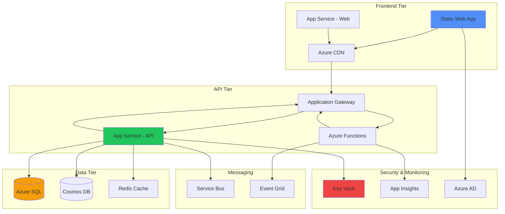

# Azure Services for .NET

## Compute Services Comparison

**Comparación de servicios de compute de Azure para aplicaciones .NET con análisis de costo, escalabilidad y casos de uso.**
Esta tabla ayuda a seleccionar el servicio de compute más apropiado según los requerimientos de la aplicación.
Fundamental para tomar decisiones arquitectónicas informadas sobre donde hospedar aplicaciones .NET en Azure.

| **Servicio**            | **Tipo**                | **Escalabilidad** | **Costo**          | **Casos de Uso**                 | **SDK/Integración**     |
| ----------------------- | ----------------------- | ----------------- | ------------------ | -------------------------------- | ----------------------- |
| **App Service**         | PaaS                    | Auto-scaling      | Medio              | Web apps, APIs                   | Deploy directo desde VS |
| **Azure Functions**     | Serverless              | Event-driven      | Bajo (pay-per-use) | Event processing, APIs           | Azure Functions SDK     |
| **Container Instances** | CaaS                    | Manual            | Medio              | Microservicios, batch jobs       | Docker integration      |
| **Kubernetes Service**  | Orchestrated containers | Muy alta          | Alto               | Complex microservices            | Helm charts, kubectl    |
| **Virtual Machines**    | IaaS                    | Manual/VMSS       | Variable           | Legacy apps, custom requirements | RDP/SSH access          |

## Data Services for .NET Applications

**Servicios de datos de Azure optimizados para aplicaciones .NET con soporte para Entity Framework y diferentes modelos de consistencia.**
Esta tabla compara las opciones de persistencia disponibles, desde bases de datos relacionales hasta NoSQL y caché.
Esencial para elegir la solución de datos más apropiada según los patrones de acceso y requerimientos de consistencia.

| **Servicio**                      | **Tipo**          | **Consistencia**      | **Escalabilidad**        | **Pricing Model** | **Entity Framework Support** |
| --------------------------------- | ----------------- | --------------------- | ------------------------ | ----------------- | ---------------------------- |
| **Azure SQL Database**            | Relational        | ACID                  | Vertical + horizontal    | DTU/vCore         | Full EF Core support         |
| **Cosmos DB**                     | NoSQL multi-model | Tunable               | Global, automatic        | RU/s consumption  | EF Core provider             |
| **Azure Database for PostgreSQL** | Relational        | ACID                  | Vertical + read replicas | vCore-based       | Npgsql EF provider           |
| **Redis Cache**                   | In-memory         | Eventually consistent | Vertical scaling         | Memory-based      | StackExchange.Redis          |
| **Table Storage**                 | NoSQL key-value   | Eventually consistent | Massive scale            | Per transaction   | Azure.Data.Tables            |

## Messaging & Event Services

**Servicios de messaging y eventos de Azure para arquitecturas distribuidas y event-driven con aplicaciones .NET.**
Esta tabla compara throughput, ordering guarantees y durabilidad de cada servicio de messaging disponible.
Crítica para diseñar sistemas distribuidos resilientes y elegir el patrón de comunicación más apropiado.

| **Servicio**       | **Patrón**           | **Throughput** | **Ordering**    | **Durabilidad** | **.NET Integration**       |
| ------------------ | -------------------- | -------------- | --------------- | --------------- | -------------------------- |
| **Service Bus**    | Message queue/topics | Alto           | FIFO guaranteed | Persistent      | Azure.Messaging.ServiceBus |
| **Event Hubs**     | Event streaming      | Muy alto       | Partition-level | Configurable    | Azure.Messaging.EventHubs  |
| **Event Grid**     | Event routing        | Muy alto       | No garantizado  | At-least-once   | Azure.Messaging.EventGrid  |
| **Storage Queues** | Simple queuing       | Medio          | No garantizado  | Persistent      | Azure.Storage.Queues       |

## Security & Identity Services

**Servicios de identidad y seguridad de Azure para autenticación y autorización en aplicaciones .NET empresariales.**
Esta tabla presenta las opciones disponibles para gestión de identidades, desde clientes externos hasta usuarios empresariales.
Fundamental para implementar autenticación segura y cumplir con requerimientos de compliance corporativo.

| **Servicio**          | **Propósito**            | **Integración .NET**                                     | **Casos de Uso**        | **Pricing**   |
| --------------------- | ------------------------ | -------------------------------------------------------- | ----------------------- | ------------- |
| **Azure AD B2C**      | Customer identity        | Microsoft.Identity.Web                                   | Customer-facing apps    | Per MAU       |
| **Azure AD**          | Enterprise identity      | Microsoft.Graph                                          | Enterprise apps         | Per user      |
| **Key Vault**         | Secrets management       | Azure.Security.KeyVault                                  | API keys, certificates  | Per operation |
| **App Configuration** | Configuration management | Microsoft.Extensions.Configuration.AzureAppConfiguration | Feature flags, settings | Per request   |

## Application Insights Monitoring

```csharp
// Program.cs setup
builder.Services.AddApplicationInsightsTelemetry();

// Custom telemetry
public class OrderService
{
    private readonly TelemetryClient _telemetryClient;

    public OrderService(TelemetryClient telemetryClient)
    {
        _telemetryClient = telemetryClient;
    }

    public async Task<Order> CreateOrderAsync(CreateOrderRequest request)
    {
        var stopwatch = Stopwatch.StartNew();

        try
        {
            var order = await ProcessOrderAsync(request);

            // Track success
            _telemetryClient.TrackEvent("OrderCreated", new Dictionary<string, string>
            {
                ["OrderId"] = order.Id.ToString(),
                ["CustomerType"] = request.CustomerType
            });

            return order;
        }
        catch (Exception ex)
        {
            // Track failure
            _telemetryClient.TrackException(ex, new Dictionary<string, string>
            {
                ["Operation"] = "CreateOrder",
                ["CustomerId"] = request.CustomerId.ToString()
            });
            throw;
        }
        finally
        {
            stopwatch.Stop();
            _telemetryClient.TrackMetric("OrderProcessingTime", stopwatch.ElapsedMilliseconds);
        }
    }
}
```

## Azure SQL Database Configuration

| **Configuración**      | **Desarrollo**     | **Producción**                  | **Consideraciones**      |
| ---------------------- | ------------------ | ------------------------------- | ------------------------ |
| **Service Tier**       | Basic/S0           | Premium/Business Critical       | Performance requirements |
| **Backup**             | Automatic (7 days) | Automatic (35 days) + manual    | RTO/RPO requirements     |
| **Security**           | SQL authentication | Azure AD + Always Encrypted     | Compliance requirements  |
| **Connection Pooling** | Default settings   | Tuned for workload              | `Max Pool Size=100`      |
| **Retry Policy**       | Built-in           | Custom with exponential backoff | Transient fault handling |

## Cosmos DB Implementation Patterns

```csharp
// Container configuration
public class CosmosDbService
{
    private readonly Container _container;

    public CosmosDbService(CosmosClient cosmosClient)
    {
        var database = cosmosClient.GetDatabase("ecommerce");
        _container = database.GetContainer("orders");
    }

    // Point read (most efficient)
    public async Task<Order> GetOrderAsync(string orderId, string customerId)
    {
        try
        {
            var response = await _container.ReadItemAsync<Order>(orderId,
                new PartitionKey(customerId));
            return response.Resource;
        }
        catch (CosmosException ex) when (ex.StatusCode == HttpStatusCode.NotFound)
        {
            return null;
        }
    }

    // Query with partition key (efficient)
    public async Task<List<Order>> GetOrdersByCustomerAsync(string customerId)
    {
        var queryDef = new QueryDefinition(
            "SELECT * FROM orders o WHERE o.customerId = @customerId")
            .WithParameter("@customerId", customerId);

        var iterator = _container.GetItemQueryIterator<Order>(queryDef,
            requestOptions: new QueryRequestOptions
            {
                PartitionKey = new PartitionKey(customerId)
            });

        var results = new List<Order>();
        while (iterator.HasMoreResults)
        {
            var response = await iterator.ReadNextAsync();
            results.AddRange(response);
        }

        return results;
    }
}
```

## Service Bus Messaging Patterns

```csharp
// Publisher
public class OrderEventPublisher
{
    private readonly ServiceBusClient _client;
    private readonly ServiceBusSender _sender;

    public OrderEventPublisher(ServiceBusClient client)
    {
        _client = client;
        _sender = _client.CreateSender("order-events");
    }

    public async Task PublishOrderCreatedAsync(Order order)
    {
        var message = new ServiceBusMessage(JsonSerializer.Serialize(order))
        {
            Subject = "OrderCreated",
            MessageId = Guid.NewGuid().ToString(),
            ContentType = "application/json"
        };

        message.ApplicationProperties["EventType"] = "OrderCreated";
        message.ApplicationProperties["Version"] = "1.0";

        await _sender.SendMessageAsync(message);
    }
}

// Consumer
public class OrderEventProcessor : BackgroundService
{
    private readonly ServiceBusClient _client;
    private readonly ServiceBusProcessor _processor;

    public OrderEventProcessor(ServiceBusClient client)
    {
        _client = client;
        _processor = _client.CreateProcessor("order-events", "inventory-service");
        _processor.ProcessMessageAsync += ProcessMessageAsync;
        _processor.ProcessErrorAsync += ProcessErrorAsync;
    }

    private async Task ProcessMessageAsync(ProcessMessageEventArgs args)
    {
        var eventType = args.Message.ApplicationProperties["EventType"].ToString();

        switch (eventType)
        {
            case "OrderCreated":
                var order = JsonSerializer.Deserialize<Order>(args.Message.Body);
                await UpdateInventoryAsync(order);
                break;
        }

        await args.CompleteMessageAsync(args.Message);
    }
}
```

## Azure Functions Deployment Options

| **Hosting Plan** | **Scaling**  | **Cold Start** | **Execution Time** | **Costo**           | **Uso**              |
| ---------------- | ------------ | -------------- | ------------------ | ------------------- | -------------------- |
| **Consumption**  | Event-driven | Sí (5-10s)     | 10 min max         | Pay-per-execution   | Event processing     |
| **Premium**      | Pre-warmed   | Minimal        | Unlimited          | Always-on cost      | Low-latency APIs     |
| **Dedicated**    | Manual/auto  | No             | Unlimited          | App Service pricing | Predictable workload |

## Key Vault Integration

```csharp
// Program.cs
builder.Configuration.AddAzureKeyVault(
    new Uri("https://myvault.vault.azure.net/"),
    new DefaultAzureCredential());

// Service registration
builder.Services.Configure<ConnectionStrings>(
    builder.Configuration.GetSection("ConnectionStrings"));

// Usage
public class DatabaseService
{
    private readonly string _connectionString;

    public DatabaseService(IOptions<ConnectionStrings> options)
    {
        _connectionString = options.Value.DefaultConnection;
    }
}

// Key Vault naming convention
// Secret name in Key Vault: ConnectionStrings--DefaultConnection
// Maps to: configuration["ConnectionStrings:DefaultConnection"]
```

## Azure DevOps Integration

| **Función**        | **Herramienta**      | **Configuración**         | **Beneficio**               |
| ------------------ | -------------------- | ------------------------- | --------------------------- |
| **Source Control** | Azure Repos          | Git repositories          | Integration with work items |
| **CI/CD**          | Azure Pipelines      | YAML pipelines            | Built-in Azure deployment   |
| **Testing**        | Azure Test Plans     | Manual/automated tests    | Test case management        |
| **Monitoring**     | Application Insights | Automatic instrumentation | Performance insights        |

## Cost Optimization Strategies

| **Servicio**     | **Estrategia**       | **Ahorro Esperado** | **Implementación**                     |
| ---------------- | -------------------- | ------------------- | -------------------------------------- |
| **App Service**  | Auto-scaling rules   | 30-50%              | Scale down during low traffic          |
| **SQL Database** | Reserved capacity    | 20-40%              | 1-3 year commitments                   |
| **Storage**      | Lifecycle policies   | 50-80%              | Archive old data to cool/archive tiers |
| **Compute**      | Azure Hybrid Benefit | 40%                 | Use existing Windows licenses          |

## Deployment Architecture Patterns

**Arquitectura de referencia para aplicaciones .NET en Azure mostrando las mejores prácticas de deployment.**
Este diagrama presenta un patrón típico de 3 capas con frontend, API y datos, incluyendo servicios de monitoreo y seguridad.
Es ideal para aplicaciones empresariales que requieren alta disponibilidad, escalabilidad y observabilidad completa.



## Environment Configuration

| **Entorno**     | **App Service Plan** | **SQL Database**          | **Monitoring**           | **Security**  |
| --------------- | -------------------- | ------------------------- | ------------------------ | ------------- |
| **Development** | Free/Shared          | Basic                     | Basic logs               | Minimal       |
| **Staging**     | Standard             | Standard                  | Application Insights     | Azure AD test |
| **Production**  | Premium              | Premium/Business Critical | Full monitoring + alerts | Full security |

## Performance Monitoring KPIs

| **Métrica**       | **Target** | **Tool**           | **Alert Threshold** |
| ----------------- | ---------- | ------------------ | ------------------- |
| **Response Time** | < 200ms    | App Insights       | > 1s                |
| **Availability**  | > 99.9%    | Availability tests | < 99%               |
| **Error Rate**    | < 0.1%     | App Insights       | > 1%                |
| **DTU Usage**     | < 80%      | Azure Monitor      | > 90%               |
| **Memory Usage**  | < 80%      | App Insights       | > 90%               |

## Disaster Recovery Planning

| **RTO Target** | **RPO Target**   | **Strategy**                       | **Cost** |
| -------------- | ---------------- | ---------------------------------- | -------- |
| **< 1 hour**   | **< 15 minutes** | Active-Active with geo-replication | Alto     |
| **< 4 hours**  | **< 1 hour**     | Active-Passive with failover       | Medio    |
| **< 24 hours** | **< 4 hours**    | Backup restore to secondary region | Bajo     |

## Azure CLI Commands for .NET Deployment

```bash
# Create resource group
az group create --name myapp-rg --location eastus

# Create App Service plan
az appservice plan create --name myapp-plan --resource-group myapp-rg --sku S1

# Create web app
az webapp create --name myapp --resource-group myapp-rg --plan myapp-plan --runtime "DOTNET|6.0"

# Deploy from local folder
az webapp deployment source config-zip --resource-group myapp-rg --name myapp --src app.zip

# Configure app settings
az webapp config appsettings set --resource-group myapp-rg --name myapp \
  --settings ConnectionStrings__DefaultConnection="Server=..."

# Enable Application Insights
az monitor app-insights component create --app myapp-insights --location eastus \
  --resource-group myapp-rg --application-type web
```
