# Contexto y Propósito

## ¿Qué es?
Los deployment pipelines son procesos automatizados de integración continua (CI) y entrega continua (CD) que permiten compilar, testear y desplegar aplicaciones de manera confiable. En .NET se implementan con herramientas como Azure DevOps, GitHub Actions, GitLab CI o Jenkins, y suelen incluir stages de build, testing, análisis de seguridad y despliegue.

## ¿Por qué?
Porque los despliegues manuales son lentos, propensos a errores y no escalan. En la práctica, un buen pipeline reduce riesgos, asegura trazabilidad y permite releases frecuentes sin afectar disponibilidad. En mis proyectos, la adopción de pipelines CI/CD habilitó pasar de despliegues mensuales a despliegues diarios con rollback seguro.

## ¿Para qué?
- **Automatizar compilación y testing** asegurando calidad desde el commit.  
- **Estandarizar despliegues** en múltiples ambientes (staging, producción).  
- **Aplicar despliegues sin downtime** con estrategias blue-green o canary.  
- **Incluir seguridad y compliance** mediante escaneos automáticos de vulnerabilidades.  

## Valor agregado desde la experiencia
- Usar **Azure DevOps con slots de App Service** permitió despliegues sin downtime en banca.  
- Con **GitHub Actions** logramos pipelines modulares y reutilizables en proyectos municipales.  
- **Análisis con SonarQube y CodeQL** detectaron vulnerabilidades antes de llegar a producción.  
- Integrar **Terraform/Bicep** como IaC evitó configuraciones manuales y redujo errores en infraestructura.  

# Deployment Pipelines - Microservices & APIs

**Guía completa para implementar pipelines de deployment optimizados para microservicios y APIs en .NET.**
Este documento cubre desde la comparación de plataformas CI/CD hasta estrategias avanzadas de deployment y monitoring.
Esencial para establecer procesos de deployment robustos, automatizados y enterprise-grade.

## Comparación de Plataformas CI/CD

**Análisis comparativo de las principales plataformas de CI/CD para proyectos .NET con focus en características enterprise.**
Esta tabla evalúa costos, facilidad de uso, integración con Azure y curva de aprendizaje de cada plataforma.
Fundamental para seleccionar la plataforma de CI/CD más apropiada según el tamaño del equipo y requerimientos del proyecto.

| **Aspecto**             | **Azure DevOps**   | **GitHub Actions**       | **GitLab CI**            | **Jenkins**       |
| ----------------------- | ------------------ | ------------------------ | ------------------------ | ----------------- |
| **Hosting**             | Microsoft Cloud    | GitHub Cloud/Self-hosted | GitLab Cloud/Self-hosted | Self-hosted       |
| **Pricing**             | Free: 1800 min/mes | Free: 2000 min/mes       | Free: 400 min/mes        | Free (infra cost) |
| **Integration**         | Tight con Azure    | Tight con GitHub         | Built-in GitLab          | Plugin ecosystem  |
| **Learning Curve**      | Medium             | Easy                     | Medium                   | Steep             |
| **Enterprise Features** | ✅ Advanced        | ✅ Good                  | ✅ Advanced              | ✅ Extensible     |

## Pipeline Stages Overview

**Desglose detallado de las etapas típicas en un pipeline de CI/CD con tiempos estimados y artifacts generados.**
Esta tabla define cada stage del pipeline, desde source control hasta deployment, con herramientas recomendadas para cada fase.
Crítica para diseñar pipelines eficientes y establecer expectations realistas sobre tiempos de deployment.

| **Stage**                | **Propósito**               | **Herramientas Típicas** | **Tiempo Estimado** | **Artifacts**          |
| ------------------------ | --------------------------- | ------------------------ | ------------------- | ---------------------- |
| **Source Control**       | Code commit triggers        | Git, GitHub, Azure Repos | < 1 min             | Source code            |
| **Build**                | Compile, package, test      | dotnet CLI, MSBuild      | 3-8 min             | Binaries, test results |
| **Unit Tests**           | Fast feedback loop          | xUnit, NUnit, MSTest     | 1-3 min             | Test reports, coverage |
| **Code Quality**         | Static analysis             | SonarQube, CodeQL        | 2-5 min             | Quality reports        |
| **Package**              | Create deployable artifacts | Docker, NuGet            | 1-3 min             | Container images       |
| **Integration Tests**    | API/DB validation           | WebApplicationFactory    | 2-10 min            | Integration reports    |
| **Security Scan**        | Vulnerability assessment    | OWASP ZAP, Snyk          | 3-8 min             | Security reports       |
| **Deploy to Staging**    | Pre-production validation   | Azure App Service, k8s   | 2-5 min             | Staging environment    |
| **E2E Tests**            | Full system validation      | Playwright, Selenium     | 5-15 min            | E2E test results       |
| **Deploy to Production** | Live environment            | Blue-Green, Rolling      | 2-10 min            | Production deployment  |

## Azure DevOps Complete Pipeline

| **Component**      | **Azure Service**      | **Configuration**        | **Best Practice**                   |
| ------------------ | ---------------------- | ------------------------ | ----------------------------------- |
| **Source Control** | Azure Repos            | Git with branch policies | Main branch protection, PR required |
| **Build Pipeline** | Azure Pipelines        | YAML-based               | Multi-stage, parallel jobs          |
| **Artifact Store** | Azure Artifacts        | NuGet, Docker Registry   | Version tagging, retention policies |
| **Infrastructure** | Azure Resource Manager | ARM/Bicep templates      | Infrastructure as Code              |
| **Deployment**     | Azure App Service/AKS  | Blue-Green slots         | Zero-downtime deployments           |
| **Monitoring**     | Application Insights   | APM, logs, metrics       | Real-time alerting                  |
| **Security**       | Azure Key Vault        | Secrets management       | Managed identities                  |

### Azure DevOps Pipeline YAML Example

```yaml
# azure-pipelines.yml
trigger:
  branches:
    include:
      - main
      - develop

variables:
  buildConfiguration: "Release"
  azureSubscription: "Production-ServiceConnection"
  resourceGroupName: "rg-microservice-prod"
  webAppName: "app-my-microservice"

stages:
  - stage: Build
    displayName: "Build and Test"
    jobs:
      - job: BuildJob
        displayName: "Build"
        pool:
          vmImage: "ubuntu-latest"

        steps:
          - task: UseDotNet@2
            displayName: "Use .NET 8 SDK"
            inputs:
              packageType: "sdk"
              version: "8.0.x"

          - task: DotNetCoreCLI@2
            displayName: "Restore packages"
            inputs:
              command: "restore"
              projects: "**/*.csproj"

          - task: DotNetCoreCLI@2
            displayName: "Build application"
            inputs:
              command: "build"
              projects: "**/*.csproj"
              arguments: "--configuration $(buildConfiguration) --no-restore"

          - task: DotNetCoreCLI@2
            displayName: "Run unit tests"
            inputs:
              command: "test"
              projects: "**/*Tests/*.csproj"
              arguments: '--configuration $(buildConfiguration) --collect:"XPlat Code Coverage" --logger trx'
              publishTestResults: true

          - task: PublishCodeCoverageResults@1
            displayName: "Publish code coverage"
            inputs:
              codeCoverageTool: "Cobertura"
              summaryFileLocation: "$(Agent.TempDirectory)/**/coverage.cobertura.xml"

          - task: DotNetCoreCLI@2
            displayName: "Publish application"
            inputs:
              command: "publish"
              projects: "**/MyMicroservice.Api.csproj"
              arguments: "--configuration $(buildConfiguration) --output $(Build.ArtifactStagingDirectory)"
              zipAfterPublish: true

          - task: PublishBuildArtifacts@1
            displayName: "Publish artifacts"
            inputs:
              PathtoPublish: "$(Build.ArtifactStagingDirectory)"
              ArtifactName: "drop"

  - stage: Deploy_Staging
    displayName: "Deploy to Staging"
    dependsOn: Build
    condition: and(succeeded(), eq(variables['Build.SourceBranch'], 'refs/heads/develop'))

    jobs:
      - deployment: DeployStaging
        displayName: "Deploy to Staging Environment"
        pool:
          vmImage: "ubuntu-latest"
        environment: "staging"

        strategy:
          runOnce:
            deploy:
              steps:
                - task: AzureWebApp@1
                  displayName: "Deploy to Azure App Service"
                  inputs:
                    azureSubscription: "$(azureSubscription)"
                    appType: "webApp"
                    appName: "$(webAppName)-staging"
                    package: "$(Pipeline.Workspace)/drop/*.zip"
                    deploymentMethod: "zipDeploy"

  - stage: Deploy_Production
    displayName: "Deploy to Production"
    dependsOn: [Build, Deploy_Staging]
    condition: and(succeeded(), eq(variables['Build.SourceBranch'], 'refs/heads/main'))

    jobs:
      - deployment: DeployProduction
        displayName: "Deploy to Production Environment"
        pool:
          vmImage: "ubuntu-latest"
        environment: "production"

        strategy:
          runOnce:
            deploy:
              steps:
                - task: AzureAppServiceManage@0
                  displayName: "Swap deployment slots"
                  inputs:
                    azureSubscription: "$(azureSubscription)"
                    WebAppName: "$(webAppName)"
                    ResourceGroupName: "$(resourceGroupName)"
                    SourceSlot: "staging"
                    SwapWithProduction: true
```

## GitHub Actions Complete Pipeline

| **Component**          | **GitHub Feature**      | **Configuration**          | **Best Practice**      |
| ---------------------- | ----------------------- | -------------------------- | ---------------------- |
| **Source Control**     | GitHub Repositories     | Git with branch protection | Status checks required |
| **CI/CD**              | GitHub Actions          | Workflow YAML              | Reusable workflows     |
| **Package Registry**   | GitHub Packages         | Docker, NuGet              | GHCR for containers    |
| **Secrets Management** | GitHub Secrets          | Environment secrets        | Least privilege access |
| **Environments**       | GitHub Environments     | Staging, Production        | Manual approvals       |
| **Security**           | Dependabot, CodeQL      | Automated scanning         | Security advisories    |
| **Monitoring**         | Third-party integration | Datadog, New Relic         | External APM tools     |

### GitHub Actions Workflow Example

```yaml
# .github/workflows/deploy.yml
name: Deploy Microservice

on:
  push:
    branches: [main, develop]
  pull_request:
    branches: [main]

env:
  DOTNET_VERSION: "8.0.x"
  AZURE_WEBAPP_NAME: "my-microservice"
  AZURE_WEBAPP_PACKAGE_PATH: "./publish"

jobs:
  build-and-test:
    runs-on: ubuntu-latest

    steps:
      - name: Checkout code
        uses: actions/checkout@v4

      - name: Setup .NET
        uses: actions/setup-dotnet@v4
        with:
          dotnet-version: ${{ env.DOTNET_VERSION }}

      - name: Cache NuGet packages
        uses: actions/cache@v3
        with:
          path: ~/.nuget/packages
          key: ${{ runner.os }}-nuget-${{ hashFiles('**/*.csproj') }}
          restore-keys: ${{ runner.os }}-nuget-

      - name: Restore dependencies
        run: dotnet restore

      - name: Build application
        run: dotnet build --configuration Release --no-restore

      - name: Run unit tests
        run: dotnet test --configuration Release --no-build --verbosity normal --collect:"XPlat Code Coverage"

      - name: Upload coverage to Codecov
        uses: codecov/codecov-action@v3
        with:
          file: ./coverage.xml
          flags: unittests
          name: codecov-umbrella

      - name: Publish application
        run: dotnet publish --configuration Release --no-build --output ${{ env.AZURE_WEBAPP_PACKAGE_PATH }}

      - name: Upload artifact
        uses: actions/upload-artifact@v3
        with:
          name: webapp
          path: ${{ env.AZURE_WEBAPP_PACKAGE_PATH }}

  security-scan:
    runs-on: ubuntu-latest
    needs: build-and-test

    steps:
      - name: Checkout code
        uses: actions/checkout@v4

      - name: Run CodeQL Analysis
        uses: github/codeql-action/init@v2
        with:
          languages: csharp

      - name: Autobuild
        uses: github/codeql-action/autobuild@v2

      - name: Perform CodeQL Analysis
        uses: github/codeql-action/analyze@v2

  deploy-staging:
    runs-on: ubuntu-latest
    needs: [build-and-test, security-scan]
    if: github.ref == 'refs/heads/develop'
    environment: staging

    steps:
      - name: Download artifact
        uses: actions/download-artifact@v3
        with:
          name: webapp
          path: ${{ env.AZURE_WEBAPP_PACKAGE_PATH }}

      - name: Deploy to Azure Web App (Staging)
        uses: azure/webapps-deploy@v2
        with:
          app-name: ${{ env.AZURE_WEBAPP_NAME }}-staging
          publish-profile: ${{ secrets.AZURE_WEBAPP_PUBLISH_PROFILE_STAGING }}
          package: ${{ env.AZURE_WEBAPP_PACKAGE_PATH }}

  deploy-production:
    runs-on: ubuntu-latest
    needs: [build-and-test, security-scan]
    if: github.ref == 'refs/heads/main'
    environment: production

    steps:
      - name: Download artifact
        uses: actions/download-artifact@v3
        with:
          name: webapp
          path: ${{ env.AZURE_WEBAPP_PACKAGE_PATH }}

      - name: Deploy to Azure Web App (Production)
        uses: azure/webapps-deploy@v2
        with:
          app-name: ${{ env.AZURE_WEBAPP_NAME }}
          publish-profile: ${{ secrets.AZURE_WEBAPP_PUBLISH_PROFILE }}
          package: ${{ env.AZURE_WEBAPP_PACKAGE_PATH }}

      - name: Health check
        run: |
          sleep 30
          curl -f https://${{ env.AZURE_WEBAPP_NAME }}.azurewebsites.net/health || exit 1
```

## Docker Pipeline Integration

| **Stage**  | **Docker Command**                              | **Best Practice**       | **Security Consideration** |
| ---------- | ----------------------------------------------- | ----------------------- | -------------------------- |
| **Build**  | `docker build -t myapp:${BUILD_ID} .`           | Multi-stage builds      | Scan base images           |
| **Test**   | `docker run --rm myapp:${BUILD_ID} dotnet test` | Test in container       | Isolated test environment  |
| **Scan**   | `trivy image myapp:${BUILD_ID}`                 | Vulnerability scanning  | Block high/critical CVEs   |
| **Push**   | `docker push registry/myapp:${BUILD_ID}`        | Registry authentication | Signed images              |
| **Deploy** | `kubectl apply -f deployment.yml`               | Rolling updates         | Pod security policies      |

### Multi-stage Dockerfile for .NET API

```dockerfile
# Build stage
FROM mcr.microsoft.com/dotnet/sdk:8.0 AS build
WORKDIR /src

# Copy project files and restore dependencies
COPY ["MyMicroservice.Api/MyMicroservice.Api.csproj", "MyMicroservice.Api/"]
COPY ["MyMicroservice.Core/MyMicroservice.Core.csproj", "MyMicroservice.Core/"]
RUN dotnet restore "MyMicroservice.Api/MyMicroservice.Api.csproj"

# Copy source code and build
COPY . .
WORKDIR "/src/MyMicroservice.Api"
RUN dotnet build "MyMicroservice.Api.csproj" -c Release -o /app/build

# Test stage
FROM build AS test
WORKDIR /src
RUN dotnet test --configuration Release --logger trx --results-directory /testresults

# Publish stage
FROM build AS publish
RUN dotnet publish "MyMicroservice.Api.csproj" -c Release -o /app/publish /p:UseAppHost=false

# Runtime stage
FROM mcr.microsoft.com/dotnet/aspnet:8.0 AS final
WORKDIR /app

# Create non-root user
RUN addgroup --system --gid 1001 appgroup && \
    adduser --system --uid 1001 --gid 1001 appuser

# Copy published app
COPY --from=publish /app/publish .

# Set ownership and switch to non-root user
RUN chown -R appuser:appgroup /app
USER appuser

# Health check
HEALTHCHECK --interval=30s --timeout=3s --start-period=5s --retries=3 \
    CMD curl -f http://localhost:8080/health || exit 1

EXPOSE 8080
ENTRYPOINT ["dotnet", "MyMicroservice.Api.dll"]
```

## Infrastructure as Code

| **Tool**          | **Azure Integration** | **Complexity** | **Learning Curve** | **Best For**               |
| ----------------- | --------------------- | -------------- | ------------------ | -------------------------- |
| **ARM Templates** | ✅ Native             | High           | Steep              | Azure-only deployments     |
| **Bicep**         | ✅ Native             | Medium         | Medium             | Azure-focused, readable    |
| **Terraform**     | ✅ Provider-based     | Medium         | Medium             | Multi-cloud scenarios      |
| **Pulumi**        | ✅ SDK-based          | Low            | Easy               | Developers preferring code |

### Bicep Infrastructure Template

```bicep
// main.bicep
param appName string
param environment string
param location string = resourceGroup().location

// App Service Plan
resource appServicePlan 'Microsoft.Web/serverfarms@2022-03-01' = {
  name: 'asp-${appName}-${environment}'
  location: location
  sku: {
    name: environment == 'prod' ? 'P1v3' : 'B1'
    capacity: environment == 'prod' ? 2 : 1
  }
  properties: {
    reserved: true // Linux
  }
}

// App Service with staging slot
resource webApp 'Microsoft.Web/sites@2022-03-01' = {
  name: 'app-${appName}-${environment}'
  location: location
  properties: {
    serverFarmId: appServicePlan.id
    siteConfig: {
      linuxFxVersion: 'DOTNETCORE|8.0'
      alwaysOn: true
      minTlsVersion: '1.2'
      ftpsState: 'Disabled'
      httpLoggingEnabled: true
      logsDirectorySizeLimit: 35
      detailedErrorLoggingEnabled: true
      appSettings: [
        {
          name: 'ASPNETCORE_ENVIRONMENT'
          value: environment == 'prod' ? 'Production' : 'Staging'
        }
        {
          name: 'APPINSIGHTS_INSTRUMENTATIONKEY'
          value: applicationInsights.properties.InstrumentationKey
        }
      ]
    }
    httpsOnly: true
  }
}

// Staging slot for production
resource stagingSlot 'Microsoft.Web/sites/slots@2022-03-01' = if (environment == 'prod') {
  parent: webApp
  name: 'staging'
  location: location
  properties: {
    serverFarmId: appServicePlan.id
    siteConfig: webApp.properties.siteConfig
  }
}

// Application Insights
resource applicationInsights 'Microsoft.Insights/components@2020-02-02' = {
  name: 'ai-${appName}-${environment}'
  location: location
  kind: 'web'
  properties: {
    Application_Type: 'web'
    WorkspaceResourceId: logAnalyticsWorkspace.id
  }
}

// Log Analytics Workspace
resource logAnalyticsWorkspace 'Microsoft.OperationalInsights/workspaces@2022-10-01' = {
  name: 'law-${appName}-${environment}'
  location: location
  properties: {
    sku: {
      name: 'PerGB2018'
    }
    retentionInDays: environment == 'prod' ? 90 : 30
  }
}

// Key Vault for secrets
resource keyVault 'Microsoft.KeyVault/vaults@2022-07-01' = {
  name: 'kv-${appName}-${environment}'
  location: location
  properties: {
    sku: {
      family: 'A'
      name: 'standard'
    }
    tenantId: subscription().tenantId
    accessPolicies: [
      {
        tenantId: subscription().tenantId
        objectId: webApp.identity.principalId
        permissions: {
          secrets: ['get', 'list']
        }
      }
    ]
    enabledForTemplateDeployment: true
    enableRbacAuthorization: false
  }
}

output webAppUrl string = 'https://${webApp.properties.defaultHostName}'
output stagingUrl string = environment == 'prod' ? 'https://${stagingSlot.properties.defaultHostName}' : ''
```

## Deployment Strategies Comparison

| **Strategy**   | **Downtime** | **Rollback Speed** | **Resource Usage** | **Risk Level** | **Azure Implementation**    |
| -------------- | ------------ | ------------------ | ------------------ | -------------- | --------------------------- |
| **Blue-Green** | Zero         | Instant            | 2x resources       | Low            | App Service Slots           |
| **Rolling**    | Zero         | Medium             | 1.2x resources     | Medium         | AKS Rolling Updates         |
| **Canary**     | Zero         | Fast               | 1.1x resources     | Very Low       | App Service Traffic Routing |
| **Recreate**   | High         | Medium             | 1x resources       | High           | Simple replacement          |

## Monitoring and Observability Pipeline

| **Metric Type**         | **Azure Tool**          | **GitHub Integration** | **Alerting**       | **Dashboard**      |
| ----------------------- | ----------------------- | ---------------------- | ------------------ | ------------------ |
| **Application Metrics** | Application Insights    | Third-party APM        | Smart Detection    | Azure Dashboard    |
| **Infrastructure**      | Azure Monitor           | GitHub Actions logs    | Metric alerts      | Grafana            |
| **Logs**                | Log Analytics           | Actions artifacts      | Log alerts         | Kibana             |
| **Security**            | Azure Security Center   | Dependabot             | Security alerts    | Security Dashboard |
| **Performance**         | App Service Diagnostics | Lighthouse CI          | Performance alerts | Custom dashboards  |

**Diagrama completo del flujo de deployment optimizado mostrando todas las etapas desde commit hasta producción.**
Este diagrama ilustra el pipeline completo con Azure DevOps y GitHub Actions, incluyendo testing, security scanning y deployment strategies.
Fundamental para implementar CI/CD enterprise-grade con zero-downtime deployments y observabilidad completa en entornos de microservicios.

```mermaid
graph TB
    subgraph "Source Control"
        A[Developer Commit] --> B[Pull Request]
        B --> C[Code Review]
        C --> D[Merge to Main/Develop]
    end

    subgraph "CI Pipeline"
        D --> E[Trigger Build]
        E --> F[Restore Dependencies]
        F --> G[Build Application]
        G --> H[Run Unit Tests]
        H --> I[Code Quality Scan]
        I --> J[Security Scan]
        J --> K[Build Docker Image]
        K --> L[Push to Registry]
    end

    subgraph "CD Pipeline - Staging"
        L --> M[Deploy to Staging]
        M --> N[Integration Tests]
        N --> O[E2E Tests]
        O --> P[Performance Tests]
        P --> Q[Security Tests]
    end

    subgraph "CD Pipeline - Production"
        Q --> R{Manual Approval}
        R --> S[Blue-Green Deploy]
        S --> T[Health Checks]
        T --> U[Smoke Tests]
        U --> V[Traffic Routing]
        V --> W[Monitor & Alert]
    end

    subgraph "Rollback Strategy"
        W --> X{Issues Detected?}
        X -->|Yes| Y[Automatic Rollback]
        X -->|No| Z[Deployment Complete]
        Y --> AA[Route Traffic Back]
        AA --> BB[Investigate Issues]
    end

    classDef source fill:#1e3a8a,stroke:#60a5fa,stroke-width:3px,color:#ffffff
    classDef ciStage fill:#14532d,stroke:#4ade80,stroke-width:3px,color:#ffffff
    classDef approval fill:#c2410c,stroke:#fb923c,stroke-width:3px,color:#ffffff
    classDef monitoring fill:#be185d,stroke:#f472b6,stroke-width:3px,color:#ffffff
    classDef rollback fill:#991b1b,stroke:#f87171,stroke-width:3px,color:#ffffff
    classDef success fill:#365314,stroke:#84cc16,stroke-width:3px,color:#ffffff
    
    class A source
    class L ciStage
    class R approval
    class W monitoring
    class Y rollback
    class Z success
```



## Environment Configuration Best Practices

| **Environment** | **Purpose**         | **Data Source**     | **Deployment Frequency** | **Rollback Policy** |
| --------------- | ------------------- | ------------------- | ------------------------ | ------------------- |
| **Development** | Feature development | Synthetic/Mock data | Multiple times/day       | Not applicable      |
| **Testing**     | QA validation       | Sanitized prod data | Daily                    | Immediate           |
| **Staging**     | Pre-production      | Production clone    | Per release              | Within 15 minutes   |
| **Production**  | Live system         | Live data           | Per sprint/release       | Within 5 minutes    |

## Common Deployment Anti-Patterns

| **Anti-Pattern**        | **Problem**                | **Solution**                   | **Impact**           |
| ----------------------- | -------------------------- | ------------------------------ | -------------------- |
| **Manual Deployments**  | Human error, inconsistency | Full automation with scripts   | High reliability     |
| **Long-lived Branches** | Integration issues         | Trunk-based development        | Faster feedback      |
| **No Rollback Plan**    | Extended downtime          | Automated rollback triggers    | Reduced MTTR         |
| **Shared Databases**    | Coupling between services  | Database per service           | Independent scaling  |
| **No Health Checks**    | Silent failures            | Comprehensive health endpoints | Proactive monitoring |

## Security in Deployment Pipeline

| **Security Layer**      | **Implementation**                   | **Tools**               | **Frequency**    |
| ----------------------- | ------------------------------------ | ----------------------- | ---------------- |
| **Secret Management**   | Azure Key Vault, GitHub Secrets      | Managed identities      | Every deployment |
| **Image Scanning**      | Container vulnerability assessment   | Trivy, Snyk             | Every build      |
| **SAST**                | Static application security testing  | CodeQL, SonarQube       | Every commit     |
| **DAST**                | Dynamic application security testing | OWASP ZAP               | Nightly          |
| **Dependency Scanning** | Third-party library vulnerabilities  | Dependabot, WhiteSource | Weekly           |

## Cost Optimization in CI/CD

| **Optimization**        | **Azure DevOps**   | **GitHub Actions**  | **Savings Potential** |
| ----------------------- | ------------------ | ------------------- | --------------------- |
| **Parallel Jobs**       | Use matrix builds  | Use job matrix      | 50-70% time reduction |
| **Caching**             | Pipeline caching   | Actions cache       | 30-50% time reduction |
| **Self-hosted Runners** | Scale sets         | Self-hosted runners | 60-80% cost reduction |
| **Spot Instances**      | Azure spot VMs     | Not available       | 70-90% cost reduction |
| **Build Optimization**  | Incremental builds | Layer caching       | 40-60% time reduction |
