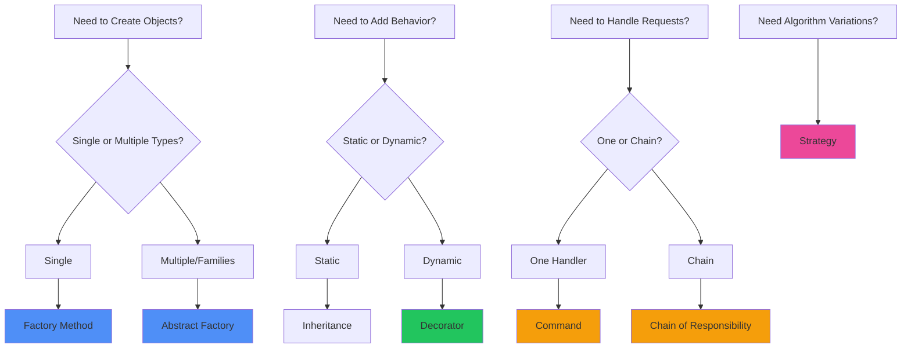

# Design Patterns for .NET

**Guía completa de patrones de diseño aplicados específicamente a desarrollo .NET con ejemplos prácticos.**
Este documento cubre desde principios SOLID hasta patrones GoF con implementaciones idiomáticas en C#.
Fundamental para escribir código mantenible, extensible y que siga las mejores prácticas de ingeniería de software.

## SOLID Principles Examples

**Ejemplos prácticos de los principios SOLID con violaciones comunes y sus soluciones en aplicaciones .NET.**
Esta tabla muestra cómo aplicar cada principio SOLID con casos específicos de violación y refactoring.
Esencial para escribir código limpio, testeable y que cumpla con los fundamentos de la programación orientada a objetos.

| **Principio**             | **Descripción**                                   | **Violación**                                                                        | **Solución**                                                 |
| ------------------------- | ------------------------------------------------- | ------------------------------------------------------------------------------------ | ------------------------------------------------------------ |
| **Single Responsibility** | Una clase, una responsabilidad                    | `UserService` maneja validación, BD y email                                          | Separar en `UserValidator`, `UserRepository`, `EmailService` |
| **Open/Closed**           | Abierto para extensión, cerrado para modificación | Modificar `PaymentProcessor` para cada método                                        | Interface `IPaymentMethod` con implementaciones              |
| **Liskov Substitution**   | Las subclases deben ser intercambiables           | `Square` hereda de `Rectangle` pero no puede cambiar width/height independientemente | Usar interface `IShape`                                      |
| **Interface Segregation** | Interfaces específicas, no gordas                 | `IWorker` con `Work()` y `Eat()`                                                     | Separar en `IWorkable` e `IFeedable`                         |
| **Dependency Inversion**  | Depender de abstracciones, no implementaciones    | `OrderService` instancia directamente `EmailService`                                 | Inyectar `IEmailService`                                     |

## Creational Patterns

**Patrones creacionales implementados en .NET para gestionar la creación de objetos de manera flexible y reutilizable.**
Esta tabla presenta los patrones más importantes para la creación de objetos con ejemplos específicos de implementación en C#.
Fundamental para desacoplar la creación de objetos del código cliente y facilitar la extensibilidad del sistema.

| **Patrón**               | **Propósito**                              | **Implementación .NET**                          | **Cuándo usar**            |
| ------------------------ | ------------------------------------------ | ------------------------------------------------ | -------------------------- |
| **Singleton**            | Una única instancia                        | `public static readonly Lazy<T> Instance`        | Logging, configuración     |
| **Factory Method**       | Crear objetos sin especificar clase exacta | `PaymentFactory.CreatePayment(PaymentType type)` | Múltiples implementaciones |
| **Abstract Factory**     | Familias de objetos relacionados           | UI themes, database providers                    | Ecosistemas completos      |
| **Builder**              | Construcción paso a paso                   | Fluent APIs, `StringBuilder`                     | Objetos complejos          |
| **Dependency Injection** | Inversión de control                       | `IServiceCollection`, constructors               | Desacoplamiento            |

## Structural Patterns

| **Patrón**       | **Propósito**                                   | **Implementación .NET** | **Ejemplo Real**             |
| ---------------- | ----------------------------------------------- | ----------------------- | ---------------------------- |
| **Adapter**      | Hacer compatibles interfaces incompatibles      | Wrapper classes         | Legacy system integration    |
| **Decorator**    | Agregar funcionalidad dinámicamente             | ASP.NET Core middleware | Logging, caching, validation |
| **Facade**       | Interface simplificada para subsistema complejo | Service layer           | Complex business operations  |
| **Repository**   | Encapsular acceso a datos                       | `IRepository<T>`        | Data access abstraction      |
| **Unit of Work** | Coordinar cambios en múltiples repositorios     | `IUnitOfWork`           | Transaction management       |

## Behavioral Patterns

| **Patrón**                  | **Propósito**                              | **Implementación .NET**                  | **Framework que lo usa** |
| --------------------------- | ------------------------------------------ | ---------------------------------------- | ------------------------ |
| **Observer**                | Notificar cambios a múltiples objetos      | `event`, `INotifyPropertyChanged`        | WPF data binding         |
| **Command**                 | Encapsular solicitudes como objetos        | `ICommand`, MediatR                      | CQRS, undo/redo          |
| **Strategy**                | Algoritmos intercambiables                 | Interface con múltiples implementaciones | Payment processing       |
| **Template Method**         | Esqueleto de algoritmo con pasos variables | Abstract base class                      | ASP.NET page lifecycle   |
| **Chain of Responsibility** | Pasar solicitudes a cadena de handlers     | Middleware pipeline                      | ASP.NET Core pipeline    |

## Repository Pattern Implementation

```csharp
// Generic Repository
public interface IRepository<T> where T : class
{
    Task<T> GetByIdAsync(int id);
    Task<IEnumerable<T>> GetAllAsync();
    Task<T> AddAsync(T entity);
    Task UpdateAsync(T entity);
    Task DeleteAsync(int id);
    Task<IEnumerable<T>> FindAsync(Expression<Func<T, bool>> predicate);
}

// Specific Repository
public interface IUserRepository : IRepository<User>
{
    Task<User> GetByEmailAsync(string email);
    Task<IEnumerable<User>> GetActiveUsersAsync();
}
```

## Unit of Work Pattern

```csharp
public interface IUnitOfWork : IDisposable
{
    IUserRepository Users { get; }
    IOrderRepository Orders { get; }
    IProductRepository Products { get; }

    Task<int> SaveChangesAsync();
    Task BeginTransactionAsync();
    Task CommitAsync();
    Task RollbackAsync();
}

public class UnitOfWork : IUnitOfWork
{
    private readonly ApplicationDbContext _context;

    public UnitOfWork(ApplicationDbContext context)
    {
        _context = context;
        Users = new UserRepository(_context);
        Orders = new OrderRepository(_context);
        Products = new ProductRepository(_context);
    }

    public IUserRepository Users { get; }
    public IOrderRepository Orders { get; }
    public IProductRepository Products { get; }

    public async Task<int> SaveChangesAsync() => await _context.SaveChangesAsync();
}
```

## Factory Pattern Variations

| **Tipo**             | **Cuándo usar**              | **Ejemplo**                           | **Beneficio**       |
| -------------------- | ---------------------------- | ------------------------------------- | ------------------- |
| **Simple Factory**   | Creación basada en parámetro | `PaymentFactory.Create(type)`         | Centraliza creación |
| **Factory Method**   | Subclases deciden qué crear  | `abstract Creator.FactoryMethod()`    | Extensibilidad      |
| **Abstract Factory** | Familias de productos        | `IUIFactory` → WinFactory, WebFactory | Consistencia        |

## Command Pattern with MediatR

```csharp
// Command
public class CreateUserCommand : IRequest<User>
{
    public string Name { get; set; }
    public string Email { get; set; }
}

// Handler
public class CreateUserHandler : IRequestHandler<CreateUserCommand, User>
{
    private readonly IUserRepository _repository;

    public CreateUserHandler(IUserRepository repository)
    {
        _repository = repository;
    }

    public async Task<User> Handle(CreateUserCommand request, CancellationToken cancellationToken)
    {
        var user = new User { Name = request.Name, Email = request.Email };
        return await _repository.AddAsync(user);
    }
}
```

## Strategy Pattern for Payment Processing

```csharp
public interface IPaymentStrategy
{
    Task<PaymentResult> ProcessPaymentAsync(decimal amount, string token);
}

public class CreditCardStrategy : IPaymentStrategy
{
    public async Task<PaymentResult> ProcessPaymentAsync(decimal amount, string token)
    {
        // Credit card processing logic
        return new PaymentResult { Success = true };
    }
}

public class PayPalStrategy : IPaymentStrategy
{
    public async Task<PaymentResult> ProcessPaymentAsync(decimal amount, string token)
    {
        // PayPal processing logic
        return new PaymentResult { Success = true };
    }
}

public class PaymentProcessor
{
    private readonly IPaymentStrategy _strategy;

    public PaymentProcessor(IPaymentStrategy strategy)
    {
        _strategy = strategy;
    }

    public async Task<PaymentResult> ProcessAsync(decimal amount, string token)
    {
        return await _strategy.ProcessPaymentAsync(amount, token);
    }
}
```

## Decorator Pattern for Caching

```csharp
public interface IUserService
{
    Task<User> GetUserAsync(int id);
}

public class UserService : IUserService
{
    private readonly IUserRepository _repository;

    public async Task<User> GetUserAsync(int id)
    {
        return await _repository.GetByIdAsync(id);
    }
}

public class CachedUserService : IUserService
{
    private readonly IUserService _userService;
    private readonly IMemoryCache _cache;

    public CachedUserService(IUserService userService, IMemoryCache cache)
    {
        _userService = userService;
        _cache = cache;
    }

    public async Task<User> GetUserAsync(int id)
    {
        var cacheKey = $"user-{id}";

        if (_cache.TryGetValue(cacheKey, out User cachedUser))
            return cachedUser;

        var user = await _userService.GetUserAsync(id);
        _cache.Set(cacheKey, user, TimeSpan.FromMinutes(30));

        return user;
    }
}
```

## Observer Pattern with Events

```csharp
public class OrderService
{
    public event EventHandler<OrderCreatedEventArgs> OrderCreated;

    public async Task<Order> CreateOrderAsync(CreateOrderRequest request)
    {
        var order = new Order(request);
        await _repository.AddAsync(order);

        // Notify observers
        OrderCreated?.Invoke(this, new OrderCreatedEventArgs(order));

        return order;
    }
}

public class EmailNotificationService
{
    public EmailNotificationService(OrderService orderService)
    {
        orderService.OrderCreated += OnOrderCreated;
    }

    private async void OnOrderCreated(object sender, OrderCreatedEventArgs e)
    {
        await SendOrderConfirmationEmail(e.Order);
    }
}
```

## Pattern Selection Flow

**Árbol de decisión para seleccionar el patrón de diseño más apropiado según el problema a resolver.**
Este diagrama de flujo te ayuda a elegir entre los patrones GoF más comunes basándose en preguntas clave sobre tu escenario.
Útil durante el diseño arquitectónico para tomar decisiones informadas sobre qué patrón implementar.



## Anti-Patterns to Avoid

| **Anti-Pattern**           | **Problema**               | **Solución**              | **Ejemplo**                       |
| -------------------------- | -------------------------- | ------------------------- | --------------------------------- |
| **God Object**             | Una clase hace todo        | Dividir responsabilidades | `UserManagerServiceHelperUtility` |
| **Anemic Domain Model**    | Objetos sin comportamiento | Rich domain objects       | POCOs solo con properties         |
| **Singleton Abuse**        | Todo es Singleton          | Dependency Injection      | Multiple singletons               |
| **Copy-Paste Programming** | Código duplicado           | Extract method/class      | Misma lógica repetida             |

## Dependency Injection Patterns

| **Patrón**                | **Implementación**                            | **Cuándo usar**            | **Lifetime**     |
| ------------------------- | --------------------------------------------- | -------------------------- | ---------------- |
| **Constructor Injection** | `public Service(IDependency dep)`             | Dependencias requeridas    | Scoped/Singleton |
| **Property Injection**    | `public IDependency Dependency { get; set; }` | Dependencias opcionales    | Any              |
| **Method Injection**      | `public void DoWork(IDependency dep)`         | Dependencias por operación | Transient        |
| **Service Locator**       | `ServiceLocator.Get<IDependency>()`           | **Anti-pattern - evitar**  | N/A              |

## CQRS Pattern Implementation

```csharp
// Command Side (Write)
public class CreateProductCommand
{
    public string Name { get; set; }
    public decimal Price { get; set; }
}

public class CreateProductHandler
{
    private readonly IProductRepository _repository;

    public async Task<int> Handle(CreateProductCommand command)
    {
        var product = new Product(command.Name, command.Price);
        await _repository.AddAsync(product);
        return product.Id;
    }
}

// Query Side (Read)
public class GetProductQuery
{
    public int Id { get; set; }
}

public class GetProductHandler
{
    private readonly IProductReadRepository _repository;

    public async Task<ProductDto> Handle(GetProductQuery query)
    {
        return await _repository.GetProductDtoAsync(query.Id);
    }
}
```
