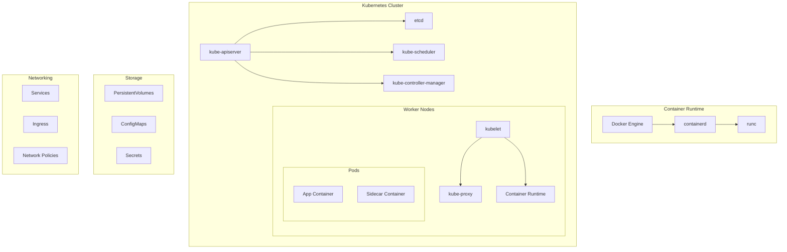
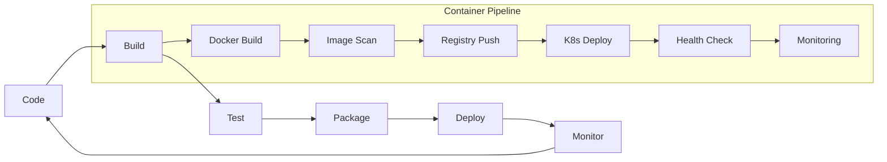

# 🐳 Docker & Kubernetes - Guía de Referencia Completa

## 📋 Tabla de Contenidos

- [Comandos Docker Básicos](#comandos-docker-básicos)
- [Dockerfile Instrucciones](#dockerfile-instrucciones)
- [Docker Compose](#docker-compose)
- [Comandos Kubernetes Básicos](#comandos-kubernetes-básicos)
- [Recursos Kubernetes](#recursos-kubernetes)
- [Configuración YAML](#configuración-yaml)
- [Networking](#networking)
- [Volumes y Storage](#volumes-y-storage)
- [Seguridad](#seguridad)
- [Monitoring y Troubleshooting](#monitoring-y-troubleshooting)
- [Best Practices](#best-practices)
- [Arquitectura Container](#arquitectura-container)

---

## 🐳 Comandos Docker Básicos

| Comando          | Descripción                       | Ejemplo                              |
| ---------------- | --------------------------------- | ------------------------------------ |
| `docker build`   | Construir imagen desde Dockerfile | `docker build -t myapp:v1 .`         |
| `docker run`     | Ejecutar contenedor               | `docker run -d -p 8080:80 nginx`     |
| `docker ps`      | Listar contenedores corriendo     | `docker ps -a`                       |
| `docker images`  | Listar imágenes                   | `docker images`                      |
| `docker pull`    | Descargar imagen                  | `docker pull ubuntu:20.04`           |
| `docker push`    | Subir imagen                      | `docker push myrepo/myapp:v1`        |
| `docker stop`    | Detener contenedor                | `docker stop container_id`           |
| `docker rm`      | Eliminar contenedor               | `docker rm container_id`             |
| `docker rmi`     | Eliminar imagen                   | `docker rmi image_id`                |
| `docker exec`    | Ejecutar comando en contenedor    | `docker exec -it container bash`     |
| `docker logs`    | Ver logs del contenedor           | `docker logs -f container_id`        |
| `docker inspect` | Inspeccionar contenedor/imagen    | `docker inspect container_id`        |
| `docker cp`      | Copiar archivos                   | `docker cp file.txt container:/path` |
| `docker network` | Gestionar redes                   | `docker network ls`                  |
| `docker volume`  | Gestionar volúmenes               | `docker volume create myvolume`      |

---

## 📁 Dockerfile Instrucciones

| Instrucción   | Descripción                      | Ejemplo                                    |
| ------------- | -------------------------------- | ------------------------------------------ |
| `FROM`        | Imagen base                      | `FROM node:18-alpine`                      |
| `WORKDIR`     | Directorio de trabajo            | `WORKDIR /app`                             |
| `COPY`        | Copiar archivos                  | `COPY package.json .`                      |
| `ADD`         | Copiar archivos (con extracción) | `ADD app.tar.gz /app`                      |
| `RUN`         | Ejecutar comando                 | `RUN npm install`                          |
| `CMD`         | Comando por defecto              | `CMD ["npm", "start"]`                     |
| `ENTRYPOINT`  | Punto de entrada                 | `ENTRYPOINT ["dotnet", "app.dll"]`         |
| `EXPOSE`      | Puerto expuesto                  | `EXPOSE 8080`                              |
| `ENV`         | Variable de entorno              | `ENV NODE_ENV=production`                  |
| `ARG`         | Argumento de build               | `ARG VERSION=latest`                       |
| `LABEL`       | Metadatos                        | `LABEL version="1.0"`                      |
| `USER`        | Usuario de ejecución             | `USER 1001`                                |
| `VOLUME`      | Punto de montaje                 | `VOLUME ["/data"]`                         |
| `HEALTHCHECK` | Verificación de salud            | `HEALTHCHECK CMD curl -f http://localhost` |

---

## 🔧 Docker Compose

| Sección       | Configuración           | Ejemplo                                                        |
| ------------- | ----------------------- | -------------------------------------------------------------- |
| `version`     | Versión de Compose      | `version: '3.8'`                                               |
| `services`    | Definición de servicios | `services: web: image: nginx`                                  |
| `networks`    | Configuración de red    | `networks: frontend: driver: bridge`                           |
| `volumes`     | Volúmenes compartidos   | `volumes: data: driver: local`                                 |
| `environment` | Variables de entorno    | `environment: - DEBUG=true`                                    |
| `ports`       | Mapeo de puertos        | `ports: - "8080:80"`                                           |
| `depends_on`  | Dependencias            | `depends_on: - database`                                       |
| `restart`     | Política de reinicio    | `restart: unless-stopped`                                      |
| `healthcheck` | Verificación de salud   | `healthcheck: test: ["CMD", "curl", "-f", "http://localhost"]` |
| `secrets`     | Gestión de secretos     | `secrets: db_password: file: ./db_password.txt`                |

---

## ☸️ Comandos Kubernetes Básicos

| Comando                | Descripción             | Ejemplo                                                                                     |
| ---------------------- | ----------------------- | ------------------------------------------------------------------------------------------- |
| `kubectl get`          | Listar recursos         | `kubectl get pods -n default`                                                               |
| `kubectl describe`     | Describir recurso       | `kubectl describe pod mypod`                                                                |
| `kubectl create`       | Crear recurso           | `kubectl create -f deployment.yaml`                                                         |
| `kubectl apply`        | Aplicar configuración   | `kubectl apply -f app.yaml`                                                                 |
| `kubectl delete`       | Eliminar recurso        | `kubectl delete pod mypod`                                                                  |
| `kubectl logs`         | Ver logs                | `kubectl logs -f pod/mypod`                                                                 |
| `kubectl exec`         | Ejecutar comando        | `kubectl exec -it mypod -- bash`                                                            |
| `kubectl port-forward` | Reenvío de puertos      | `kubectl port-forward pod/mypod 8080:80`                                                    |
| `kubectl scale`        | Escalar réplicas        | `kubectl scale deployment myapp --replicas=3`                                               |
| `kubectl rollout`      | Gestionar despliegues   | `kubectl rollout restart deployment/myapp`                                                  |
| `kubectl config`       | Configurar contexto     | `kubectl config use-context prod`                                                           |
| `kubectl top`          | Uso de recursos         | `kubectl top nodes`                                                                         |
| `kubectl patch`        | Actualizar parcialmente | `kubectl patch pod mypod -p '{"spec":{"containers":[{"name":"app","image":"new-image"}]}}'` |
| `kubectl edit`         | Editar recurso          | `kubectl edit deployment myapp`                                                             |

---

## 📦 Recursos Kubernetes

| Recurso                   | Descripción                 | Uso Principal                         |
| ------------------------- | --------------------------- | ------------------------------------- |
| `Pod`                     | Unidad básica de despliegue | Contenedor(es) co-ubicados            |
| `Deployment`              | Gestión de réplicas         | Aplicaciones stateless                |
| `StatefulSet`             | Pods con estado             | Bases de datos, aplicaciones stateful |
| `DaemonSet`               | Pod por nodo                | Logging, monitoring, networking       |
| `Job`                     | Tarea de ejecución única    | Batch processing, backups             |
| `CronJob`                 | Tareas programadas          | Jobs periódicos                       |
| `Service`                 | Exposición de pods          | Load balancing, service discovery     |
| `Ingress`                 | Acceso HTTP(S) externo      | Routing, SSL termination              |
| `ConfigMap`               | Configuración no sensible   | Variables de entorno, archivos config |
| `Secret`                  | Datos sensibles             | Passwords, certificates, keys         |
| `PersistentVolume`        | Almacenamiento              | Datos persistentes                    |
| `Namespace`               | Aislamiento lógico          | Multi-tenancy, environments           |
| `ServiceAccount`          | Identidad de pods           | RBAC, authentication                  |
| `HorizontalPodAutoscaler` | Auto-escalado               | Scaling basado en métricas            |

---

## 📄 Configuración YAML

### Pod Básico

```yaml
apiVersion: v1
kind: Pod
metadata:
  name: mypod
  labels:
    app: myapp
spec:
  containers:
    - name: app
      image: nginx:1.20
      ports:
        - containerPort: 80
      resources:
        requests:
          memory: "64Mi"
          cpu: "250m"
        limits:
          memory: "128Mi"
          cpu: "500m"
```

### Deployment

```yaml
apiVersion: apps/v1
kind: Deployment
metadata:
  name: myapp-deployment
spec:
  replicas: 3
  selector:
    matchLabels:
      app: myapp
  template:
    metadata:
      labels:
        app: myapp
    spec:
      containers:
        - name: app
          image: myapp:v1
          ports:
            - containerPort: 8080
```

### Service

```yaml
apiVersion: v1
kind: Service
metadata:
  name: myapp-service
spec:
  selector:
    app: myapp
  ports:
    - protocol: TCP
      port: 80
      targetPort: 8080
  type: LoadBalancer
```

---

## 🌐 Networking

| Concepto             | Descripción                  | Uso                           |
| -------------------- | ---------------------------- | ----------------------------- |
| `ClusterIP`          | IP interna del cluster       | Comunicación interna          |
| `NodePort`           | Puerto en cada nodo          | Acceso externo simple         |
| `LoadBalancer`       | Load balancer externo        | Producción con cloud provider |
| `ExternalName`       | Alias a servicio externo     | Servicios fuera del cluster   |
| `Ingress Controller` | Controlador de tráfico HTTP  | Routing avanzado              |
| `Network Policies`   | Reglas de firewall           | Seguridad de red              |
| `CNI Plugin`         | Interfaz de red              | Calico, Flannel, Weave        |
| `Service Mesh`       | Infraestructura de servicios | Istio, Linkerd                |

---

## 💾 Volumes y Storage

| Tipo                    | Descripción                | Persistencia           |
| ----------------------- | -------------------------- | ---------------------- |
| `emptyDir`              | Directorio temporal        | No persistente         |
| `hostPath`              | Path del host              | Persistente al nodo    |
| `persistentVolumeClaim` | Reclamación de volumen     | Persistente al cluster |
| `configMap`             | Configuración como volumen | No persistente         |
| `secret`                | Secretos como volumen      | No persistente         |
| `nfs`                   | Network File System        | Persistente compartido |
| `awsElasticBlockStore`  | EBS de AWS                 | Persistente cloud      |
| `azureDisk`             | Disco de Azure             | Persistente cloud      |
| `gcePersistentDisk`     | Disco de GCP               | Persistente cloud      |

---

## 🔒 Seguridad

| Concepto                 | Descripción                       | Implementación                   |
| ------------------------ | --------------------------------- | -------------------------------- |
| `RBAC`                   | Control de acceso basado en roles | Role, RoleBinding, ClusterRole   |
| `Pod Security Standards` | Estándares de seguridad           | Privileged, Baseline, Restricted |
| `Network Policies`       | Seguridad de red                  | Ingress/Egress rules             |
| `Service Accounts`       | Identidades de pods               | Authentication, authorization    |
| `Secrets Management`     | Gestión de secretos               | External secrets, encryption     |
| `Image Security`         | Seguridad de imágenes             | Vulnerability scanning, signing  |
| `Runtime Security`       | Seguridad en ejecución            | Falco, OPA Gatekeeper            |
| `Admission Controllers`  | Control de admisión               | Validation, mutation             |

---

## 📊 Monitoring y Troubleshooting

| Herramienta          | Propósito            | Comando/Uso                                                |
| -------------------- | -------------------- | ---------------------------------------------------------- |
| `kubectl logs`       | Logs de pods         | `kubectl logs -f pod/mypod`                                |
| `kubectl describe`   | Detalles de recursos | `kubectl describe pod mypod`                               |
| `kubectl top`        | Uso de recursos      | `kubectl top nodes/pods`                                   |
| `kubectl get events` | Eventos del cluster  | `kubectl get events --sort-by=.metadata.creationTimestamp` |
| `Prometheus`         | Métricas             | Scraping, alerting                                         |
| `Grafana`            | Visualización        | Dashboards, monitoring                                     |
| `Jaeger`             | Distributed tracing  | APM, performance                                           |
| `ELK Stack`          | Logging centralizado | ElasticSearch, Logstash, Kibana                            |

---

## ✅ Best Practices

### Docker

| Práctica                | Descripción                           | Ejemplo                                    |
| ----------------------- | ------------------------------------- | ------------------------------------------ |
| **Multi-stage builds**  | Optimizar tamaño de imagen            | `FROM node:18 AS builder`                  |
| **Non-root user**       | Ejecutar como usuario no privilegiado | `USER 1001`                                |
| **Minimal base images** | Usar imágenes mínimas                 | `FROM alpine:3.18`                         |
| **Layer caching**       | Optimizar orden de comandos           | Copiar package.json antes que código       |
| **Health checks**       | Verificaciones de salud               | `HEALTHCHECK CMD curl -f http://localhost` |
| **Security scanning**   | Escanear vulnerabilidades             | Trivy, Snyk, Clair                         |

### Kubernetes

| Práctica                      | Descripción                   | Implementación                 |
| ----------------------------- | ----------------------------- | ------------------------------ |
| **Resource limits**           | Limitar recursos              | CPU/Memory requests y limits   |
| **Liveness/Readiness probes** | Health checks                 | HTTP, TCP, exec probes         |
| **ConfigMaps/Secrets**        | Externalizar configuración    | No hardcodear en imágenes      |
| **Labels y selectors**        | Organización de recursos      | Consistent labeling strategy   |
| **Namespaces**                | Aislamiento lógico            | Environment separation         |
| **RBAC**                      | Principio de menor privilegio | Roles específicos por servicio |
| **Backup strategy**           | Respaldo de datos             | etcd backups, persistent data  |

---

## 🏗️ Arquitectura Container



---

## 🔄 Ciclo de Vida DevOps



---

## 📈 Escalabilidad y Performance

| Estrategia              | Docker                 | Kubernetes                   |
| ----------------------- | ---------------------- | ---------------------------- |
| **Horizontal Scaling**  | Docker Swarm replicas  | HPA, VPA                     |
| **Load Balancing**      | Built-in load balancer | Services, Ingress            |
| **Resource Management** | --memory, --cpus flags | Resource requests/limits     |
| **Auto-scaling**        | Manual scaling         | HPA basado en métricas       |
| **Rolling Updates**     | Service updates        | Deployment strategies        |
| **Health Monitoring**   | Health checks          | Probes (liveness, readiness) |

---

## 🚀 Deployment Strategies

| Estrategia         | Descripción            | K8s Implementation            |
| ------------------ | ---------------------- | ----------------------------- |
| **Rolling Update** | Actualización gradual  | Default deployment strategy   |
| **Blue-Green**     | Dos entornos paralelos | Service selector switching    |
| **Canary**         | Despliegue progresivo  | Istio, Flagger, Argo Rollouts |
| **A/B Testing**    | Testing de versiones   | Ingress routing rules         |

---

_📚 Esta guía cubre los aspectos fundamentales y avanzados de Docker y Kubernetes para desarrollo y operaciones enterprise._
