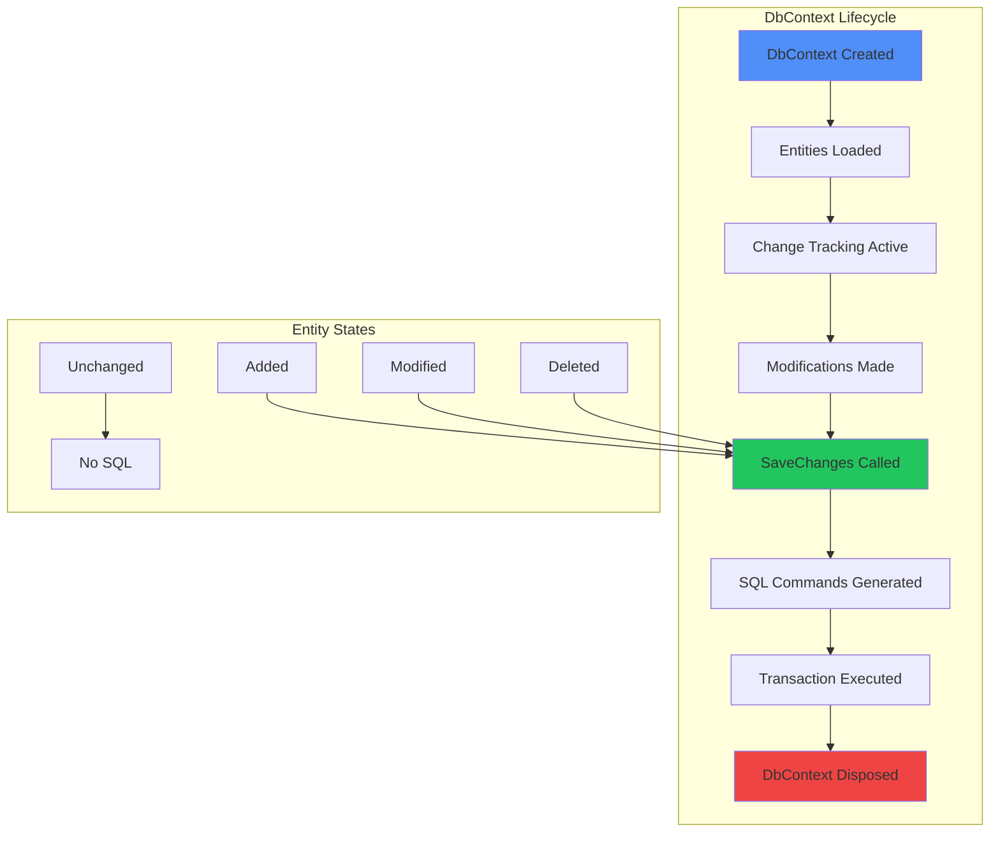

# Contexto y Propósito

## ¿Qué es?
Entity Framework (EF) Core es un ORM (Object-Relational Mapper) que permite a aplicaciones .NET interactuar con bases de datos relacionales usando LINQ y modelos de objetos. Facilita el mapeo objeto-relacional, la gestión de migraciones y la optimización de consultas sin escribir SQL manual en la mayoría de los casos.

## ¿Por qué?
Porque abstraer el acceso a datos reduce errores, mejora la productividad y permite mantener consistencia entre capas. En mi experiencia, EF Core ha sido clave en banca y municipalidades para reducir complejidad en queries, agilizar despliegues con migraciones y mejorar mantenibilidad en equipos grandes.

## ¿Para qué?
- **Modelar datos** con Code First o Database First según el contexto.  
- **Automatizar migraciones** y versionado de esquemas.  
- **Optimizar queries** usando LINQ, proyecciones y configuraciones de tracking.  
- **Aplicar patrones de acceso** como Repository, Unit of Work y DbContext por request.  

## Valor agregado desde la experiencia
- Implementar **AsNoTracking** redujo consumo de memoria en APIs de alta concurrencia.  
- Usar **Split Queries** evitó explosiones cartesianas en joins complejos.  
- Con **Compiled Queries**, mejoramos en 30% el rendimiento en escenarios de lectura masiva.  
- Estrategias de **sharding y pooling** permitieron escalar sistemas municipales a millones de registros.  

# Entity Framework Core Reference

**Guía completa de Entity Framework Core para desarrolladores .NET con patrones, performance tips y mejores prácticas.**
Este documento cubre desde migraciones y configuración hasta optimización de queries y troubleshooting común.
Esencial para trabajar eficientemente con datos en aplicaciones .NET modernas.

## Code First vs Database First

**Comparación de enfoques Code First y Database First en Entity Framework Core con recomendaciones por escenario.**
Esta tabla analiza las ventajas y desventajas de cada approach para ayudar en la decisión arquitectónica.
Fundamental para elegir la estrategia de modelado de datos más apropiada según el contexto del proyecto.

| **Aspecto**        | **Code First**                 | **Database First**     | **Recomendación**                   |
| ------------------ | ------------------------------ | ---------------------- | ----------------------------------- |
| **Control**        | Desarrollador controla esquema | BD existente controla  | Code First para proyectos nuevos    |
| **Versionado**     | Migrations automáticas         | Scripts SQL manuales   | Code First mejor para CI/CD         |
| **Colaboración**   | Conflictos en migrations       | Conflictos en BD       | Code First mejor para equipos       |
| **Legacy Systems** | Requiere mapeo manual          | Scaffolding automático | Database First para sistemas legacy |
| **Performance**    | Optimizable desde código       | Optimizado desde BD    | Database First para DBA teams       |

## Migration Commands

**Comandos esenciales de Entity Framework para gestionar migraciones y evolución del esquema de base de datos.**
Esta tabla presenta los comandos más utilizados en el ciclo de vida de desarrollo con ejemplos prácticos.
Crítica para mantener sincronizados los modelos de datos entre diferentes entornos y versiones de la aplicación.

| **Comando**        | **Propósito**             | **Ejemplo**                                 | **Cuándo usar**                |
| ------------------ | ------------------------- | ------------------------------------------- | ------------------------------ |
| `Add-Migration`    | Crear nueva migración     | `Add-Migration InitialCreate`               | Cambios en modelos             |
| `Update-Database`  | Aplicar migraciones       | `Update-Database -TargetMigration AddUsers` | Deploy a BD                    |
| `Remove-Migration` | Eliminar última migración | `Remove-Migration`                          | Corregir migración no aplicada |
| `Script-Migration` | Generar script SQL        | `Script-Migration -From 0 -To AddUsers`     | Deploy manual                  |
| `Drop-Database`    | Eliminar BD completa      | `Drop-Database`                             | Reset completo en desarrollo   |

## Relationship Configurations

| **Tipo**             | **Convención**            | **Fluent API**                                    | **Ejemplo de Uso**         |
| -------------------- | ------------------------- | ------------------------------------------------- | -------------------------- |
| **One-to-One**       | Por convención de nombres | `HasOne().WithOne()`                              | Usuario → Perfil           |
| **One-to-Many**      | Foreign Key property      | `HasMany().WithOne()`                             | Blog → Posts               |
| **Many-to-Many**     | Join table automática     | `HasMany().WithMany()`                            | Estudiantes ↔ Cursos       |
| **Self-Referencing** | Explicit configuration    | `HasMany(e => e.Children).WithOne(e => e.Parent)` | Categorías → Subcategorías |

## LINQ Query Patterns

| **Operación** | **LINQ Syntax**                                           | **Method Syntax**                                  | **SQL Generado**                          |
| ------------- | --------------------------------------------------------- | -------------------------------------------------- | ----------------------------------------- |
| **Select**    | `from u in users select u.Name`                           | `users.Select(u => u.Name)`                        | `SELECT Name FROM Users`                  |
| **Where**     | `from u in users where u.IsActive select u`               | `users.Where(u => u.IsActive)`                     | `SELECT * FROM Users WHERE IsActive = 1`  |
| **Join**      | `from u in users join p in posts on u.Id equals p.UserId` | `users.Join(posts, u => u.Id, p => p.UserId, ...)` | `SELECT * FROM Users INNER JOIN Posts...` |
| **GroupBy**   | `from u in users group u by u.City`                       | `users.GroupBy(u => u.City)`                       | `SELECT * FROM Users GROUP BY City`       |

## Performance Optimization Techniques

| **Técnica**             | **Problema que resuelve** | **Implementación**                                  | **Mejora esperada**    |
| ----------------------- | ------------------------- | --------------------------------------------------- | ---------------------- |
| **Include/ThenInclude** | N+1 queries               | `.Include(b => b.Posts).ThenInclude(p => p.Author)` | 90% menos queries      |
| **Split Queries**       | Cartesian explosion       | `.AsSplitQuery()`                                   | Mejor con many-to-many |
| **No Tracking**         | Memoria innecesaria       | `.AsNoTracking()`                                   | 50% menos memoria      |
| **Compiled Queries**    | Parsing repetitivo        | `EF.CompileQuery()`                                 | 30% más rápido         |
| **Bulk Operations**     | Insert/Update masivos     | `context.BulkInsert(entities)`                      | 10x más rápido         |

## Data Annotations vs Fluent API

| **Configuración**  | **Data Annotations** | **Fluent API**         | **Recomendación**            |
| ------------------ | -------------------- | ---------------------- | ---------------------------- |
| **Primary Key**    | `[Key]`              | `.HasKey(e => e.Id)`   | Data Annotations para simple |
| **Required Field** | `[Required]`         | `.IsRequired()`        | Data Annotations             |
| **String Length**  | `[MaxLength(100)]`   | `.HasMaxLength(100)`   | Data Annotations             |
| **Relationships**  | `[ForeignKey]`       | `.HasOne().WithMany()` | Fluent API para complejo     |
| **Indexes**        | `[Index]`            | `.HasIndex()`          | Fluent API más flexible      |
| **Table Names**    | `[Table("Users")]`   | `.ToTable("Users")`    | Fluent API para consistencia |

## Connection Patterns

| **Patrón**                | **Implementación**     | **Pros**           | **Contras**            | **Uso**                           |
| ------------------------- | ---------------------- | ------------------ | ---------------------- | --------------------------------- |
| **DbContext per Request** | DI Scoped              | Simple, automático | No para long-running   | Web APIs                          |
| **DbContext Factory**     | `IDbContextFactory<T>` | Control total      | Manual management      | Background services               |
| **Connection Pooling**    | `AddDbContextPool()`   | Mejor performance  | Limitaciones de estado | High throughput APIs              |
| **Read/Write Split**      | Múltiples conexiones   | Escalabilidad      | Complejidad            | Aplicaciones de lectura intensiva |

## Query Execution Types

| **Método**              | **Ejecución**             | **Uso de Memoria** | **Cuándo usar**                           |
| ----------------------- | ------------------------- | ------------------ | ----------------------------------------- |
| **ToList()**            | Inmediata, completa       | Alta               | Pocas entidades, necesitas lista completa |
| **FirstOrDefault()**    | Inmediata, una entidad    | Baja               | Búsqueda por ID                           |
| **AsEnumerable()**      | Diferida, streaming       | Media              | Procesar entity por entity                |
| **AsAsyncEnumerable()** | Diferida, async streaming | Baja               | Grandes datasets, async processing        |

## Entity States & Change Tracking

| **Estado**    | **Significado**       | **En SaveChanges()** | **Cómo llegar**                          |
| ------------- | --------------------- | -------------------- | ---------------------------------------- |
| **Added**     | Nueva entidad         | INSERT               | `context.Add(entity)`                    |
| **Modified**  | Entidad cambiada      | UPDATE               | Modificar tracked entity                 |
| **Deleted**   | Marcada para eliminar | DELETE               | `context.Remove(entity)`                 |
| **Unchanged** | Sin cambios           | No acción            | Entidad recién cargada                   |
| **Detached**  | No tracked            | No acción            | `context.Entry(entity).State = Detached` |

## Advanced Query Techniques

```csharp
// Raw SQL con parámetros
var users = context.Users
    .FromSqlRaw("SELECT * FROM Users WHERE City = {0}", city)
    .ToList();

// Global Query Filters (Soft Delete)
modelBuilder.Entity<User>()
    .HasQueryFilter(u => !u.IsDeleted);

// Value Conversions
modelBuilder.Entity<User>()
    .Property(e => e.Status)
    .HasConversion<string>();

// Shadow Properties
modelBuilder.Entity<User>()
    .Property<DateTime>("LastModified");
```

## Database Context Lifecycle

**Ciclo de vida del DbContext mostrando las fases desde creación hasta disposal, incluyendo change tracking.**
Este diagrama ilustra cómo EF Core rastrea cambios y genera SQL durante el ciclo de vida de una instancia de contexto.
Fundamental para entender el rendimiento y la gestión correcta de memoria en aplicaciones que usan Entity Framework Core.



## Connection String Patterns

| **Provider**   | **Connection String**                                                                          | **Uso**             |
| -------------- | ---------------------------------------------------------------------------------------------- | ------------------- |
| **SQL Server** | `Server=.;Database=MyDB;Trusted_Connection=true`                                               | Desarrollo local    |
| **Azure SQL**  | `Server=tcp:server.database.windows.net;Database=MyDB;User ID=user;Password=pass;Encrypt=True` | Producción cloud    |
| **SQLite**     | `Data Source=MyDatabase.db`                                                                    | Testing, prototipos |
| **In-Memory**  | `"InMemoryDatabase"`                                                                           | Unit testing        |

## Concurrency Control

| **Estrategia**       | **Implementación**                   | **Pros**                    | **Contras**         |
| -------------------- | ------------------------------------ | --------------------------- | ------------------- |
| **Optimistic**       | `[Timestamp]` o `[ConcurrencyCheck]` | No locks, mejor performance | Conflictos manuales |
| **Pessimistic**      | SQL Server locks                     | Evita conflictos            | Deadlocks posibles  |
| **Last-Writer-Wins** | Sin control                          | Simple                      | Pérdida de datos    |

## Seeding Data Strategies

```csharp
// En OnModelCreating
modelBuilder.Entity<User>().HasData(
    new User { Id = 1, Name = "Admin", Email = "admin@example.com" }
);

// Custom Initializer
public static class DbInitializer
{
    public static void Initialize(ApplicationDbContext context)
    {
        if (!context.Users.Any())
        {
            context.Users.AddRange(
                new User { Name = "User1" },
                new User { Name = "User2" }
            );
            context.SaveChanges();
        }
    }
}
```

## Common Performance Issues

| **Problema**                 | **Síntoma**               | **Solución**          | **Prevención**         |
| ---------------------------- | ------------------------- | --------------------- | ---------------------- |
| **N+1 Queries**              | Muchas queries en bucle   | `.Include()`          | Eager loading strategy |
| **Cartesian Explosion**      | Queries enormes con joins | `.AsSplitQuery()`     | Separate queries       |
| **Change Tracking Overhead** | Memoria alta              | `.AsNoTracking()`     | Solo para read-only    |
| **Large Result Sets**        | OutOfMemoryException      | Pagination, streaming | `Take()`, `Skip()`     |
| **Inefficient Queries**      | Queries lentas            | Indexes, query tuning | Query plan analysis    |

## Transaction Management

```csharp
// Explicit Transaction
using var transaction = context.Database.BeginTransaction();
try
{
    // Multiple operations
    context.SaveChanges();
    context.SaveChanges();
    transaction.Commit();
}
catch
{
    transaction.Rollback();
    throw;
}

// Transaction Scope
using var scope = new TransactionScope();
// Operations
scope.Complete();
```
