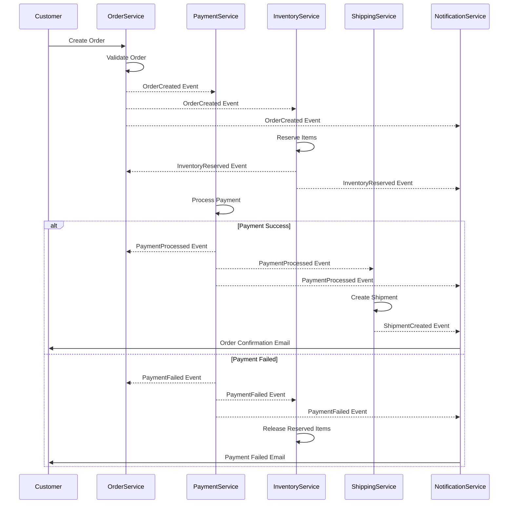
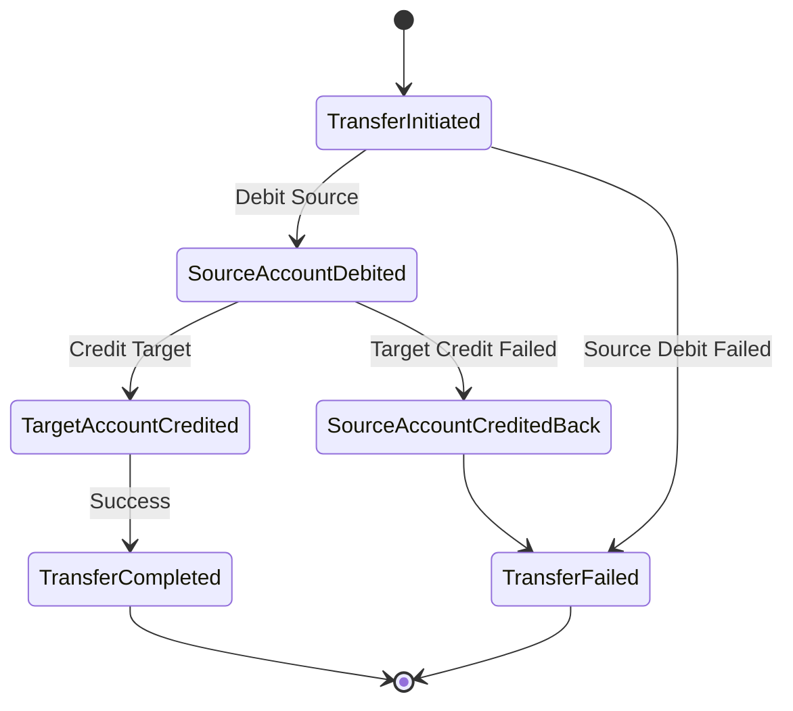
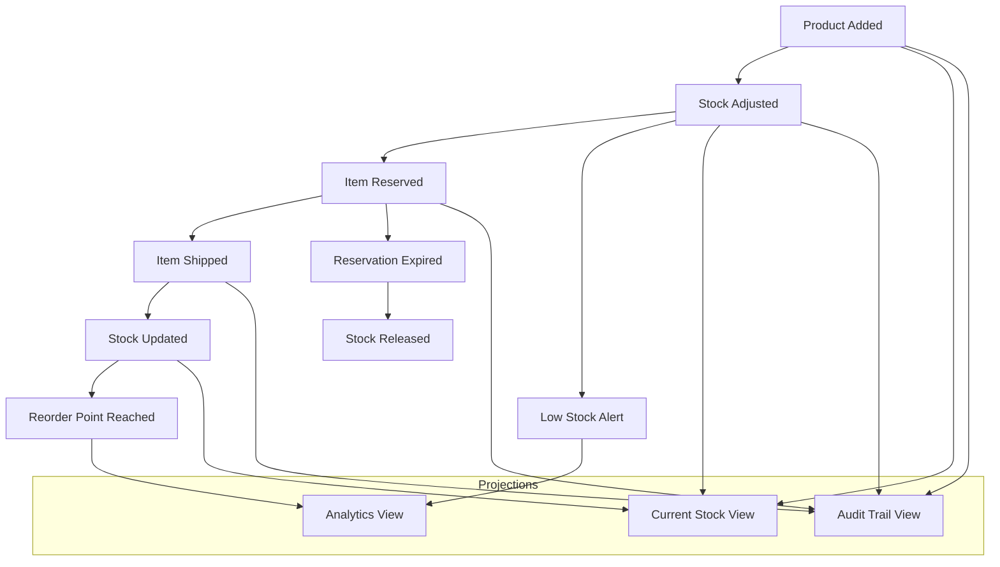
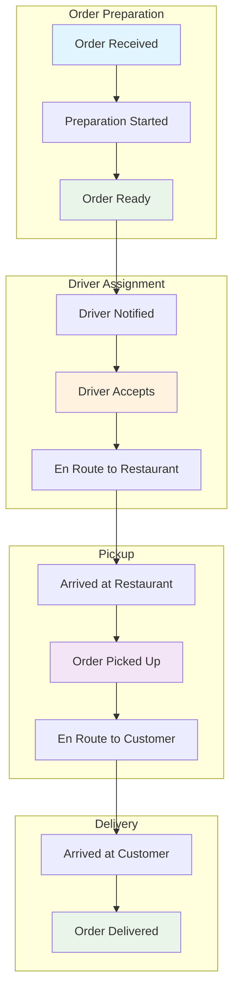

# Event-Driven Architecture - Casos de Uso y Flujos Prácticos

**Guía didáctica de Event-Driven Architecture con casos de uso reales, flujos visuales y ejemplos paso a paso.**
Este documento complementa la referencia técnica con escenarios prácticos, diagramas de flujo y implementaciones simplificadas.
Ideal para equipos que aprenden patrones event-driven y necesitan ver aplicaciones concretas en contextos empresariales.

## 🏪 Caso de Uso: E-commerce Platform

**Implementación completa de una plataforma e-commerce usando Event-Driven Architecture con múltiples bounded contexts.**
Este caso muestra cómo diferentes servicios se comunican mediante eventos para procesar un pedido completo.
Perfecto para entender la coordinación entre servicios y la propagación de eventos en sistemas distribuidos.

### 📋 Servicios Involucrados

| **Servicio**             | **Responsabilidad**     | **Eventos que Produce**                  | **Eventos que Consume**                 |
| ------------------------ | ----------------------- | ---------------------------------------- | --------------------------------------- |
| **Order Service**        | Gestión de pedidos      | `OrderCreated`, `OrderCancelled`         | `PaymentProcessed`, `InventoryReserved` |
| **Payment Service**      | Procesamiento de pagos  | `PaymentProcessed`, `PaymentFailed`      | `OrderCreated`                          |
| **Inventory Service**    | Control de stock        | `InventoryReserved`, `InventoryReleased` | `OrderCreated`, `OrderCancelled`        |
| **Shipping Service**     | Gestión de envíos       | `ShipmentCreated`, `ShipmentDelivered`   | `PaymentProcessed`                      |
| **Notification Service** | Comunicación al cliente | `EmailSent`, `SMSSent`                   | Todos los eventos de dominio            |

### 🔄 Flujo Completo: "Compra de Producto"



### 💻 Implementación Simplificada

```csharp
// 1. Event Bus Interface
public interface IEventBus
{
    Task PublishAsync<T>(T @event) where T : class;
    void Subscribe<T>(Func<T, Task> handler) where T : class;
}

// 2. Domain Events
public record OrderCreated(Guid OrderId, string CustomerId, List<OrderItem> Items, decimal Total);
public record PaymentProcessed(Guid OrderId, string PaymentId, decimal Amount);
public record InventoryReserved(Guid OrderId, Dictionary<string, int> ReservedItems);

// 3. Order Service
public class OrderService
{
    private readonly IEventBus _eventBus;

    public async Task<Guid> CreateOrderAsync(CreateOrderRequest request)
    {
        var orderId = Guid.NewGuid();

        // Validate and create order
        var order = new Order(orderId, request.CustomerId, request.Items);
        await SaveOrderAsync(order);

        // Publish event
        await _eventBus.PublishAsync(new OrderCreated(
            orderId,
            request.CustomerId,
            request.Items,
            request.Items.Sum(i => i.Price * i.Quantity)
        ));

        return orderId;
    }
}

// 4. Payment Service Event Handler
public class PaymentEventHandler
{
    private readonly IEventBus _eventBus;

    public async Task Handle(OrderCreated orderCreated)
    {
        try
        {
            // Process payment logic
            var paymentResult = await ProcessPaymentAsync(orderCreated);

            if (paymentResult.Success)
            {
                await _eventBus.PublishAsync(new PaymentProcessed(
                    orderCreated.OrderId,
                    paymentResult.PaymentId,
                    orderCreated.Total
                ));
            }
            else
            {
                await _eventBus.PublishAsync(new PaymentFailed(
                    orderCreated.OrderId,
                    paymentResult.ErrorMessage
                ));
            }
        }
        catch (Exception ex)
        {
            // Handle payment errors
            await _eventBus.PublishAsync(new PaymentFailed(
                orderCreated.OrderId,
                ex.Message
            ));
        }
    }
}
```

---

## 🏦 Caso de Uso: Sistema Bancario

**Implementación de transferencias bancarias usando Saga Pattern para manejar transacciones distribuidas.**
Este ejemplo muestra cómo coordinar operaciones que deben ser atómicas entre múltiples servicios.
Esencial para entender compensación y rollback en sistemas financieros donde la consistencia es crítica.

### 🔄 Saga Pattern: "Transferencia Entre Cuentas"



### 📝 Implementación de Saga

```csharp
// Saga Orchestrator
public class MoneyTransferSaga
{
    private readonly IEventBus _eventBus;
    private readonly ISagaRepository _sagaRepository;

    public async Task Handle(TransferMoneyCommand command)
    {
        var sagaId = Guid.NewGuid();
        var saga = new MoneyTransferSagaData
        {
            SagaId = sagaId,
            SourceAccountId = command.SourceAccountId,
            TargetAccountId = command.TargetAccountId,
            Amount = command.Amount,
            State = SagaState.Started
        };

        await _sagaRepository.SaveAsync(saga);

        // Step 1: Debit source account
        await _eventBus.PublishAsync(new DebitAccountCommand
        {
            SagaId = sagaId,
            AccountId = command.SourceAccountId,
            Amount = command.Amount
        });
    }

    public async Task Handle(AccountDebitedEvent @event)
    {
        var saga = await _sagaRepository.GetAsync(@event.SagaId);

        if (saga.SourceAccountId == @event.AccountId)
        {
            saga.State = SagaState.SourceDebited;
            await _sagaRepository.SaveAsync(saga);

            // Step 2: Credit target account
            await _eventBus.PublishAsync(new CreditAccountCommand
            {
                SagaId = saga.SagaId,
                AccountId = saga.TargetAccountId,
                Amount = saga.Amount
            });
        }
    }

    public async Task Handle(AccountCreditedEvent @event)
    {
        var saga = await _sagaRepository.GetAsync(@event.SagaId);

        if (saga.TargetAccountId == @event.AccountId)
        {
            saga.State = SagaState.Completed;
            await _sagaRepository.SaveAsync(saga);

            await _eventBus.PublishAsync(new TransferCompletedEvent
            {
                SagaId = saga.SagaId,
                SourceAccountId = saga.SourceAccountId,
                TargetAccountId = saga.TargetAccountId,
                Amount = saga.Amount
            });
        }
    }

    public async Task Handle(AccountDebitFailedEvent @event)
    {
        var saga = await _sagaRepository.GetAsync(@event.SagaId);
        saga.State = SagaState.Failed;
        saga.FailureReason = @event.Reason;
        await _sagaRepository.SaveAsync(saga);

        await _eventBus.PublishAsync(new TransferFailedEvent
        {
            SagaId = saga.SagaId,
            Reason = @event.Reason
        });
    }

    public async Task Handle(AccountCreditFailedEvent @event)
    {
        var saga = await _sagaRepository.GetAsync(@event.SagaId);

        // Compensating action: Credit back the source account
        await _eventBus.PublishAsync(new CreditAccountCommand
        {
            SagaId = saga.SagaId,
            AccountId = saga.SourceAccountId,
            Amount = saga.Amount,
            IsCompensation = true
        });

        saga.State = SagaState.Compensating;
        await _sagaRepository.SaveAsync(saga);
    }
}
```

---

## 📊 Caso de Uso: Sistema de Inventario en Tiempo Real

**Implementación de Event Sourcing para tracking de inventario con proyecciones para diferentes vistas.**
Este ejemplo muestra cómo mantener múltiples vistas de datos sincronizadas mediante eventos.
Perfecto para entender proyecciones, snapshots y queries en sistemas de alta concurrencia.

### 🔄 Flujo de Eventos de Inventario



### 💻 Event Sourcing para Inventario

```csharp
// Inventory Events
public abstract record InventoryEvent(Guid ProductId, DateTime Timestamp);
public record ProductAdded(Guid ProductId, string Name, string SKU, DateTime Timestamp) : InventoryEvent(ProductId, Timestamp);
public record StockAdjusted(Guid ProductId, int Quantity, string Reason, DateTime Timestamp) : InventoryEvent(ProductId, Timestamp);
public record ItemReserved(Guid ProductId, Guid OrderId, int Quantity, DateTime Timestamp) : InventoryEvent(ProductId, Timestamp);
public record ItemShipped(Guid ProductId, Guid OrderId, int Quantity, DateTime Timestamp) : InventoryEvent(ProductId, Timestamp);

// Inventory Aggregate
public class InventoryItem
{
    public Guid ProductId { get; private set; }
    public string Name { get; private set; } = string.Empty;
    public string SKU { get; private set; } = string.Empty;
    public int CurrentStock { get; private set; }
    public int ReservedStock { get; private set; }
    public int AvailableStock => CurrentStock - ReservedStock;

    private readonly List<InventoryEvent> _events = new();
    public IReadOnlyList<InventoryEvent> Events => _events.AsReadOnly();

    public static InventoryItem FromEvents(IEnumerable<InventoryEvent> events)
    {
        var item = new InventoryItem();
        foreach (var @event in events)
        {
            item.Apply(@event);
        }
        return item;
    }

    public void AddProduct(Guid productId, string name, string sku)
    {
        var @event = new ProductAdded(productId, name, sku, DateTime.UtcNow);
        Apply(@event);
        _events.Add(@event);
    }

    public void AdjustStock(int quantity, string reason)
    {
        var @event = new StockAdjusted(ProductId, quantity, reason, DateTime.UtcNow);
        Apply(@event);
        _events.Add(@event);
    }

    public bool TryReserveItems(Guid orderId, int quantity)
    {
        if (AvailableStock < quantity)
            return false;

        var @event = new ItemReserved(ProductId, orderId, quantity, DateTime.UtcNow);
        Apply(@event);
        _events.Add(@event);
        return true;
    }

    private void Apply(InventoryEvent @event)
    {
        switch (@event)
        {
            case ProductAdded added:
                ProductId = added.ProductId;
                Name = added.Name;
                SKU = added.SKU;
                break;

            case StockAdjusted adjusted:
                CurrentStock += adjusted.Quantity;
                break;

            case ItemReserved reserved:
                ReservedStock += reserved.Quantity;
                break;

            case ItemShipped shipped:
                ReservedStock -= shipped.Quantity;
                CurrentStock -= shipped.Quantity;
                break;
        }
    }
}

// Projection: Current Stock View
public class CurrentStockProjection
{
    public async Task Handle(InventoryEvent @event)
    {
        switch (@event)
        {
            case ProductAdded added:
                await CreateProductView(added);
                break;

            case StockAdjusted adjusted:
                await UpdateStock(adjusted.ProductId, adjusted.Quantity);
                break;

            case ItemReserved reserved:
                await UpdateReservedStock(reserved.ProductId, reserved.Quantity);
                break;

            case ItemShipped shipped:
                await UpdateStockAfterShipment(shipped.ProductId, shipped.Quantity);
                break;
        }
    }

    private async Task CreateProductView(ProductAdded added)
    {
        var view = new ProductStockView
        {
            ProductId = added.ProductId,
            Name = added.Name,
            SKU = added.SKU,
            CurrentStock = 0,
            ReservedStock = 0,
            LastUpdated = added.Timestamp
        };

        await SaveProductViewAsync(view);
    }
}
```

---

## 🚚 Caso de Uso: Sistema de Delivery

**Implementación de tracking en tiempo real usando eventos para coordinar conductores, pedidos y clientes.**
Este ejemplo muestra publish/subscribe patterns para notificaciones en tiempo real.
Ideal para entender broadcasting de eventos y múltiples suscriptores con diferentes responsabilidades.

### 🗺️ Flujo de Delivery Tracking



### 📱 Real-time Events Implementation

```csharp
// Delivery Events
public abstract record DeliveryEvent(Guid OrderId, DateTime Timestamp);
public record OrderAssignedToDriver(Guid OrderId, Guid DriverId, DateTime Timestamp) : DeliveryEvent(OrderId, Timestamp);
public record DriverEnRouteToRestaurant(Guid OrderId, Guid DriverId, Location DriverLocation, DateTime Timestamp) : DeliveryEvent(OrderId, Timestamp);
public record DriverArrivedAtRestaurant(Guid OrderId, Guid DriverId, DateTime Timestamp) : DeliveryEvent(OrderId, Timestamp);
public record OrderPickedUp(Guid OrderId, Guid DriverId, DateTime Timestamp) : DeliveryEvent(OrderId, Timestamp);
public record DriverEnRouteToCustomer(Guid OrderId, Guid DriverId, Location DriverLocation, DateTime Timestamp) : DeliveryEvent(OrderId, Timestamp);
public record OrderDelivered(Guid OrderId, Guid DriverId, DateTime Timestamp) : DeliveryEvent(OrderId, Timestamp);

// Event Handlers for different subscribers
public class CustomerNotificationHandler
{
    private readonly INotificationService _notificationService;

    public async Task Handle(OrderAssignedToDriver @event)
    {
        await _notificationService.SendPushNotificationAsync(
            await GetCustomerIdAsync(@event.OrderId),
            "¡Tu pedido ha sido asignado a un conductor!",
            $"El conductor está en camino al restaurante."
        );
    }

    public async Task Handle(DriverEnRouteToCustomer @event)
    {
        await _notificationService.SendPushNotificationAsync(
            await GetCustomerIdAsync(@event.OrderId),
            "¡Tu pedido está en camino!",
            $"El conductor llegará en aproximadamente {await EstimateDeliveryTimeAsync(@event)} minutos."
        );
    }

    public async Task Handle(OrderDelivered @event)
    {
        await _notificationService.SendPushNotificationAsync(
            await GetCustomerIdAsync(@event.OrderId),
            "¡Pedido entregado!",
            "Esperamos que disfrutes tu comida. ¡No olvides calificar tu experiencia!"
        );
    }
}

public class DriverAppHandler
{
    private readonly IDriverAppService _driverAppService;

    public async Task Handle(OrderAssignedToDriver @event)
    {
        await _driverAppService.SendOrderDetailsAsync(@event.DriverId, @event.OrderId);
        await _driverAppService.EnableNavigationAsync(@event.DriverId, await GetRestaurantLocationAsync(@event.OrderId));
    }

    public async Task Handle(OrderPickedUp @event)
    {
        await _driverAppService.EnableNavigationAsync(@event.DriverId, await GetCustomerLocationAsync(@event.OrderId));
        await _driverAppService.UpdateOrderStatusAsync(@event.DriverId, @event.OrderId, "En camino al cliente");
    }
}

public class AnalyticsHandler
{
    private readonly IAnalyticsService _analyticsService;

    public async Task Handle(DeliveryEvent @event)
    {
        await _analyticsService.TrackDeliveryEventAsync(new DeliveryMetric
        {
            OrderId = @event.OrderId,
            EventType = @event.GetType().Name,
            Timestamp = @event.Timestamp,
            Metadata = ExtractMetadata(@event)
        });
    }

    public async Task Handle(OrderDelivered @event)
    {
        var deliveryTime = await CalculateDeliveryTimeAsync(@event.OrderId);
        await _analyticsService.TrackDeliveryPerformanceAsync(new DeliveryPerformanceMetric
        {
            OrderId = @event.OrderId,
            TotalDeliveryTime = deliveryTime,
            DriverId = @event.DriverId
        });
    }
}
```

---

## 🎯 Patrones de Messaging Comparados

**Comparación práctica de diferentes patrones de messaging con ejemplos de cuándo usar cada uno.**
Esta tabla ayuda a elegir el patrón correcto según las características del problema a resolver.
Fundamental para tomar decisiones arquitectónicas informadas en sistemas distribuidos.

| **Patrón**            | **Características**      | **Ejemplo de Uso**      | **Ventajas**        | **Desventajas**        | **Cuándo Usar**                                      |
| --------------------- | ------------------------ | ----------------------- | ------------------- | ---------------------- | ---------------------------------------------------- |
| **Request/Response**  | Síncrono, acoplado       | API calls, queries      | Simple, inmediato   | Acoplamiento, latencia | Operaciones simples, datos requeridos inmediatamente |
| **Fire and Forget**   | Asíncrono, sin respuesta | Logging, analytics      | Desacoplado, rápido | Sin confirmación       | Acciones que no requieren confirmación               |
| **Publish/Subscribe** | 1 a muchos, asíncrono    | Notificaciones, updates | Escalable, flexible | Complejidad en orden   | Múltiples consumidores del mismo evento              |
| **Message Queue**     | 1 a 1, garantías         | Task processing         | Confiable, ordenado | Single consumer        | Procesamiento de tareas, workers                     |
| **Event Streaming**   | Continuo, alto volumen   | Real-time analytics     | Alto throughput     | Complejidad            | Análisis en tiempo real, big data                    |

---

## 🔧 Tools y Tecnologías por Escenario

**Selección de herramientas según el tipo de aplicación y requerimientos específicos.**
Esta tabla facilita la elección de tecnología basada en características del sistema.
Esencial para hacer decisiones técnicas alineadas con requirements no funcionales.

| **Escenario**                   | **Message Broker**             | **Event Store**             | **Casos de Uso**                  | **Consideraciones**                    |
| ------------------------------- | ------------------------------ | --------------------------- | --------------------------------- | -------------------------------------- |
| **Microservices Communication** | RabbitMQ, Apache Kafka         | EventStore, SQL Server      | E-commerce, SaaS platforms        | Latencia, throughput, order guarantees |
| **Real-time Analytics**         | Apache Kafka, Azure Event Hubs | InfluxDB, Apache Cassandra  | IoT, monitoring, metrics          | Volumen de datos, retention policies   |
| **Financial Systems**           | IBM MQ, RabbitMQ               | EventStore, PostgreSQL      | Banking, payments, trading        | ACID compliance, audit trails          |
| **Gaming/Social**               | Redis Streams, Apache Pulsar   | MongoDB, Cassandra          | Chat, leaderboards, notifications | Latencia ultra-baja, escalabilidad     |
| **Enterprise Integration**      | Azure Service Bus, MassTransit | Azure Cosmos DB, SQL Server | ERP integration, workflows        | Connectivity, security, compliance     |

---

## 📊 Monitoreo y Observabilidad

**Métricas clave para monitorear sistemas event-driven y detectar problemas proactivamente.**
Esta tabla define qué observar en cada componente para mantener sistemas saludables.
Crítica para operaciones que mantienen sistemas distribuidos en producción.

````mermaid
graph TB
    subgraph "Event-Driven System Monitoring"
        subgraph "Message Queue Health"
            MQ1[Queue Depth: 45/100 ✅]
            MQ2[Processing Rate: 1500 msgs/sec ✅]
        end

        subgraph "Event Processing"
            EP1[Avg Latency: 150ms ✅]
            EP2[Error Rate: 0.5% ✅]
        end

        subgraph "Saga Coordination"
            SC1[Active Sagas: 23 📊]
            SC2[Failed Sagas: 2/hour ⚠️]
        end

        subgraph "System Health"
            SH1[Overall Status: Healthy ✅]
            SH2[Total Throughput: 15K events/min]
        end
    end

    MQ1 --> SH1
    MQ2 --> SH1
    EP1 --> SH1
    EP2 --> SH1
    SC1 --> SH1
    SC2 --> SH1

    style MQ1 fill:#e8f5e8
    style MQ2 fill:#e8f5e8
    style EP1 fill:#e8f5e8
    style EP2 fill:#e8f5e8
    style SC1 fill:#e1f5fe
    style SC2 fill:#fff3e0
    style SH1 fill:#e8f5e8
```| **Componente**        | **Métricas Clave**                               | **Alertas**                   | **Herramientas**      |
| --------------------- | ------------------------------------------------ | ----------------------------- | --------------------- |
| **Message Broker**    | Queue depth, throughput, latency                 | Queue overflow, consumer lag  | Prometheus, Grafana   |
| **Event Handlers**    | Processing time, error rate, retry count         | High latency, failures        | Application Insights  |
| **Saga Orchestrator** | Active sagas, completion rate, compensation rate | Stuck sagas, high failures    | Custom dashboards     |
| **Event Store**       | Write throughput, read latency, storage growth   | Storage limits, slow queries  | Database monitoring   |
| **Consumer Groups**   | Lag, partition distribution, rebalancing         | Consumer failures, lag spikes | Kafka Manager, Burrow |

---

## 🚀 Mejores Prácticas Implementadas

**Patrones probados en producción con ejemplos de implementación para sistemas robustos.**
Esta sección presenta técnicas que han demostrado funcionar en sistemas enterprise de alta escala.
Fundamental para evitar problemas comunes y construir sistemas resilientes desde el inicio.

### 1. **Idempotencia en Event Handlers**

```csharp
public class OrderEventHandler
{
    private readonly IEventProcessingRepository _repository;

    public async Task Handle(OrderCreated @event)
    {
        // Idempotency check
        var eventId = GenerateEventId(@event);
        if (await _repository.HasBeenProcessedAsync(eventId))
        {
            return; // Already processed, skip
        }

        try
        {
            // Process the event
            await ProcessOrderCreatedAsync(@event);

            // Mark as processed
            await _repository.MarkAsProcessedAsync(eventId, @event);
        }
        catch (Exception ex)
        {
            // Log error but don't mark as processed for retry
            _logger.LogError(ex, "Failed to process OrderCreated event {EventId}", eventId);
            throw;
        }
    }

    private string GenerateEventId(OrderCreated @event)
    {
        // Create deterministic ID based on event content
        return $"{@event.GetType().Name}_{@event.OrderId}_{@event.Timestamp:yyyyMMddHHmmss}";
    }
}
````

### 2. **Circuit Breaker para Event Publishing**

```csharp
public class ResilientEventBus : IEventBus
{
    private readonly IEventBus _innerBus;
    private readonly CircuitBreaker _circuitBreaker;

    public async Task PublishAsync<T>(T @event) where T : class
    {
        await _circuitBreaker.ExecuteAsync(async () =>
        {
            await _innerBus.PublishAsync(@event);
        });
    }
}
```

### 3. **Dead Letter Queue Pattern**

```csharp
public class ReliableEventHandler<T> where T : class
{
    private readonly IEventHandler<T> _handler;
    private readonly IDeadLetterQueue _deadLetterQueue;
    private readonly int _maxRetries = 3;

    public async Task Handle(T @event)
    {
        var retryCount = 0;
        Exception lastException = null;

        while (retryCount < _maxRetries)
        {
            try
            {
                await _handler.Handle(@event);
                return; // Success
            }
            catch (Exception ex)
            {
                lastException = ex;
                retryCount++;

                if (retryCount < _maxRetries)
                {
                    await Task.Delay(TimeSpan.FromSeconds(Math.Pow(2, retryCount))); // Exponential backoff
                }
            }
        }

        // All retries exhausted, send to dead letter queue
        await _deadLetterQueue.SendAsync(@event, lastException);
    }
}
```

---

## 📚 Recursos y Referencias

**Enlaces útiles y recursos adicionales para profundizar en Event-Driven Architecture.**
Esta sección proporciona materiales complementarios para continuar el aprendizaje.
Útil para equipos que quieren expandir conocimientos y mantenerse actualizados con mejores prácticas.

### 📖 Libros Recomendados

- **"Building Event-Driven Microservices"** - Adam Bellemare
- **"Microservices Patterns"** - Chris Richardson
- **"Enterprise Integration Patterns"** - Gregor Hohpe

### 🛠️ Herramientas y Frameworks

- **MassTransit** - .NET messaging framework
- **NServiceBus** - Enterprise service bus for .NET
- **Apache Kafka** - Distributed streaming platform
- **EventStore** - Purpose-built database for Event Sourcing
- **RabbitMQ** - Reliable message broker

### 🎯 Próximos Pasos

1. **Implementar un caso simple** - Comenzar con pub/sub básico
2. **Agregar persistencia** - Implementar event store
3. **Introducir sagas** - Para transacciones distribuidas
4. **Monitoreo y alertas** - Observabilidad completa
5. **Performance tuning** - Optimización para producción

---

_🎯 Esta guía didáctica complementa la referencia técnica proporcionando contexto práctico y casos de uso reales para implementar Event-Driven Architecture exitosamente._
