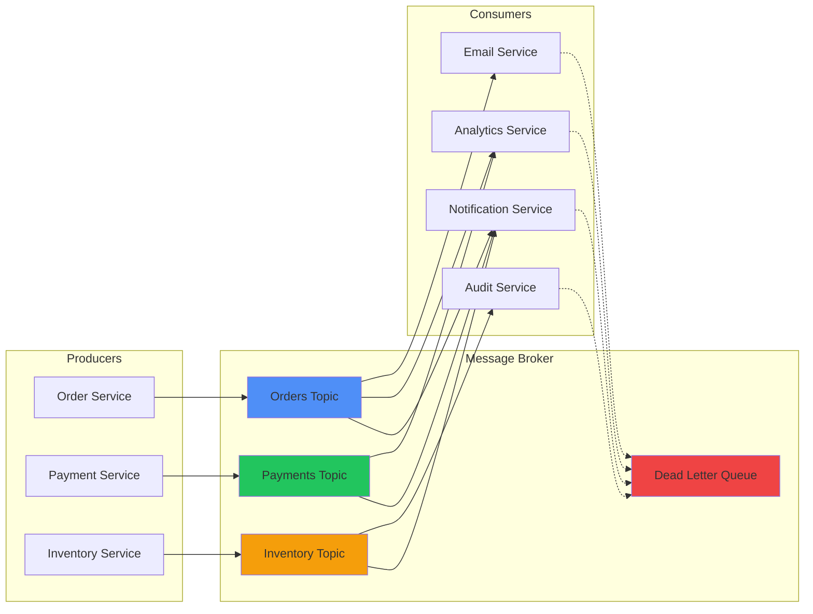

# Messaging & Queues

## Message Brokers Comparison

| **Broker**            | **Type**        | **Delivery Guarantee**      | **Ordering**          | **Throughput**          | **.NET Integration**         |
| --------------------- | --------------- | --------------------------- | --------------------- | ----------------------- | ---------------------------- |
| **RabbitMQ**          | Traditional     | At-least-once, exactly-once | FIFO per queue        | Medium (100K msg/sec)   | MassTransit, RabbitMQ.Client |
| **Azure Service Bus** | Cloud-native    | At-least-once, exactly-once | FIFO with sessions    | High (1M msg/sec)       | Azure.Messaging.ServiceBus   |
| **Apache Kafka**      | Event streaming | At-least-once, exactly-once | Per partition         | Very high (10M msg/sec) | Confluent.Kafka              |
| **Amazon SQS**        | Cloud-managed   | At-least-once               | FIFO queues available | High                    | AWSSDK.SQS                   |
| **Redis Streams**     | In-memory       | At-least-once               | Per stream            | Very high               | StackExchange.Redis          |

## Message Patterns

| **Patrón**              | **Descripción**                                   | **Casos de Uso**                    | **Implementación**           |
| ----------------------- | ------------------------------------------------- | ----------------------------------- | ---------------------------- |
| **Point-to-Point**      | Un productor → Una cola → Un consumidor           | Order processing, email sending     | Direct queue consumption     |
| **Publish-Subscribe**   | Un productor → Topic → Múltiples suscriptores     | Event notifications, logging        | Topic subscriptions          |
| **Request-Reply**       | Comunicación síncrona sobre infraestructura async | API calls over messaging            | Correlation ID + temp queues |
| **Scatter-Gather**      | Una request → Múltiples servicios → Agregación    | Price comparison, data aggregation  | Fan-out + fan-in             |
| **Competing Consumers** | Múltiples workers → Una cola                      | Load balancing, parallel processing | Multiple consumer instances  |

## MassTransit Implementation

```csharp
// Message definition
public record OrderCreated(Guid OrderId, string CustomerEmail, decimal Total);

// Consumer
public class OrderCreatedConsumer : IConsumer<OrderCreated>
{
    private readonly IEmailService _emailService;

    public OrderCreatedConsumer(IEmailService emailService)
    {
        _emailService = emailService;
    }

    public async Task Consume(ConsumeContext<OrderCreated> context)
    {
        var message = context.Message;

        await _emailService.SendOrderConfirmationAsync(
            message.CustomerEmail,
            message.OrderId,
            message.Total);
    }
}

// Configuration
services.AddMassTransit(x =>
{
    x.AddConsumer<OrderCreatedConsumer>();

    x.UsingRabbitMq((context, cfg) =>
    {
        cfg.Host("localhost", "/", h =>
        {
            h.Username("guest");
            h.Password("guest");
        });

        cfg.ConfigureEndpoints(context);
    });
});

// Publishing
public class OrderService
{
    private readonly IPublishEndpoint _publishEndpoint;

    public async Task CreateOrderAsync(CreateOrderRequest request)
    {
        // Business logic
        var order = new Order(request);
        await _repository.SaveAsync(order);

        // Publish event
        await _publishEndpoint.Publish(new OrderCreated(
            order.Id,
            order.CustomerEmail,
            order.Total));
    }
}
```

## Azure Service Bus Patterns

| **Feature**             | **Uso**                 | **Configuración**          | **Beneficio**         |
| ----------------------- | ----------------------- | -------------------------- | --------------------- |
| **Dead Letter Queue**   | Mensajes no procesables | MaxDeliveryCount           | Error handling        |
| **Session State**       | Procesamiento ordenado  | RequiresSession            | Message ordering      |
| **Duplicate Detection** | Idempotencia            | RequiresDuplicateDetection | Exactly-once delivery |
| **Message Deferral**    | Procesamiento futuro    | ScheduledEnqueueTime       | Delayed processing    |
| **Auto-forwarding**     | Message routing         | ForwardTo property         | Chain processing      |

## Error Handling Strategies

| **Estrategia**          | **Descripción**                | **Implementación**         | **Casos de Uso**         |
| ----------------------- | ------------------------------ | -------------------------- | ------------------------ |
| **Immediate Retry**     | Reintentar inmediatamente      | Try-catch with retry count | Transient network errors |
| **Exponential Backoff** | Espera incremental             | Polly RetryPolicy          | Service unavailable      |
| **Circuit Breaker**     | Stop processing after failures | Polly CircuitBreaker       | Downstream service down  |
| **Dead Letter Queue**   | Apartar mensajes problemáticos | Broker feature             | Poison messages          |
| **Compensation**        | Reversar operaciones           | Saga pattern               | Business logic errors    |

## Message Serialization Options

| **Format**           | **Size**   | **Speed** | **Human Readable** | **.NET Support** | **Schema Evolution** |
| -------------------- | ---------- | --------- | ------------------ | ---------------- | -------------------- |
| **JSON**             | Large      | Medium    | Yes                | Native           | Good with versioning |
| **MessagePack**      | Small      | Fast      | No                 | NuGet package    | Limited              |
| **Protocol Buffers** | Small      | Fast      | No                 | Google.Protobuf  | Excellent            |
| **Avro**             | Small      | Fast      | No                 | Apache.Avro      | Excellent            |
| **XML**              | Very large | Slow      | Yes                | Native           | Good                 |

## Kafka Implementation with .NET

```csharp
// Producer
public class KafkaOrderProducer
{
    private readonly IProducer<string, string> _producer;

    public KafkaOrderProducer()
    {
        var config = new ProducerConfig
        {
            BootstrapServers = "localhost:9092",
            ClientId = "order-service",
            Acks = Acks.All, // Wait for all replicas
            Retries = 3,
            EnableIdempotence = true
        };

        _producer = new ProducerBuilder<string, string>(config).Build();
    }

    public async Task PublishOrderAsync(Order order)
    {
        var message = new Message<string, string>
        {
            Key = order.CustomerId.ToString(), // Partition key
            Value = JsonSerializer.Serialize(order),
            Headers = new Headers
            {
                { "event-type", Encoding.UTF8.GetBytes("OrderCreated") },
                { "version", Encoding.UTF8.GetBytes("1.0") }
            }
        };

        var result = await _producer.ProduceAsync("orders", message);
        Console.WriteLine($"Message delivered to {result.TopicPartitionOffset}");
    }
}

// Consumer
public class KafkaOrderConsumer : BackgroundService
{
    private readonly IConsumer<string, string> _consumer;

    public KafkaOrderConsumer()
    {
        var config = new ConsumerConfig
        {
            BootstrapServers = "localhost:9092",
            GroupId = "inventory-service",
            AutoOffsetReset = AutoOffsetReset.Earliest,
            EnableAutoCommit = false
        };

        _consumer = new ConsumerBuilder<string, string>(config).Build();
    }

    protected override async Task ExecuteAsync(CancellationToken stoppingToken)
    {
        _consumer.Subscribe("orders");

        while (!stoppingToken.IsCancellationRequested)
        {
            try
            {
                var consumeResult = _consumer.Consume(stoppingToken);

                // Process message
                await ProcessOrderAsync(consumeResult.Message.Value);

                // Manual commit after successful processing
                _consumer.Commit(consumeResult);
            }
            catch (Exception ex)
            {
                // Log error, potentially send to DLQ
                Console.WriteLine($"Error processing message: {ex.Message}");
            }
        }
    }
}
```

## Background Job Processing

| **Library**          | **Persistence**     | **Scheduling**   | **Dashboard**   | **Reliability** | **Scaling**      |
| -------------------- | ------------------- | ---------------- | --------------- | --------------- | ---------------- |
| **Hangfire**         | SQL Server, Redis   | Cron expressions | Built-in web UI | High            | Multiple servers |
| **Quartz.NET**       | SQL Server, MongoDB | Cron expressions | Third-party     | Very high       | Clustered        |
| **Azure Functions**  | Managed             | Timer triggers   | Azure portal    | Very high       | Automatic        |
| **AWS SQS + Lambda** | Managed             | Event-driven     | CloudWatch      | Very high       | Automatic        |

## Message Durability & Persistence

| **Level**      | **Durability**   | **Performance** | **Use Case**              |
| -------------- | ---------------- | --------------- | ------------------------- |
| **In-Memory**  | Lost on restart  | Fastest         | Development, non-critical |
| **File-based** | Survives restart | Fast            | Single-node production    |
| **Database**   | High durability  | Medium          | Multi-node, transactional |
| **Replicated** | Very high        | Slower          | Mission-critical systems  |

## Monitoring & Observability

```csharp
// Custom metrics for message processing
public class MessageProcessingMetrics
{
    private readonly IMetrics _metrics;

    public MessageProcessingMetrics(IMetrics metrics)
    {
        _metrics = metrics;
    }

    public void RecordMessageProcessed(string messageType, string status, TimeSpan duration)
    {
        _metrics.Measure.Counter.Increment("messages_processed_total",
            new MetricTags("type", messageType, "status", status));

        _metrics.Measure.Histogram.Update("message_processing_duration",
            duration.TotalMilliseconds,
            new MetricTags("type", messageType));
    }

    public void RecordQueueDepth(string queueName, int depth)
    {
        _metrics.Measure.Gauge.SetValue("queue_depth", depth,
            new MetricTags("queue", queueName));
    }
}

// Usage in consumer
public async Task ProcessMessageAsync(Message message)
{
    var stopwatch = Stopwatch.StartNew();
    var status = "success";

    try
    {
        await HandleMessageAsync(message);
    }
    catch (Exception)
    {
        status = "error";
        throw;
    }
    finally
    {
        stopwatch.Stop();
        _metrics.RecordMessageProcessed(message.Type, status, stopwatch.Elapsed);
    }
}
```

## Message Versioning Strategies

| **Estrategia**          | **Compatibilidad** | **Complejidad** | **Performance** | **Ejemplo**                |
| ----------------------- | ------------------ | --------------- | --------------- | -------------------------- |
| **Schema Evolution**    | Forward/backward   | Media           | Alta            | Protobuf, Avro             |
| **Version Header**      | Full control       | Alta            | Media           | Message header versioning  |
| **Multiple Endpoints**  | Complete isolation | Baja            | Media           | `/v1/orders`, `/v2/orders` |
| **Message Translation** | Legacy support     | Alta            | Baja            | Transform old → new format |

## Saga Pattern Implementation

```csharp
// Saga state
public class OrderSagaState : SagaStateMachineInstance
{
    public Guid CorrelationId { get; set; }
    public string CurrentState { get; set; }
    public Guid OrderId { get; set; }
    public string PaymentId { get; set; }
    public string ShipmentId { get; set; }
}

// Saga definition
public class OrderSaga : MassTransitStateMachine<OrderSagaState>
{
    public State OrderCreated { get; private set; }
    public State PaymentProcessed { get; private set; }
    public State OrderCompleted { get; private set; }
    public State OrderFailed { get; private set; }

    public Event<OrderCreated> OrderCreatedEvent { get; private set; }
    public Event<PaymentProcessed> PaymentProcessedEvent { get; private set; }
    public Event<PaymentFailed> PaymentFailedEvent { get; private set; }

    public OrderSaga()
    {
        InstanceState(x => x.CurrentState);

        Initially(
            When(OrderCreatedEvent)
                .Then(context =>
                {
                    context.Instance.OrderId = context.Data.OrderId;
                })
                .Publish(context => new ProcessPayment(context.Instance.OrderId))
                .TransitionTo(OrderCreated));

        During(OrderCreated,
            When(PaymentProcessedEvent)
                .Then(context =>
                {
                    context.Instance.PaymentId = context.Data.PaymentId;
                })
                .Publish(context => new CreateShipment(context.Instance.OrderId))
                .TransitionTo(PaymentProcessed),

            When(PaymentFailedEvent)
                .Publish(context => new CancelOrder(context.Instance.OrderId))
                .TransitionTo(OrderFailed));
    }
}
```

## Performance Tuning Guidelines

| **Aspecto**            | **Configuración**         | **Impacto**     | **Trade-off** |
| ---------------------- | ------------------------- | --------------- | ------------- |
| **Batch Size**         | 10-100 messages           | Throughput ↑    | Latency ↑     |
| **Prefetch Count**     | 2x CPU cores              | CPU utilization | Memory usage  |
| **Connection Pooling** | Reuse connections         | Performance ↑   | Memory usage  |
| **Compression**        | Enable for large messages | Bandwidth ↓     | CPU usage ↑   |
| **Serialization**      | Binary formats            | Size ↓, Speed ↑ | Readability ↓ |

## Message Flow Architecture

**Arquitectura típica de messaging mostrando el flujo de mensajes entre producers, brokers y consumers.**
Este diagrama representa un patrón común de event-driven architecture con topics separados por dominio y dead letter queue para errores.
Esencial para entender cómo diseñar sistemas distribuidos resilientes con patrones de messaging asíncrono.



## Common Anti-Patterns

| **Anti-Pattern**           | **Problema**                   | **Solución**                     | **Impacto**             |
| -------------------------- | ------------------------------ | -------------------------------- | ----------------------- |
| **Synchronous Processing** | Blocking on message processing | Async/await, parallel processing | Performance degradation |
| **Large Message Payloads** | Network overhead               | Reference data, pagination       | Bandwidth, latency      |
| **No Error Handling**      | Silent failures                | Retry policies, DLQ              | Data loss               |
| **Tight Coupling**         | Direct service dependencies    | Event-driven architecture        | Maintainability         |
| **No Message Ordering**    | Race conditions                | Session-based processing         | Data consistency        |
