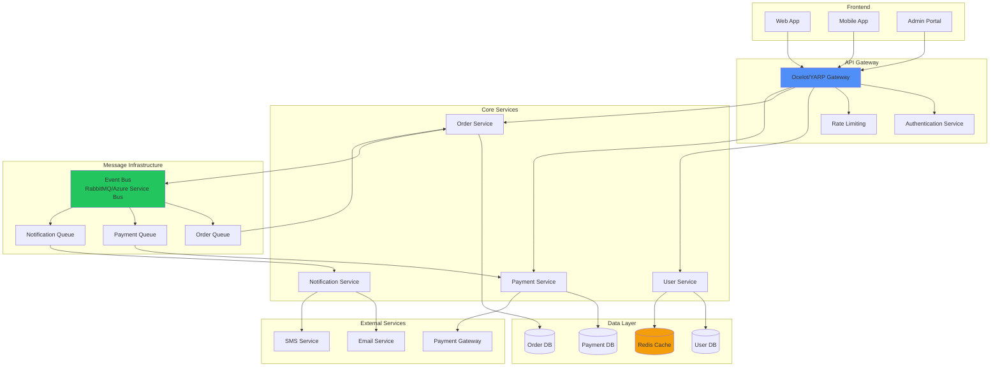
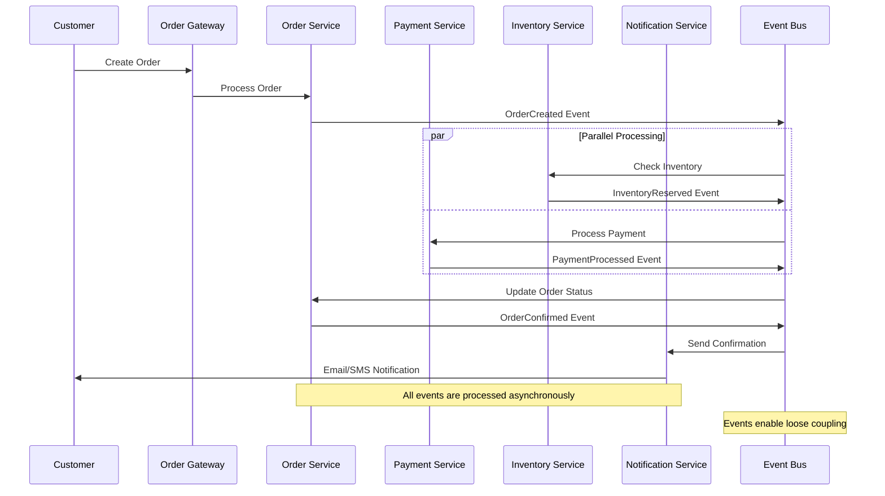

# Arquitecturas de Microservicios

## Patrones de Diseño Fundamentales

| **Patrón**          | **Propósito**                     | **Cuándo usar**                     | **Ejemplo en .NET**    |
| ------------------- | --------------------------------- | ----------------------------------- | ---------------------- |
| **API Gateway**     | Punto único de entrada            | Múltiples servicios backend         | Ocelot, YARP           |
| **Circuit Breaker** | Prevenir fallos en cascada        | Servicios con alta latencia         | Polly                  |
| **Bulkhead**        | Aislamiento de recursos           | Evitar que un servicio afecte otros | Thread pools separados |
| **Retry Pattern**   | Recuperación de fallos temporales | Errores de red transitorios         | Polly Retry Policy     |
| **Timeout Pattern** | Evitar esperas indefinidas        | Servicios lentos                    | HttpClient.Timeout     |

## Estrategias de Comunicación

| **Tipo**      | **Protocolo**   | **Ventajas**                   | **Desventajas**                   | **Caso de Uso**      |
| ------------- | --------------- | ------------------------------ | --------------------------------- | -------------------- |
| **Síncrona**  | HTTP/REST       | Simple, directo                | Acoplamiento, latencia            | CRUD operations      |
| **Síncrona**  | gRPC            | Alto rendimiento, tipado       | Complejidad                       | Comunicación interna |
| **Asíncrona** | Message Queue   | Desacoplamiento, escalabilidad | Complejidad, eventual consistency | Eventos de negocio   |
| **Asíncrona** | Event Streaming | Tiempo real, replay            | Overhead, complejidad             | Logs, métricas       |

## Patrones de Datos

| **Patrón**               | **Descripción**               | **Pros**                         | **Contras**                | **Implementación**            |
| ------------------------ | ----------------------------- | -------------------------------- | -------------------------- | ----------------------------- |
| **Database per Service** | Cada servicio su BD           | Autonomía, tecnología específica | Transacciones distribuidas | Entity Framework por servicio |
| **Shared Database**      | BD compartida                 | Transacciones ACID               | Acoplamiento               | No recomendado                |
| **Saga Pattern**         | Transacciones distribuidas    | Consistencia eventual            | Complejidad                | MassTransit, NServiceBus      |
| **CQRS**                 | Separar lectura/escritura     | Optimización específica          | Complejidad                | MediatR + separar modelos     |
| **Event Sourcing**       | Eventos como fuente de verdad | Auditoría completa               | Complejidad queries        | EventStore, Marten            |

## Técnicas de Deployment

| **Estrategia** | **Descripción**          | **Tiempo de Downtime** | **Riesgo** | **Rollback** |
| -------------- | ------------------------ | ---------------------- | ---------- | ------------ |
| **Blue-Green** | Dos entornos idénticos   | Cero                   | Bajo       | Inmediato    |
| **Canary**     | Despliegue gradual       | Cero                   | Muy bajo   | Gradual      |
| **Rolling**    | Actualización secuencial | Cero                   | Medio      | Manual       |
| **Recreation** | Parar y recrear          | Alto                   | Alto       | Manual       |

## Observabilidad y Monitoreo

| **Pilar**         | **Herramientas**      | **Métricas Clave**           | **Alertas Críticas** |
| ----------------- | --------------------- | ---------------------------- | -------------------- |
| **Logging**       | Serilog, ELK Stack    | Error rate, response time    | Error spikes         |
| **Metrics**       | Prometheus, Grafana   | CPU, Memory, Requests/sec    | Resource exhaustion  |
| **Tracing**       | Jaeger, Zipkin        | Request duration, span count | Slow requests        |
| **Health Checks** | ASP.NET Health Checks | Service availability         | Service down         |

## Arquitectura de Referencia

**Arquitectura completa de microservicios con API Gateway, servicios de dominio y infraestructura compartida.**
Este diagrama muestra una implementación típica con Ocelot/YARP como gateway, servicios independientes por dominio de negocio.
Incluye patrones esenciales como service discovery, circuit breaker, y observabilidad distribuida para sistemas enterprise.

## Configuración y Secrets Management

| **Herramienta**           | **Propósito**              | **Ventajas**         | **Casos de Uso**             |
| ------------------------- | -------------------------- | -------------------- | ---------------------------- |
| **Azure Key Vault**       | Gestión de secretos        | Seguridad, auditoría | Connection strings, API keys |
| **Configuration Server**  | Configuración centralizada | Consistencia         | Feature flags, settings      |
| **Environment Variables** | Configuración por entorno  | Simplicidad          | URLs, timeouts               |
| **HashiCorp Vault**       | Secretos enterprise        | Rotación automática  | Certificados, tokens         |

## Seguridad en Microservicios

| **Aspecto**            | **Implementación**         | **Herramientas**           | **Consideraciones**       |
| ---------------------- | -------------------------- | -------------------------- | ------------------------- |
| **Authentication**     | JWT, OAuth 2.0             | IdentityServer, Auth0      | Token expiration, refresh |
| **Authorization**      | Claims-based, RBAC         | ASP.NET Core Identity      | Granularidad de permisos  |
| **Inter-service Auth** | Service-to-service tokens  | Mutual TLS, JWT            | Certificate management    |
| **API Security**       | Rate limiting, validation  | Ocelot, custom middleware  | Input sanitization        |
| **Data Protection**    | Encryption at rest/transit | TLS, Azure Disk Encryption | Key rotation              |

## Testing Strategies

| **Tipo**              | **Scope**               | **Herramientas**     | **Velocidad** | **Confiabilidad** |
| --------------------- | ----------------------- | -------------------- | ------------- | ----------------- |
| **Unit Tests**        | Método/clase            | xUnit, NUnit         | 🚀 Muy rápida | ⭐⭐⭐            |
| **Integration Tests** | Servicio + dependencias | TestContainers       | 🐌 Lenta      | ⭐⭐⭐⭐          |
| **Contract Tests**    | API contracts           | Pact.NET             | 🚀 Rápida     | ⭐⭐⭐⭐          |
| **End-to-End Tests**  | Sistema completo        | Selenium, Playwright | 🐌 Muy lenta  | ⭐⭐⭐⭐⭐        |
| **Load Tests**        | Performance             | NBomber, k6          | 🐌 Lenta      | ⭐⭐⭐⭐          |

## Flujo de Eventos en Sistema E-commerce

**Diagrama de secuencia mostrando la comunicación entre microservicios durante el proceso de creación de una orden.**
Este ejemplo ilustra cómo los eventos fluyen asincrónicamente entre servicios usando un event bus (RabbitMQ/Kafka).
Demuestra patrones como saga, eventual consistency y compensating actions en un escenario real de e-commerce.

## Performance Benchmarks

| **Métrica**       | **Target** | **Good**  | **Needs Improvement** |
| ----------------- | ---------- | --------- | --------------------- |
| **Response Time** | < 200ms    | < 500ms   | > 1s                  |
| **Throughput**    | > 1000 RPS | > 500 RPS | < 100 RPS             |
| **Error Rate**    | < 0.1%     | < 1%      | > 5%                  |
| **CPU Usage**     | < 70%      | < 80%     | > 90%                 |
| **Memory Usage**  | < 80%      | < 90%     | > 95%                 |
| **Disk I/O**      | < 70%      | < 80%     | > 90%                 |

## Migration Strategies

| **Estrategia**     | **Descripción**      | **Riesgo** | **Duración**  | **Rollback** |
| ------------------ | -------------------- | ---------- | ------------- | ------------ |
| **Strangler Fig**  | Migración gradual    | Bajo       | Meses/años    | Fácil        |
| **Big Bang**       | Migración completa   | Alto       | Días/semanas  | Difícil      |
| **Parallel Run**   | Sistemas en paralelo | Medio      | Semanas/meses | Fácil        |
| **Database First** | Migrar BD primero    | Medio      | Semanas       | Medio        |
