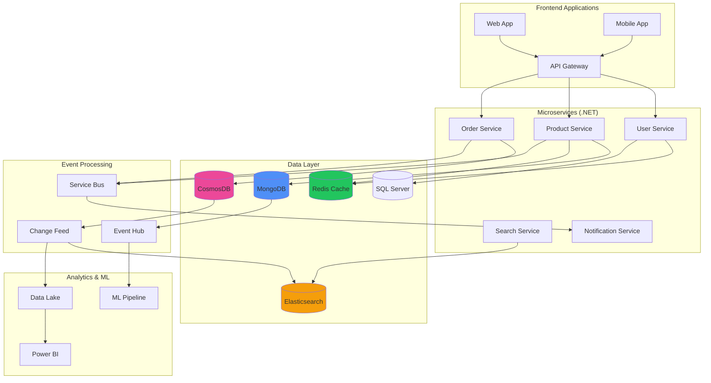

# Contexto y Propósito

## ¿Qué es?
NoSQL (Not Only SQL) es una categoría de bases de datos que incluye documentos (MongoDB), clave-valor (Redis), grafos (Neo4j) y columnas (Cassandra). En .NET se usan con drivers oficiales y permiten persistencia flexible y escalable en arquitecturas modernas.

## ¿Por qué?
Porque SQL no siempre es suficiente: algunos escenarios requieren escalabilidad horizontal, baja latencia o datos semi-estructurados. En mi experiencia, NoSQL fue clave para soportar catálogos masivos en retail, caching distribuido en municipalidades y replicación global en banca.

## ¿Para qué?
- **Manejar datos semi-estructurados** en JSON o documentos.  
- **Escalar horizontalmente** con sharding y replicación.  
- **Reducir latencia** con cachés distribuidos en Redis.  
- **Habilitar búsqueda avanzada** con Elasticsearch.  

## Valor agregado desde la experiencia
- Usar **MongoDB con índices compuestos** aceleró búsquedas en catálogos con millones de productos.  
- **Redis con locks distribuidos** resolvió condiciones de carrera en sistemas multiusuario.  
- **Cosmos DB** permitió replicación multi-región con consistencia configurable.  
- **Elasticsearch** mejoró búsquedas en catálogos con filtros y autocompletado en tiempo real.  

# NoSQL con .NET

**Guía completa de bases de datos NoSQL para desarrollo .NET con ejemplos prácticos y casos de uso reales.**
Esta referencia cubre desde MongoDB y Redis hasta CosmosDB y Elasticsearch con integración nativa .NET.
Esencial para desarrolladores .NET que implementan soluciones polyglot persistence y arquitecturas distribuidas modernas.

## 💡 Cuándo usar NoSQL vs SQL

**Comparación directa entre bases de datos NoSQL y SQL con criterios de decisión para proyectos .NET.**
Esta tabla ayuda a seleccionar la tecnología de persistencia más apropiada según requerimientos específicos del proyecto.
Fundamental para arquitectos que diseñan sistemas escalables con múltiples tipos de datos y patrones de acceso.

| **Criterio**             | **NoSQL**                             | **SQL**                                 | **Recomendación .NET**                      |
| ------------------------ | ------------------------------------- | --------------------------------------- | -------------------------------------------- |
| **Estructura de Datos**  | Semi-estructurados, JSON, documentos  | Estructurados, relaciones definidas     | NoSQL para APIs REST, SQL para transacciones |
| **Escalabilidad**        | Horizontal (sharding natural)         | Vertical (principalmente)               | NoSQL para microservicios distribuidos      |
| **Consistencia**         | Eventual (BASE)                       | Fuerte (ACID)                           | SQL para finanzas, NoSQL para social media  |
| **Desarrollo Rápido**    | Schema-less, cambios frecuentes       | Schema fijo, migraciones controladas    | NoSQL para MVP, SQL para sistemas maduros   |
| **Queries Complejas**    | Limitadas, mapeo manual               | SQL estándar, JOINs complejos           | SQL + Entity Framework para reporting       |
| **Performance**          | Lecturas masivas, cache distribuido   | Transacciones ACID, integridad          | Redis para cache, SQL para consistencia     |

## MongoDB con .NET

**Implementación completa de MongoDB en aplicaciones .NET usando el driver oficial con patrones y mejores prácticas.**
Esta sección cubre desde configuración básica hasta agregaciones complejas con ejemplos de código C# optimizados.
Crítica para desarrolladores que migran de Entity Framework hacia document stores o implementan arquitecturas híbridas.

| **Operación**           | **Código .NET**                                                                                                      | **Caso de Uso**                         | **Performance Tips**                  |
| ----------------------- | -------------------------------------------------------------------------------------------------------------------- | ---------------------------------------- | ------------------------------------- |
| **Setup & Conexión**   | `var client = new MongoClient("mongodb://localhost:27017"); var database = client.GetDatabase("ecommerce");`        | Configuración inicial                    | Connection pooling automático         |
| **Insertar Documento** | `var collection = database.GetCollection＜Product＞("products"); await collection.InsertOneAsync(newProduct);`        | Crear productos, usuarios                | Use InsertManyAsync para bulk         |
| **Buscar por ID**       | `var product = await collection.Find(x =＞ x.Id == productId).FirstOrDefaultAsync();`                                | Detalles de producto                     | Index en _id automático               |
| **Buscar con Filtros**  | `var products = await collection.Find(x =＞ x.Category == "Electronics" && x.Price ＜ 1000).ToListAsync();`           | Catálogo con filtros                     | Compound indexes en campos frecuentes |
| **Actualizar**          | `await collection.UpdateOneAsync(x =＞ x.Id == id, Builders＜Product＞.Update.Set(x =＞ x.Stock, newStock));`           | Actualizar inventario                    | Use UpdateMany para bulk operations   |
| **Agregaciones**        | `var pipeline = new[] { new BsonDocument("$group", new BsonDocument { {"_id", "$category"}, {"total", new BsonDocument("$sum", "$price")} }) };` | Reports por categoría                    | Use indexes en campos de agrupación   |

### Configuración MongoDB en .NET

```csharp
// Startup.cs / Program.cs
public void ConfigureServices(IServiceCollection services)
{
    // Configuración MongoDB
    services.Configure＜MongoDbSettings＞(Configuration.GetSection("MongoDb"));
    
    services.AddSingleton＜IMongoClient＞(serviceProvider =＞
    {
        var settings = serviceProvider.GetService＜IOptions＜MongoDbSettings＞＞().Value;
        return new MongoClient(settings.ConnectionString);
    });
    
    services.AddScoped(serviceProvider =＞
    {
        var client = serviceProvider.GetService＜IMongoClient＞();
        var settings = serviceProvider.GetService＜IOptions＜MongoDbSettings＞＞().Value;
        return client.GetDatabase(settings.DatabaseName);
    });
    
    // Repository pattern
    services.AddScoped＜IProductRepository, ProductRepository＞();
}

// Models
public class Product
{
    [BsonId]
    [BsonRepresentation(BsonType.ObjectId)]
    public string Id { get; set; }
    
    public string Name { get; set; }
    public decimal Price { get; set; }
    public string Category { get; set; }
    public int Stock { get; set; }
    public List＜string＞ Tags { get; set; } = new();
    public DateTime CreatedAt { get; set; } = DateTime.UtcNow;
    
    [BsonExtraElements]
    public Dictionary＜string, object＞ AdditionalData { get; set; } = new();
}

// Repository Implementation
public class ProductRepository : IProductRepository
{
    private readonly IMongoCollection＜Product＞ _products;
    
    public ProductRepository(IMongoDatabase database)
    {
        _products = database.GetCollection＜Product＞("products");
        
        // Crear índices
        CreateIndexes();
    }
    
    private void CreateIndexes()
    {
        var indexKeys = Builders＜Product＞.IndexKeys
            .Ascending(x =＞ x.Category)
            .Ascending(x =＞ x.Price);
        
        var indexModel = new CreateIndexModel＜Product＞(indexKeys);
        _products.Indexes.CreateOne(indexModel);
    }
    
    public async Task＜Product＞ GetByIdAsync(string id)
    {
        return await _products.Find(x =＞ x.Id == id).FirstOrDefaultAsync();
    }
    
    public async Task＜List＜Product＞＞ GetByCategoryAsync(string category, int page = 1, int size = 20)
    {
        return await _products
            .Find(x =＞ x.Category == category)
            .Skip((page - 1) * size)
            .Limit(size)
            .ToListAsync();
    }
    
    public async Task＜Product＞ CreateAsync(Product product)
    {
        await _products.InsertOneAsync(product);
        return product;
    }
    
    public async Task＜bool＞ UpdateStockAsync(string id, int newStock)
    {
        var result = await _products.UpdateOneAsync(
            x =＞ x.Id == id,
            Builders＜Product＞.Update.Set(x =＞ x.Stock, newStock)
        );
        
        return result.ModifiedCount ＞ 0;
    }
}
```

## Redis con .NET

**Implementación de Redis como cache distribuido y almacén de sesiones en aplicaciones .NET con StackExchange.Redis.**
Esta tabla presenta patrones comunes de uso de Redis para mejorar performance y escalabilidad de aplicaciones web.
Fundamental para aplicaciones de alto tráfico que requieren respuesta sub-segundo y state management distribuido.

| **Patrón**                | **Implementación .NET**                                                                                             | **Caso de Uso**                    | **TTL Recomendado**     |
| ------------------------- | ------------------------------------------------------------------------------------------------------------------- | ----------------------------------- | ----------------------- |
| **Cache Aside**           | `var cached = await cache.GetStringAsync(key); if (cached == null) { var data = await GetFromDb(); await cache.SetStringAsync(key, data, TimeSpan.FromMinutes(30)); }` | Cache de productos, usuarios        | 15-60 minutos           |
| **Session Storage**       | `services.AddStackExchangeRedisCache(options =＞ options.Configuration = "localhost:6379"); services.AddSession(options =＞ options.IdleTimeout = TimeSpan.FromMinutes(30));` | Estado de usuario web               | 20-30 minutos           |
| **Distributed Lock**      | `var lockKey = $"lock:{resource}"; var lockValue = Guid.NewGuid().ToString(); var acquired = await database.StringSetAsync(lockKey, lockValue, TimeSpan.FromSeconds(30), When.NotExists);` | Prevenir condiciones de carrera     | 30-300 segundos         |
| **Rate Limiting**         | `var key = $"rate_limit:{userId}"; var current = await database.StringIncrementAsync(key); if (current == 1) await database.KeyExpireAsync(key, TimeSpan.FromMinutes(1));` | API throttling                      | 1-60 minutos            |
| **Real-time Messaging**   | `await subscriber.PublishAsync("notifications", JsonSerializer.Serialize(notification)); await subscriber.SubscribeAsync("notifications", (channel, message) =＞ ProcessNotification(message));` | Chat, notificaciones push           | No TTL (pub/sub)        |
| **Leaderboards**          | `await database.SortedSetAddAsync("leaderboard", userId, score); var topPlayers = await database.SortedSetRangeByRankAsync("leaderboard", 0, 9, Order.Descending);` | Gaming, rankings                    | 1-24 horas              |

### Configuración Redis Completa

```csharp
// Startup.cs configuración avanzada
public void ConfigureServices(IServiceCollection services)
{
    // Redis como cache distribuido
    services.AddStackExchangeRedisCache(options =＞
    {
        options.Configuration = Configuration.GetConnectionString("Redis");
        options.InstanceName = "MyApp";
    });
    
    // Redis connection directo para operaciones avanzadas
    services.AddSingleton＜IConnectionMultiplexer＞(provider =＞
    {
        var connectionString = Configuration.GetConnectionString("Redis");
        return ConnectionMultiplexer.Connect(connectionString);
    });
    
    services.AddScoped＜ICacheService, CacheService＞();
    services.AddScoped＜IRateLimitService, RateLimitService＞();
}

// Service implementation
public class CacheService : ICacheService
{
    private readonly IDistributedCache _cache;
    private readonly IDatabase _database;
    
    public CacheService(IDistributedCache cache, IConnectionMultiplexer redis)
    {
        _cache = cache;
        _database = redis.GetDatabase();
    }
    
    public async Task＜T＞ GetOrSetAsync＜T＞(string key, Func＜Task＜T＞＞ getItem, TimeSpan? expiry = null)
    {
        var cachedValue = await _cache.GetStringAsync(key);
        
        if (cachedValue != null)
        {
            return JsonSerializer.Deserialize＜T＞(cachedValue);
        }
        
        var item = await getItem();
        var serialized = JsonSerializer.Serialize(item);
        
        var options = new DistributedCacheEntryOptions();
        if (expiry.HasValue)
            options.SetAbsoluteExpiration(expiry.Value);
            
        await _cache.SetStringAsync(key, serialized, options);
        return item;
    }
    
    public async Task RemoveByPatternAsync(string pattern)
    {
        var server = _database.Multiplexer.GetServer(_database.Multiplexer.GetEndPoints()[0]);
        var keys = server.Keys(pattern: pattern);
        
        foreach (var key in keys)
        {
            await _database.KeyDeleteAsync(key);
        }
    }
}

// Rate limiting service
public class RateLimitService : IRateLimitService
{
    private readonly IDatabase _database;
    
    public RateLimitService(IConnectionMultiplexer redis)
    {
        _database = redis.GetDatabase();
    }
    
    public async Task＜bool＞ IsAllowedAsync(string identifier, int maxRequests, TimeSpan window)
    {
        var key = $"rate_limit:{identifier}";
        var current = await _database.StringIncrementAsync(key);
        
        if (current == 1)
        {
            await _database.KeyExpireAsync(key, window);
        }
        
        return current ＜= maxRequests;
    }
}
```

## CosmosDB con .NET

**Implementación de Azure CosmosDB con el SDK .NET incluyendo partitioning, consistency levels y cross-region replication.**
Esta tabla cubre desde operaciones básicas hasta patrones avanzados de escalabilidad global con ejemplos optimizados.
Esencial para aplicaciones cloud-native que requieren distribución global y múltiples modelos de datos.

| **Operación**              | **Código .NET**                                                                                                    | **Consistency Level**   | **RU Cost**      |
| -------------------------- | ------------------------------------------------------------------------------------------------------------------ | ------------------------ | ---------------- |
| **Setup Cliente**          | `var client = new CosmosClient(connectionString, new CosmosClientOptions { ConsistencyLevel = ConsistencyLevel.Session });` | Session (default)        | N/A              |
| **Create/Upsert**          | `var response = await container.UpsertItemAsync(item, new PartitionKey(item.CategoryId));`                        | Session                  | 5-10 RUs         |
| **Point Read**             | `var response = await container.ReadItemAsync＜Product＞(id, new PartitionKey(categoryId));`                        | Strong/Session           | 1 RU             |
| **Query con filtros**      | `var query = container.GetItemQueryIterator＜Product＞("SELECT * FROM c WHERE c.category = @cat AND c.price ＜ @price", requestOptions: new QueryRequestOptions { PartitionKey = new PartitionKey(category) });` | Session                  | 2-20 RUs         |
| **Cross-partition Query**  | `var query = container.GetItemQueryIterator＜Product＞("SELECT * FROM c WHERE c.price ＞ 1000");`                   | Session                  | 5-100+ RUs       |
| **Stored Procedure**       | `var response = await container.Scripts.ExecuteStoredProcedureAsync＜dynamic＞("bulkUpdate", new PartitionKey(categoryId), new[] { updateData });` | Strong                   | Variable         |
| **Change Feed**            | `var processor = container.GetChangeFeedProcessorBuilder＜Product＞("myProcessor", HandleChangesAsync).WithInstanceName("consumerInstance").WithLeaseContainer(leaseContainer).Build();` | Strong                   | 1-2 RUs per item |

### Configuración CosmosDB Avanzada

```csharp
// Models con partitioning strategy
public class Product
{
    [JsonPropertyName("id")]
    public string Id { get; set; } = Guid.NewGuid().ToString();
    
    [JsonPropertyName("categoryId")]
    public string CategoryId { get; set; } // Partition Key
    
    [JsonPropertyName("name")]
    public string Name { get; set; }
    
    [JsonPropertyName("price")]
    public decimal Price { get; set; }
    
    [JsonPropertyName("_etag")]
    public string ETag { get; set; }
    
    [JsonPropertyName("ttl")]
    public int? TimeToLive { get; set; } // Auto-expire después de X segundos
}

// Repository con optimizaciones
public class CosmosProductRepository : IProductRepository
{
    private readonly Container _container;
    
    public CosmosProductRepository(CosmosClient client)
    {
        var database = client.GetDatabase("ecommerce");
        _container = database.GetContainer("products");
    }
    
    // Point read - más eficiente (1 RU)
    public async Task＜Product＞ GetByIdAsync(string id, string categoryId)
    {
        try
        {
            var response = await _container.ReadItemAsync＜Product＞(
                id, 
                new PartitionKey(categoryId)
            );
            return response.Resource;
        }
        catch (CosmosException ex) when (ex.StatusCode == HttpStatusCode.NotFound)
        {
            return null;
        }
    }
    
    // Query optimizada para single partition
    public async Task＜List＜Product＞＞ GetByCategoryAsync(string categoryId, decimal? maxPrice = null)
    {
        var queryDefinition = new QueryDefinition(
            "SELECT * FROM c WHERE c.categoryId = @categoryId AND (@maxPrice IS NULL OR c.price ＜= @maxPrice)"
        )
        .WithParameter("@categoryId", categoryId)
        .WithParameter("@maxPrice", maxPrice);
        
        var queryOptions = new QueryRequestOptions
        {
            PartitionKey = new PartitionKey(categoryId),
            MaxItemCount = 100
        };
        
        var products = new List＜Product＞();
        using var iterator = _container.GetItemQueryIterator＜Product＞(queryDefinition, requestOptions: queryOptions);
        
        while (iterator.HasMoreResults)
        {
            var response = await iterator.ReadNextAsync();
            products.AddRange(response);
            
            // Log RU consumption
            Console.WriteLine($"RU Charged: {response.RequestCharge}");
        }
        
        return products;
    }
    
    // Bulk operations para mejor throughput
    public async Task＜List＜Product＞＞ CreateManyAsync(List＜Product＞ products)
    {
        var tasks = products.Select(async product =＞
        {
            return await _container.UpsertItemAsync(product, new PartitionKey(product.CategoryId));
        });
        
        var responses = await Task.WhenAll(tasks);
        return responses.Select(r =＞ r.Resource).ToList();
    }
    
    // Change feed processor
    public async Task StartChangeFeedProcessorAsync()
    {
        var leaseContainer = _container.Database.GetContainer("leases");
        
        var processor = _container
            .GetChangeFeedProcessorBuilder＜Product＞("productProcessor", HandleProductChangesAsync)
            .WithInstanceName(Environment.MachineName)
            .WithLeaseContainer(leaseContainer)
            .WithPollInterval(TimeSpan.FromSeconds(5))
            .WithStartTime(DateTime.UtcNow.AddMinutes(-5))
            .Build();
        
        await processor.StartAsync();
    }
    
    private async Task HandleProductChangesAsync(
        ChangeFeedProcessorContext context,
        IReadOnlyCollection＜Product＞ changes,
        CancellationToken cancellationToken)
    {
        foreach (var product in changes)
        {
            // Update search index, send notifications, etc.
            await UpdateSearchIndexAsync(product);
            await PublishProductChangeEventAsync(product);
        }
    }
}
```

## Elasticsearch con .NET

**Integración de Elasticsearch para full-text search y analytics usando NEST client con mappings optimizados.**
Esta tabla presenta implementaciones de búsqueda avanzada, agregaciones y análisis de datos para aplicaciones .NET.
Crítica para e-commerce, sistemas de documentación y cualquier aplicación que requiera búsquedas complejas y análisis en tiempo real.

| **Operación**               | **Código .NET**                                                                                                     | **Caso de Uso**                    | **Performance Tips**               |
| --------------------------- | ------------------------------------------------------------------------------------------------------------------- | ----------------------------------- | ---------------------------------- |
| **Setup & Mapping**         | `var settings = new ConnectionSettings(new Uri("http://localhost:9200")).DefaultIndex("products"); var client = new ElasticClient(settings);` | Configuración inicial               | Use connection pooling             |
| **Index Document**          | `await client.IndexDocumentAsync(product);`                                                                        | Agregar productos al índice         | Bulk operations para volumen       |
| **Full-Text Search**        | `var response = await client.SearchAsync＜Product＞(s =＞ s.Query(q =＞ q.MultiMatch(m =＞ m.Fields(f =＞ f.Field(p =＞ p.Name).Field(p =＞ p.Description)).Query("smartphone"))));` | Búsqueda de productos               | Analyze y tokenize text fields     |
| **Filters & Aggregations**  | `var response = await client.SearchAsync＜Product＞(s =＞ s.Query(q =＞ q.Bool(b =＞ b.Filter(f =＞ f.Range(r =＞ r.Field(p =＞ p.Price).GreaterThanOrEquals(100).LessThanOrEquals(500))))).Aggregations(a =＞ a.Terms("categories", t =＞ t.Field(p =＞ p.Category))));` | Faceted search, analytics           | Use filters instead of queries     |
| **Autocomplete**            | `var response = await client.SearchAsync＜Product＞(s =＞ s.Suggest(su =＞ su.Completion("suggest", c =＞ c.Field(p =＞ p.NameSuggest).Prefix(term).Size(10))));` | Search suggestions                  | Dedicated completion field         |
| **Geospatial Search**       | `var response = await client.SearchAsync＜Store＞(s =＞ s.Query(q =＞ q.GeoDistance(g =＞ g.Field(p =＞ p.Location).Distance("5km").Location(userLat, userLon))));` | Store locator                       | Use geo_point mapping              |

### Configuración Elasticsearch Completa

```csharp
// Models con mappings optimizados
[ElasticsearchType(RelationName = "product")]
public class ProductDocument
{
    [Text(Name = "id")]
    public string Id { get; set; }
    
    [Text(Name = "name", Analyzer = "standard")]
    public string Name { get; set; }
    
    [Text(Name = "description", Analyzer = "standard")]
    public string Description { get; set; }
    
    [Keyword(Name = "category")]
    public string Category { get; set; }
    
    [Number(Name = "price", NumberType.Double)]
    public decimal Price { get; set; }
    
    [Number(Name = "stock", NumberType.Integer)]
    public int Stock { get; set; }
    
    [Keyword(Name = "tags")]
    public List＜string＞ Tags { get; set; }
    
    [Date(Name = "created_at")]
    public DateTime CreatedAt { get; set; }
    
    [Completion(Name = "name_suggest")]
    public CompletionField NameSuggest { get; set; }
    
    [Number(Name = "popularity_score", NumberType.Double)]
    public double PopularityScore { get; set; }
}

// Search service implementation
public class ElasticsearchService : ISearchService
{
    private readonly IElasticClient _client;
    
    public ElasticsearchService(IElasticClient client)
    {
        _client = client;
    }
    
    public async Task＜bool＞ CreateIndexAsync()
    {
        var response = await _client.Indices.CreateAsync("products", c =＞ c
            .Map＜ProductDocument＞(m =＞ m
                .AutoMap()
                .Properties(p =＞ p
                    .Text(t =＞ t
                        .Name(n =＞ n.Name)
                        .Analyzer("standard")
                        .Fields(f =＞ f
                            .Keyword(k =＞ k.Name("keyword"))
                        )
                    )
                    .Text(t =＞ t
                        .Name(n =＞ n.Description)
                        .Analyzer("standard")
                    )
                    .Completion(c =＞ c
                        .Name(n =＞ n.NameSuggest)
                        .Contexts(ctx =＞ ctx
                            .Category(cat =＞ cat
                                .Name("category")
                                .Path(p =＞ p.Category)
                            )
                        )
                    )
                )
            )
            .Settings(s =＞ s
                .NumberOfShards(1)
                .NumberOfReplicas(1)
                .Analysis(a =＞ a
                    .Analyzers(an =＞ an
                        .Custom("product_analyzer", ca =＞ ca
                            .Tokenizer("standard")
                            .Filters("lowercase", "stop", "snowball")
                        )
                    )
                )
            )
        );
        
        return response.IsValid;
    }
    
    public async Task＜SearchResult＜ProductDocument＞＞ SearchProductsAsync(SearchRequest request)
    {
        var searchResponse = await _client.SearchAsync＜ProductDocument＞(s =＞ s
            .Index("products")
            .From(request.From)
            .Size(request.Size)
            .Query(q =＞ BuildQuery(request))
            .Aggregations(a =＞ BuildAggregations(request))
            .Sort(so =＞ BuildSort(request))
            .Highlight(h =＞ h
                .Fields(f =＞ f
                    .Field(p =＞ p.Name)
                    .Field(p =＞ p.Description)
                )
            )
        );
        
        return new SearchResult＜ProductDocument＞
        {
            Items = searchResponse.Documents.ToList(),
            Total = searchResponse.Total,
            Aggregations = ExtractAggregations(searchResponse.Aggregations),
            Suggestions = ExtractSuggestions(searchResponse)
        };
    }
    
    private QueryContainer BuildQuery(SearchRequest request)
    {
        var queries = new List＜QueryContainer＞();
        
        // Full-text search
        if (!string.IsNullOrEmpty(request.Query))
        {
            queries.Add(new MultiMatchQuery
            {
                Query = request.Query,
                Fields = new[] { "name^2", "description", "tags" },
                Type = TextQueryType.BestFields,
                Fuzziness = Fuzziness.Auto
            });
        }
        
        // Filters
        var filters = new List＜QueryContainer＞();
        
        if (request.Categories?.Any() == true)
        {
            filters.Add(new TermsQuery
            {
                Field = "category",
                Terms = request.Categories
            });
        }
        
        if (request.PriceRange != null)
        {
            filters.Add(new NumericRangeQuery
            {
                Field = "price",
                GreaterThanOrEqualTo = request.PriceRange.Min,
                LessThanOrEqualTo = request.PriceRange.Max
            });
        }
        
        if (request.InStock)
        {
            filters.Add(new NumericRangeQuery
            {
                Field = "stock",
                GreaterThan = 0
            });
        }
        
        // Combine queries
        if (queries.Any() && filters.Any())
        {
            return new BoolQuery
            {
                Must = queries,
                Filter = filters
            };
        }
        
        if (queries.Any())
        {
            return new BoolQuery { Must = queries };
        }
        
        if (filters.Any())
        {
            return new BoolQuery { Filter = filters };
        }
        
        return new MatchAllQuery();
    }
    
    public async Task＜List＜string＞＞ GetSuggestionsAsync(string term, string category = null)
    {
        var response = await _client.SearchAsync＜ProductDocument＞(s =＞ s
            .Index("products")
            .Size(0)
            .Suggest(su =＞ su
                .Completion("product-suggest", c =＞ c
                    .Field(f =＞ f.NameSuggest)
                    .Prefix(term)
                    .Size(10)
                    .Contexts(ctx =＞
                    {
                        if (!string.IsNullOrEmpty(category))
                        {
                            ctx.Add("category", category);
                        }
                        return ctx;
                    })
                )
            )
        );
        
        return response.Suggest["product-suggest"]
            .SelectMany(s =＞ s.Options)
            .Select(o =＞ o.Text)
            .ToList();
    }
}
```

## Patrones de Arquitectura NoSQL en .NET

**Patrones arquitecturales comunes para implementar soluciones NoSQL escalables en ecosistemas .NET.**
Esta tabla presenta estrategias probadas para combinar diferentes tecnologías NoSQL según requisitos específicos.
Fundamental para arquitectos que diseñan sistemas distribuidos con múltiples fuentes de datos y alta concurrencia.

| **Patrón**                  | **Tecnologías**                | **Implementación .NET**                                                  | **Casos de Uso**                     | **Complejidad** |
| --------------------------- | ------------------------------- | ------------------------------------------------------------------------ | ------------------------------------- | --------------- |
| **CQRS + Event Sourcing**   | CosmosDB + Event Store + Redis  | Mediator pattern, eventos inmutables, read models materialized          | Banking, audit trails, compliance     | Alta            |
| **Cache-Aside Pattern**     | SQL Server + Redis              | IMemoryCache + IDistributedCache, fallback automático                   | E-commerce, aplicaciones web          | Media           |
| **Database per Service**    | MongoDB + CosmosDB + Redis      | Microservices con repositories específicos                              | Arquitectura de microservicios        | Alta            |
| **Polyglot Persistence**    | SQL + Document + Search + Cache | Repository abstraction, factory pattern, dependency injection           | Aplicaciones enterprise complejas     | Muy Alta        |
| **Saga Pattern**            | Service Bus + CosmosDB          | Orchestration-based o choreography-based workflows                      | Transacciones distribuidas             | Alta            |
| **Materialized View**       | Elasticsearch + Change Streams  | Event-driven updates, eventual consistency                               | Reporting, analytics en tiempo real   | Media-Alta      |

## Diagram arquitectura NoSQL Híbrida

**Arquitectura de referencia para aplicaciones .NET que combinan múltiples tecnologías NoSQL con patrones de integración.**
Este diagrama muestra cómo integrar MongoDB, Redis, Elasticsearch y CosmosDB en una solución distribuida coherente.
Esencial para entender el flujo de datos y los puntos de sincronización en arquitecturas polyglot persistence modernas.



## Performance Optimization NoSQL

**Estrategias específicas de optimización para cada tecnología NoSQL con métricas y mejores prácticas .NET.**
Esta tabla presenta técnicas probadas para maximizar throughput y minimizar latencia en aplicaciones NoSQL de alto rendimiento.
Crítica para aplicaciones que manejan millones de operaciones por día y requieren respuesta consistente bajo carga variable.

| **Tecnología** | **Optimización**           | **Implementación**                                     | **Impacto**     | **Consideraciones**          |
| -------------- | -------------------------- | ------------------------------------------------------ | --------------- | ---------------------------- |
| **MongoDB**    | Compound Indexes           | `CreateIndex({"category": 1, "price": 1, "stock": 1})` | 🚀 Muy Alto     | Index size vs query patterns |
| **MongoDB**    | Connection Pooling         | `MaxConnectionPoolSize=100, MaxConnecting=5`          | ⚡ Alto         | Monitor connection usage     |
| **Redis**      | Pipeline Operations        | `var batch = database.CreateBatch(); // bulk ops`      | 🚀 Muy Alto     | Network round trips          |
| **Redis**      | Memory Optimization        | `maxmemory-policy=allkeys-lru, compression=yes`       | 📊 Medio        | Memory vs CPU trade-off      |
| **CosmosDB**   | Partition Key Strategy     | Hot partition detection, even distribution             | 🚀 Muy Alto     | Query patterns analysis      |
| **CosmosDB**   | Point Reads vs Queries     | Use ReadItemAsync when possible                        | ⚡ Alto         | 1 RU vs 5-100+ RUs          |
| **Elasticsearch** | Bulk Indexing           | `BulkDescriptor` with optimal batch sizes             | 🚀 Muy Alto     | Index refresh intervals      |
| **Elasticsearch** | Shard Strategy           | Right-size shards, avoid over-sharding                | ⚡ Alto         | Data distribution            |

## Monitoreo y Observabilidad NoSQL

**Métricas clave y herramientas de monitoreo específicas para tecnologías NoSQL en aplicaciones .NET.**
Esta tabla define qué monitorear para mantener sistemas NoSQL saludables y detectar problemas antes de impacto en usuarios.
Fundamental para equipos de operaciones que mantienen sistemas distribuidos con múltiples tecnologías de persistencia.

| **Tecnología** | **Métricas Críticas**                     | **Herramientas .NET**          | **Alertas Recomendadas**         | **Thresholds**      |
| -------------- | ------------------------------------------ | ------------------------------- | -------------------------------- | ------------------- |
| **MongoDB**    | Slow queries, connection count, disk I/O   | MongoDB.Driver.Core logging     | Slow queries ＞ 100ms             | ＜ 80% max connections |
| **Redis**      | Memory usage, hit ratio, evicted keys      | StackExchange.Redis metrics     | Memory ＞ 80%, hit ratio ＜ 95%    | Evictions ＞ 0       |
| **CosmosDB**   | RU consumption, throttling, latency        | Application Insights, Azure Monitor | Throttling events, high RU cost | P99 latency ＜ 10ms  |
| **Elasticsearch** | JVM heap, query latency, index rate    | Elastic APM .NET agent         | Heap ＞ 75%, slow queries ＞ 1s   | Index rate stability |

## Casos de Uso Reales NoSQL + .NET

**Ejemplos específicos de implementaciones NoSQL exitosas en diferentes dominios de aplicación .NET.**
Esta tabla presenta casos de estudio con arquitecturas específicas y lecciones aprendidas en implementaciones reales.
Invaluable para tomar decisiones arquitecturales basadas en experiencias probadas en producción.

| **Dominio**        | **Arquitectura**                          | **Tecnologías**                  | **Beneficios Obtenidos**                      | **Lecciones Aprendidas**                |
| ------------------ | ------------------------------------------ | -------------------------------- | ---------------------------------------------- | ---------------------------------------- |
| **E-commerce**     | Catálogo + Cache + Search                  | MongoDB + Redis + Elasticsearch  | 50% menos latencia, 3x más throughput         | Invalidación de cache es crítica         |
| **Social Media**   | User data + Real-time + Analytics         | CosmosDB + Redis + Stream Analytics | Escala global, 99.99% uptime                   | Partition key design es fundamental      |
| **Gaming**         | Player state + Leaderboards + Matchmaking | Redis + CosmosDB + Service Bus   | Sub-100ms response, millions concurrent users | Hot partitions en leaderboards          |
| **IoT Platform**   | Time series + Device state + Analytics    | InfluxDB + MongoDB + Elasticsearch | 100x más throughput vs SQL                     | Schema evolution estrategia              |
| **Financial**      | Event sourcing + Compliance + Audit       | CosmosDB + Event Store + SQL     | Auditabilidad completa, consistency fuerte    | CQRS aumenta complejidad operacional     |
| **Content CMS**    | Document store + Search + Media           | MongoDB + Elasticsearch + Blob Storage | Flexibilidad schema, full-text search        | Index management y costos storage        |

## Migration Strategies NoSQL

**Estrategias de migración desde SQL hacia NoSQL con patrones específicos para minimizar riesgo y downtime.**
Esta tabla presenta enfoques probados para evolucionar arquitecturas legacy hacia soluciones NoSQL modernas.
Crítica para equipos que modernizan sistemas existentes sin disrumpir operaciones críticas del negocio.

| **Estrategia**           | **Enfoque**                              | **Duración** | **Riesgo** | **Casos Ideales**                        | **Pasos Clave**                     |
| ------------------------ | ---------------------------------------- | ------------ | ---------- | ----------------------------------------- | ------------------------------------ |
| **Strangler Fig**        | Gradual replacement por funcionalidad    | 6-18 meses   | Bajo       | Monolitos grandes, funcionalidad aislable | 1. Identify boundaries 2. Build new 3. Route traffic 4. Decommission old |
| **Database Replication** | Sync real-time durante transición        | 2-6 meses    | Medio      | Zero-downtime requirements                | 1. Setup replication 2. Validate data 3. Switch reads 4. Switch writes |
| **Event-Driven Sync**   | CDC + Event sourcing                     | 3-12 meses   | Medio      | Event-driven architectures                | 1. Implement CDC 2. Event processing 3. Dual read 4. Cutover |
| **Big Bang**             | Migración completa en maintenance window | 1-3 meses    | Alto       | Small systems, flexible downtime         | 1. Export data 2. Transform 3. Import 4. Validate 5. Switch |
| **Dual Write**           | Write to both systems temporarily       | 2-8 meses    | Alto       | Complex business logic                    | 1. Dual write 2. Compare data 3. Fix discrepancies 4. Cutover |

## Security Best Practices NoSQL

**Configuraciones de seguridad específicas para cada tecnología NoSQL con integración Azure AD y encryption.**
Esta tabla cubre desde network security hasta fine-grained access control para proteger datos en aplicaciones NoSQL.
Fundamental para aplicaciones que manejan datos sensibles o están sujetas a regulaciones de compliance específicas.

| **Tecnología** | **Security Feature**       | **Implementación**                              | **Compliance**          |
| -------------- | -------------------------- | ----------------------------------------------- | ----------------------- |
| **MongoDB**    | Role-based Access Control | `db.createUser({roles: ["readWrite", "custom"]})` | SOX, HIPAA              |
| **Redis**      | AUTH + TLS                 | `requirepass`, `tls-cert-file`                  | PCI DSS                 |
| **CosmosDB**   | Azure AD + RBAC            | Managed Identity, custom roles                  | SOC 2, ISO 27001        |
| **Elasticsearch** | Security pack + X-Pack   | Field-level security, document-level security   | GDPR compliance         |

Esta guía proporciona una base sólida para implementar soluciones NoSQL en aplicaciones .NET modernas, desde prototipos hasta sistemas enterprise que manejan millones de usuarios. La clave está en elegir la tecnología correcta para cada patrón de acceso y combinarlas efectivamente en arquitecturas híbridas que aprovechen las fortalezas de cada una.
