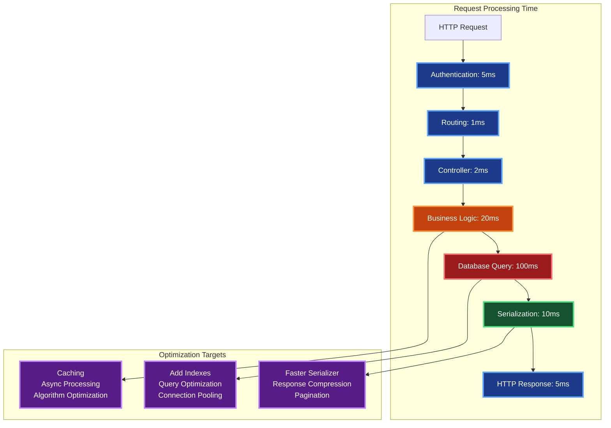

# Contexto y Propósito

## ¿Qué es?
La optimización de performance en .NET incluye prácticas de memoria, asincronía, caching, bases de datos, HTTP y profiling. Busca reducir latencia, mejorar throughput y evitar cuellos de botella en sistemas de alto tráfico.

## ¿Por qué?
Porque en aplicaciones reales la experiencia de usuario y los costos de infraestructura dependen del rendimiento. En mi experiencia, optimizar queries, usar pooling y aplicar patrones async correctos fue decisivo en banca y retail para cumplir SLA y soportar picos de tráfico.

## ¿Para qué?
- **Optimizar consumo de memoria** con pooling y evitando allocaciones innecesarias.  
- **Mejorar concurrencia** aplicando async/await y paralelismo.  
- **Acelerar consultas a BD** con índices, proyecciones y reducción de N+1 queries.  
- **Reducir latencia de red** con HTTP/2, compresión y caching distribuido.  

## Valor agregado desde la experiencia
- **StringBuilder** evitó sobrecarga de CPU en reportes con millones de concatenaciones.  
- **Parallel.ForEach y PLINQ** redujeron tiempos de procesamiento de datos municipales.  
- **Redis** bajó tiempos de respuesta de catálogos de segundos a milisegundos.  
- **Profiling con dotMemory** detectó memory leaks que afectaban APIs críticas.  

# Performance & Optimization

**Guía completa de optimización de performance para aplicaciones .NET con técnicas de memory management, async programming y caching.**
Este documento presenta estrategias prácticas para mejorar el rendimiento, desde garbage collection hasta database optimization.
Esencial para desarrollar aplicaciones .NET de alto rendimiento que escalen eficientemente bajo carga.

## Memory Management & Garbage Collection

**Análisis detallado del Garbage Collector de .NET con estrategias de optimización para cada generación de memoria.**
Esta tabla explica cómo funciona el GC en diferentes generaciones y técnicas para minimizar su impacto en performance.
Fundamental para escribir código memory-efficient y evitar problemas de performance relacionados con gestión de memoria.

| **Generación**              | **Propósito**             | **Frecuencia de GC** | **Tipos de Objetos**                  | **Optimización**                 |
| --------------------------- | ------------------------- | -------------------- | ------------------------------------- | -------------------------------- |
| **Gen 0**                   | Objetos temporales        | Muy frecuente        | Variables locales, objetos corta vida | Evitar allocaciones innecesarias |
| **Gen 1**                   | Buffer entre Gen 0 y 2    | Frecuente            | Objetos que sobreviven 1-2 GC         | Reutilizar objetos               |
| **Gen 2**                   | Objetos de larga duración | Poco frecuente       | Singletons, caché, static             | Evitar referencias circulares    |
| **LOH (Large Object Heap)** | Objetos > 85KB            | Solo Gen 2 GC        | Arrays grandes, strings grandes       | Object pooling                   |

## Async/Await Best Practices

**Mejores prácticas para programación asíncrona en .NET con ejemplos de uso correcto e incorrecto del patrón async/await.**
Esta tabla presenta errores comunes en código asíncrono y sus soluciones, con explicaciones del impacto en performance.
Crítica para escribir código asíncrono eficiente que no bloquee threads y maximice el throughput de la aplicación.

| **Escenario**          | **Incorrecto**                  | **Correcto**                                    | **Motivo**                |
| ---------------------- | ------------------------------- | ----------------------------------------------- | ------------------------- |
| **Blocking Async**     | `task.Result`, `task.Wait()`    | `await task`                                    | Evita deadlocks           |
| **Async Void**         | `async void Method()`           | `async Task Method()`                           | Excepciones manejables    |
| **ConfigureAwait**     | `await SomeAsyncMethod()`       | `await SomeAsyncMethod().ConfigureAwait(false)` | Evita captura de contexto |
| **Multiple Awaits**    | `await Task1(); await Task2();` | `await Task.WhenAll(Task1(), Task2())`          | Paralelismo               |
| **Exception Handling** | Try-catch en cada await         | Try-catch alrededor del await                   | Simplifica código         |

## Caching Strategies Performance

| **Tipo**              | **Latencia** | **Throughput** | **Memoria** | **Caso de Uso**                     |
| --------------------- | ------------ | -------------- | ----------- | ----------------------------------- |
| **In-Memory Cache**   | < 1ms        | > 1M ops/sec   | Local       | Datos frecuentes, pequeños          |
| **Redis Distributed** | 1-5ms        | > 100K ops/sec | Compartida  | Microservicios, alta disponibilidad |
| **SQL Server Cache**  | 10-50ms      | < 10K ops/sec  | BD          | Datos relacionales complejos        |
| **CDN Cache**         | 20-100ms     | Variable       | Global      | Contenido estático, archivos        |
| **Browser Cache**     | 0ms          | N/A            | Cliente     | Resources estáticos                 |

## String Performance Optimization

| **Operación**              | **Problema**                     | **Solución**                                               | **Mejora**           |
| -------------------------- | -------------------------------- | ---------------------------------------------------------- | -------------------- |
| **Concatenación múltiple** | `str1 + str2 + str3`             | `StringBuilder.Append()`                                   | 10x más rápido       |
| **String interpolation**   | `"Hello " + name + "!"`          | `$"Hello {name}!"`                                         | Más legible y rápido |
| **Comparación**            | `str1 == str2`                   | `string.Equals(str1, str2, StringComparison.Ordinal)`      | Explícito y rápido   |
| **Búsqueda**               | `str.ToLower().Contains("text")` | `str.Contains("text", StringComparison.OrdinalIgnoreCase)` | Sin allocation       |
| **Split frecuente**        | `str.Split(',')`                 | `str.AsSpan().Split(',')`                                  | Sin allocation       |

## Collection Performance Comparison

| **Operación**       | **List<T>**    | **Dictionary<K,V>** | **HashSet<T>** | **Array** |
| ------------------- | -------------- | ------------------- | -------------- | --------- |
| **Add**             | O(1) amortized | O(1) average        | O(1) average   | N/A       |
| **Contains**        | O(n)           | O(1) average        | O(1) average   | O(n)      |
| **Remove**          | O(n)           | O(1) average        | O(1) average   | N/A       |
| **Access by Index** | O(1)           | N/A                 | N/A            | O(1)      |
| **Memory Overhead** | Low            | Medium              | Medium         | Lowest    |

## Database Query Optimization

| **Problema**           | **Síntoma**                  | **Solución**                    | **Herramienta**      |
| ---------------------- | ---------------------------- | ------------------------------- | -------------------- |
| **N+1 Queries**        | Muchas queries en loop       | `.Include()`, batch loading     | EF Core logs         |
| **Missing Indexes**    | Queries lentas               | Crear índices apropiados        | SQL Server Profiler  |
| **Over-fetching**      | Transferencia de datos alta  | Projection, Select específicos  | Application Insights |
| **Cartesian Products** | Result sets enormes          | Split queries                   | `.AsSplitQuery()`    |
| **Unused Columns**     | Ancho de banda desperdiciado | Select solo columnas necesarias | Query plan analysis  |

## HTTP Performance Optimization

| **Técnica**            | **Implementación**             | **Mejora**                | **Trade-off**         |
| ---------------------- | ------------------------------ | ------------------------- | --------------------- |
| **HTTP/2**             | Configurar en servidor         | Multiplexing, server push | Complejidad setup     |
| **Compression**        | `app.UseResponseCompression()` | 70-90% menos bytes        | CPU overhead          |
| **Caching Headers**    | `Cache-Control`, `ETag`        | Reduce requests           | Invalidación compleja |
| **Connection Pooling** | `HttpClientFactory`            | Reutiliza conexiones      | Memory para pool      |
| **Keep-Alive**         | Configurar timeout             | Menos handshakes TCP      | Recursos ocupados     |

## Memory Pooling Patterns

```csharp
// ArrayPool para arrays grandes
var pool = ArrayPool<byte>.Shared;
var buffer = pool.Rent(1024);
try
{
    // Usar buffer
}
finally
{
    pool.Return(buffer);
}

// ObjectPool para objetos costosos
public class ExpensiveObjectPool : IObjectPool<ExpensiveObject>
{
    private readonly ConcurrentQueue<ExpensiveObject> _objects = new();

    public ExpensiveObject Get()
    {
        return _objects.TryDequeue(out var obj) ? obj : new ExpensiveObject();
    }

    public void Return(ExpensiveObject obj)
    {
        obj.Reset();
        _objects.Enqueue(obj);
    }
}
```

## JSON Serialization Performance

| **Serializer**       | **Speed**  | **Memory** | **Features**    | **Cuándo usar**                 |
| -------------------- | ---------- | ---------- | --------------- | ------------------------------- |
| **System.Text.Json** | Muy rápido | Baja       | Básico          | APIs modernas, high performance |
| **Newtonsoft.Json**  | Moderado   | Media      | Completo        | Legacy, features complejas      |
| **MessagePack**      | Más rápido | Muy baja   | Binario         | Microservicios internos         |
| **Protobuf**         | Rápido     | Muy baja   | Schema required | gRPC, sistemas distribuidos     |

## CPU-Intensive Task Optimization

| **Patrón**           | **Cuándo usar**      | **Implementación**                               | **Beneficio**               |
| -------------------- | -------------------- | ------------------------------------------------ | --------------------------- |
| **Parallel.ForEach** | Procesar colecciones | `Parallel.ForEach(items, item => Process(item))` | Usa todos los cores         |
| **PLINQ**            | Queries complejas    | `items.AsParallel().Where(x => x.IsValid)`       | Paraleliza LINQ             |
| **Task.Run**         | Offload trabajo      | `await Task.Run(() => CpuIntensiveWork())`       | No bloquea UI thread        |
| **Partitioner**      | Control granular     | `Partitioner.Create(items, true)`                | Balance de carga optimizado |

## Memory Profiling Metrics

| **Métrica**           | **Herramienta**  | **Valor Normal** | **Valor Problemático** | **Acción**            |
| --------------------- | ---------------- | ---------------- | ---------------------- | --------------------- |
| **Gen 0 Collections** | PerfCounters     | < 10/sec         | > 50/sec               | Reducir allocations   |
| **Gen 2 Collections** | dotMemory        | < 1/min          | > 10/min               | Revisar large objects |
| **LOH Size**          | Diagnostic Tools | < 100MB          | > 500MB                | Object pooling        |
| **Working Set**       | Task Manager     | < 500MB          | > 2GB                  | Memory leaks          |
| **Private Bytes**     | Process Explorer | Estable          | Creciente              | Dispose resources     |

## Response Time Optimization

**Desglose del tiempo de respuesta de una request HTTP típica y sus puntos de optimización más críticos.**
Este diagrama identifica los cuellos de botella más comunes en aplicaciones .NET y las técnicas específicas para optimizar cada fase.
Fundamental para el performance tuning sistemático, mostrando donde invertir tiempo de optimización para máximo impacto.



## Benchmark Examples with BenchmarkDotNet

```csharp
[MemoryDiagnoser]
[SimpleJob(RuntimeMoniker.Net60)]
public class StringConcatenationBenchmark
{
    [Params(10, 100, 1000)]
    public int N;

    [Benchmark]
    public string StringConcatenation()
    {
        var result = "";
        for (int i = 0; i < N; i++)
            result += "a";
        return result;
    }

    [Benchmark]
    public string StringBuilder()
    {
        var sb = new StringBuilder();
        for (int i = 0; i < N; i++)
            sb.Append("a");
        return sb.ToString();
    }

    [Benchmark]
    public string StringCreate()
    {
        return string.Create(N, N, (span, length) =>
        {
            span.Fill('a');
        });
    }
}
```

## Thread Safety Performance

| **Técnica**                | **Performance**    | **Complejidad** | **Uso**                           |
| -------------------------- | ------------------ | --------------- | --------------------------------- |
| **lock (object)**          | Moderado           | Bajo            | Secciones críticas simples        |
| **ReaderWriterLockSlim**   | Alto para lecturas | Medio           | Muchas lecturas, pocas escrituras |
| **Concurrent Collections** | Alto               | Bajo            | Collections thread-safe           |
| **Interlocked**            | Muy alto           | Bajo            | Operaciones atómicas simples      |
| **volatile**               | Muy alto           | Bajo            | Variables simples                 |

## Configuration for Performance

```csharp
// appsettings.json para producción
{
  "Logging": {
    "LogLevel": {
      "Default": "Warning"  // Menos logging en prod
    }
  },
  "ConnectionStrings": {
    "DefaultConnection": "...;Pooling=true;Max Pool Size=100"
  },
  "Kestrel": {
    "Limits": {
      "MaxConcurrentConnections": 1000,
      "MaxRequestBodySize": 30000000,
      "KeepAliveTimeout": "00:02:00"
    }
  }
}

// Program.cs optimizations
builder.Services.AddDbContextPool<AppDbContext>(options =>
    options.UseSqlServer(connectionString));

builder.Services.AddMemoryCache(options =>
{
    options.SizeLimit = 1024; // MB
    options.CompactionPercentage = 0.25;
});

builder.Services.Configure<IISServerOptions>(options =>
{
    options.MaxRequestBodySize = 30_000_000;
});
```

## Common Performance Anti-Patterns

| **Anti-Pattern**                  | **Problema**                 | **Solución**                        | **Impacto**                 |
| --------------------------------- | ---------------------------- | ----------------------------------- | --------------------------- |
| **Premature Optimization**        | Optimizar sin medir          | Profile first, optimize bottlenecks | Complejidad innecesaria     |
| **Sync over Async**               | Bloquear threads             | Usar async/await correctamente      | Deadlocks, poor scalability |
| **Exception for Control Flow**    | Usar excepciones para lógica | Return codes, bool methods          | 100x más lento              |
| **String concatenation in loops** | Performance O(n²)            | StringBuilder, interpolation        | Exponencial degradation     |
| **Not disposing resources**       | Memory leaks                 | using statements, IDisposable       | Memory growth               |
