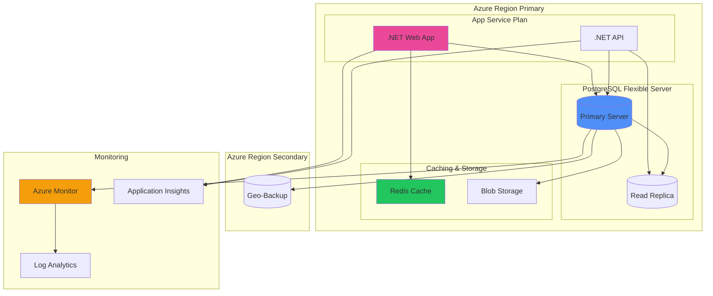

# PostgreSQL con .NET y Azure

**Guía completa de PostgreSQL enfocada en desarrollo .NET y deployment en Azure con PostGIS, Infrastructure as Code y mejores prácticas.**
Esta referencia cubre desde configuración básica hasta arquitecturas enterprise con datos geoespaciales y automatización de deployment.
Esencial para desarrolladores .NET que migran de SQL Server o implementan soluciones PostgreSQL en Azure con alta disponibilidad.

## PostgreSQL vs SQL Server para .NET

**Comparación detallada entre PostgreSQL y SQL Server desde la perspectiva de desarrollo .NET y ecosystem Microsoft.**
Esta tabla analiza diferencias clave en tipos de datos, sintaxis y herramientas para facilitar decisiones de arquitectura.
Fundamental para equipos que evalúan migración o implementación de PostgreSQL en proyectos .NET existentes.

| **Aspecto**          | **SQL Server**                            | **PostgreSQL**                           | **Consideraciones .NET**               |
| -------------------- | ----------------------------------------- | ---------------------------------------- | -------------------------------------- |
| **Provider .NET**    | `System.Data.SqlClient`                   | `Npgsql`                                 | Npgsql es robusto y bien mantenido     |
| **Entity Framework** | `Microsoft.EntityFrameworkCore.SqlServer` | `Npgsql.EntityFrameworkCore.PostgreSQL`  | Soporte completo EF Core               |
| **Tipos de Datos**   | `NVARCHAR(MAX)`, `UNIQUEIDENTIFIER`       | `TEXT`, `UUID`                           | Mapping automático con Npgsql          |
| **Identity Columns** | `IDENTITY(1,1)`                           | `SERIAL`, `GENERATED ALWAYS AS IDENTITY` | EF Core maneja ambos transparentemente |
| **JSON Support**     | `NVARCHAR(MAX)` + JSON functions          | Native `JSON`, `JSONB`                   | PostgreSQL superior para JSON          |
| **Arrays**           | No nativo                                 | Native array support                     | `List<T>` mapping automático           |
| **Full-Text Search** | Built-in                                  | Built-in + extensiones                   | PostgreSQL más flexible                |
| **Licensing**        | Comercial                                 | Open Source                              | PostgreSQL sin costos de licencia      |

## Azure Database for PostgreSQL

**Configuración y opciones de deployment de PostgreSQL en Azure con diferentes tiers de servicio.**
Esta tabla presenta las opciones disponibles en Azure con características, limitaciones y casos de uso recomendados.
Crítica para arquitectos que diseñan soluciones PostgreSQL en Azure con requerimientos específicos de performance y disponibilidad.

| **Opción de Deploy**   | **Características**                   | **Casos de Uso**                  | **Limitaciones**                    | **Pricing Tier**                             |
| ---------------------- | ------------------------------------- | --------------------------------- | ----------------------------------- | -------------------------------------------- |
| **Single Server**      | Managed service básico                | Desarrollo, aplicaciones pequeñas | Versiones limitadas, menos control  | Basic, General Purpose                       |
| **Flexible Server**    | Control granular, alta disponibilidad | Producción, microservicios        | Más costoso                         | Burstable, General Purpose, Memory Optimized |
| **Hyperscale (Citus)** | Distributed PostgreSQL                | Big data, analytics               | Complejidad adicional               | Per node                                     |
| **PostgreSQL on VMs**  | Control completo del SO               | Custom configurations, compliance | Gestión completa de infraestructura | VM pricing                                   |

## Entity Framework con PostgreSQL

**Configuración completa de Entity Framework Core con Npgsql para desarrollo .NET con PostgreSQL.**
Esta tabla cubre desde setup inicial hasta casos avanzados como migrations y optimizaciones específicas de PostgreSQL.
Esencial para desarrolladores .NET que implementan PostgreSQL como backend de datos en aplicaciones enterprise.

| **Aspecto**              | **Configuración**              | **Ejemplo**                                                                                                                         | **Notas**                            |
| ------------------------ | ------------------------------ | ----------------------------------------------------------------------------------------------------------------------------------- | ------------------------------------ |
| **Package Installation** | Install Npgsql EF provider     | `Npgsql.EntityFrameworkCore.PostgreSQL`                                                                                             | Versión compatible con EF Core       |
| **Connection String**    | Azure PostgreSQL connection    | `Server=myserver.postgres.database.azure.com;Database=mydb;Port=5432;User Id=myuser@myserver;Password=mypassword;Ssl Mode=Require;` | SSL requerido en Azure               |
| **DbContext Config**     | Configure provider             | `options.UseNpgsql(connectionString)`                                                                                               | En Startup.cs o Program.cs           |
| **Migrations**           | PostgreSQL-specific migrations | `Add-Migration InitialCreate`                                                                                                       | Genera SQL compatible con PostgreSQL |
| **Data Annotations**     | PostgreSQL column types        | `[Column(TypeName = "jsonb")]`                                                                                                      | Tipos específicos de PostgreSQL      |
| **Indexing**             | PostgreSQL index types         | `HasIndex().HasMethod("gin")`                                                                                                       | GIN, GiST, BRIN indexes              |

## Connection Strings y Configuración

**Configuraciones de connection string para diferentes entornos y escenarios de PostgreSQL en Azure.**
Esta tabla presenta configuraciones optimizadas para desarrollo, staging y producción con parámetros de performance.
Fundamental para configurar conexiones seguras y eficientes en diferentes ambientes de deployment.

| **Entorno**      | **Connection String**                                                                                                               | **Parámetros Adicionales**                                            | **Consideraciones**                 |
| ---------------- | ----------------------------------------------------------------------------------------------------------------------------------- | --------------------------------------------------------------------- | ----------------------------------- |
| **Development**  | `Server=localhost;Database=dev_db;User Id=dev_user;Password=dev_pass;`                                                              | `Pooling=true;MinPoolSize=0;MaxPoolSize=10;`                          | Pool pequeño, timeouts relajados    |
| **Staging**      | `Server=staging.postgres.database.azure.com;Database=staging_db;User Id=staging_user@staging;Password={password};Ssl Mode=Require;` | `Connection Lifetime=300;Connection Timeout=30;`                      | SSL obligatorio, timeouts moderados |
| **Production**   | `Server=prod.postgres.database.azure.com;Database=prod_db;User Id=prod_user@prod;Password={password};Ssl Mode=Require;`             | `Pooling=true;MinPoolSize=5;MaxPoolSize=100;Connection Lifetime=600;` | Pool grande, SSL, monitoring        |
| **Read Replica** | Connection string a read replica                                                                                                    | `ApplicationName=ReadOnlyQueries;`                                    | Solo queries SELECT                 |

## Tipos de Datos PostgreSQL vs .NET

**Mapping entre tipos de datos PostgreSQL y tipos .NET con consideraciones para Entity Framework.**
Esta tabla facilita el desarrollo mostrando equivalencias directas y casos especiales de conversión de tipos.
Esencial para desarrolladores que diseñan modelos de datos y entities que funcionen eficientemente con PostgreSQL.

| **PostgreSQL Type** | **.NET Type**                          | **EF Core Mapping**                  | **Notas**                   |
| ------------------- | -------------------------------------- | ------------------------------------ | --------------------------- |
| `INTEGER`           | `int`                                  | Automático                           | 32-bit signed integer       |
| `BIGINT`            | `long`                                 | Automático                           | 64-bit signed integer       |
| `VARCHAR(n)`        | `string`                               | `[MaxLength(n)]`                     | Variable length string      |
| `TEXT`              | `string`                               | Automático                           | Unlimited length            |
| `BOOLEAN`           | `bool`                                 | Automático                           | True/false values           |
| `TIMESTAMP`         | `DateTime`                             | Automático                           | Sin timezone info           |
| `TIMESTAMPTZ`       | `DateTimeOffset`                       | `[Column(TypeName = "timestamptz")]` | Con timezone info           |
| `UUID`              | `Guid`                                 | Automático                           | 128-bit identifier          |
| `JSON`              | `string` o custom class                | `[Column(TypeName = "json")]`        | JSON text                   |
| `JSONB`             | `string` o custom class                | `[Column(TypeName = "jsonb")]`       | Binary JSON (más eficiente) |
| `ARRAY`             | `List<T>`, `T[]`                       | Automático                           | Native array support        |
| `GEOMETRY`          | `NetTopologySuite.Geometries.Geometry` | `[Column(TypeName = "geometry")]`    | Requiere PostGIS            |

## PostGIS para Datos Geoespaciales

**Implementación de PostGIS con .NET para manejo de datos geoespaciales usando NetTopologySuite.**
Esta tabla cubre desde setup hasta consultas espaciales complejas con ejemplos prácticos para aplicaciones de mapas.
Fundamental para desarrollar aplicaciones con componentes geográficos como delivery, tracking o análisis territorial.

| **Operación**            | **PostGIS Function**          | **.NET/EF Core**                                | **Caso de Uso**                     |
| ------------------------ | ----------------------------- | ----------------------------------------------- | ----------------------------------- |
| **Setup PostGIS**        | `CREATE EXTENSION postgis;`   | `modelBuilder.HasPostgresExtension("postgis");` | Habilitar funciones espaciales      |
| **Create Point**         | `ST_MakePoint(lng, lat)`      | `new Point(lng, lat) { SRID = 4326 }`           | Ubicaciones de tiendas              |
| **Distance Calculation** | `ST_Distance(geom1, geom2)`   | `location1.Distance(location2)`                 | Delivery radius                     |
| **Within Polygon**       | `ST_Contains(polygon, point)` | `deliveryZone.Contains(customerLocation)`       | Service area validation             |
| **Buffer Zone**          | `ST_Buffer(point, radius)`    | `store.Location.Buffer(5000)`                   | 5km delivery zone                   |
| **Spatial Index**        | `CREATE INDEX USING GIST`     | `HasIndex().HasMethod("gist")`                  | Performance para queries espaciales |

## Infrastructure as Code para PostgreSQL

**Templates y scripts para automatizar deployment de PostgreSQL en Azure usando ARM, Bicep y Terraform.**
Esta tabla presenta diferentes herramientas de IaC con ejemplos específicos para PostgreSQL configuration.
Crítica para equipos DevOps que implementan CI/CD pipelines con databases como código.

| **Herramienta**  | **Sintaxis**              | **Ventajas**                 | **Ejemplo de Uso**                  |
| ---------------- | ------------------------- | ---------------------------- | ----------------------------------- |
| **ARM Template** | JSON declarativo          | Integración nativa Azure     | Templates empresariales complejos   |
| **Bicep**        | DSL simplificado para ARM | Sintaxis limpia, type safety | Infraestructura moderna Azure       |
| **Terraform**    | HCL (HashiCorp Language)  | Multi-cloud, ecosystem rico  | Hybrid cloud, proveedores múltiples |
| **Azure CLI**    | Scripts imperativos       | Simplicidad, debugging fácil | Automation scripts, testing         |

### Ejemplo Bicep para PostgreSQL Flexible Server

```bicep
param serverName string
param administratorLogin string
@secure()
param administratorPassword string
param location string = resourceGroup().location

resource postgreSQLServer 'Microsoft.DBforPostgreSQL/flexibleServers@2022-12-01' = {
  name: serverName
  location: location
  sku: {
    name: 'Standard_D2s_v3'
    tier: 'GeneralPurpose'
  }
  properties: {
    administratorLogin: administratorLogin
    administratorLoginPassword: administratorPassword
    version: '14'
    storage: {
      storageSizeGB: 32
    }
    backup: {
      backupRetentionDays: 7
      geoRedundantBackup: 'Enabled'
    }
    highAvailability: {
      mode: 'ZoneRedundant'
    }
  }
}

resource postgreSQLDatabase 'Microsoft.DBforPostgreSQL/flexibleServers/databases@2022-12-01' = {
  parent: postgreSQLServer
  name: 'myappdb'
  properties: {
    charset: 'utf8'
    collation: 'en_US.utf8'
  }
}
```

## Performance Optimization PostgreSQL

**Estrategias específicas de optimización para PostgreSQL con enfoque en aplicaciones .NET de alto tráfico.**
Esta tabla presenta técnicas avanzadas desde indexing hasta connection pooling para maximizar throughput.
Esencial para aplicaciones enterprise que requieren performance consistente bajo carga variable.

| **Técnica**            | **Implementación**            | **Beneficio**                    | **Consideraciones**                   |
| ---------------------- | ----------------------------- | -------------------------------- | ------------------------------------- |
| **Connection Pooling** | PgBouncer o Npgsql pooling    | Reduce connection overhead       | Configurar max connections            |
| **Partial Indexes**    | `WHERE` clause en index       | Indexes más pequeños y rápidos   | Solo para queries con WHERE constante |
| **JSONB Indexing**     | GIN indexes en columnas JSONB | Queries JSON rápidas             | Aumenta storage, slower writes        |
| **Table Partitioning** | Partition por fecha/rango     | Mejora queries en tablas grandes | Complejidad en maintenance            |
| **Vacuum Strategy**    | Autovacuum tuning             | Mantiene performance consistente | Monitorear bloat regularmente         |
| **Materialized Views** | Pre-computed aggregations     | Queries complejas muy rápidas    | Refresh strategy requerida            |

## Monitoring y Alerting PostgreSQL

**Métricas clave y herramientas de monitoring para PostgreSQL en Azure con integración Azure Monitor.**
Esta tabla define qué monitorear para mantener performance óptimo y detectar problemas proactivamente.
Fundamental para equipos de operaciones que mantienen sistemas PostgreSQL críticos en producción.

| **Métrica**            | **Descripción**                 | **Threshold Típico**        | **Herramienta**                 |
| ---------------------- | ------------------------------- | --------------------------- | ------------------------------- |
| **Connection Count**   | Número de conexiones activas    | < 80% del max_connections   | Azure Monitor, pg_stat_activity |
| **Cache Hit Ratio**    | % de reads desde buffer cache   | > 95%                       | pg_stat_database                |
| **Lock Waits**         | Queries esperando locks         | < 5% del tiempo total       | pg_stat_activity, pg_locks      |
| **Vacuum Performance** | Frecuencia y duración de vacuum | Vacuum lag < 1000           | pg_stat_user_tables             |
| **Query Performance**  | Slow query detection            | > 1 segundo para investigar | pg_stat_statements              |
| **Disk Space**         | Uso de almacenamiento           | < 85% full                  | Azure Monitor                   |

## Arquitectura PostgreSQL en Azure

**Arquitectura de referencia para PostgreSQL en Azure con alta disponibilidad, backup y disaster recovery.**
Este diagrama muestra la configuración enterprise típica con read replicas, backup automation y monitoring.
Esencial para arquitectos que diseñan sistemas mission-critical con PostgreSQL en Azure.



## Security Best Practices PostgreSQL

**Configuraciones de seguridad esenciales para PostgreSQL en Azure con Azure AD integration y encryption.**
Esta tabla cubre desde network security hasta encryption at rest para proteger datos sensibles en producción.
Crítica para aplicaciones que manejan PII, financial data o están sujetas a compliance requirements.

| **Área de Seguridad**     | **Configuración**                   | **Implementación**                      | **Beneficio**                     |
| ------------------------- | ----------------------------------- | --------------------------------------- | --------------------------------- |
| **Network Security**      | Private endpoints, VNet integration | Azure Private Link                      | Traffic no sale de Azure backbone |
| **Authentication**        | Azure AD integration                | Azure AD admin, managed identity        | Centralized identity management   |
| **Encryption in Transit** | TLS 1.2 forced                      | `Ssl Mode=Require` en connection string | Data encrypted over network       |
| **Encryption at Rest**    | Azure Storage Service Encryption    | Automático en Azure Database            | Data encrypted on disk            |
| **Access Control**        | Row Level Security (RLS)            | PostgreSQL RLS policies                 | Fine-grained data access          |
| **Audit Logging**         | pgAudit extension                   | Log all data access                     | Compliance y forensics            |

## Backup y Disaster Recovery

**Estrategias de backup y recovery para PostgreSQL en Azure con RPO/RTO targets empresariales.**
Esta tabla presenta diferentes opciones de backup desde automated hasta custom solutions con consideraciones de costo.
Fundamental para business continuity planning y compliance con data retention requirements.

| **Tipo de Backup**        | **RPO**   | **RTO**      | **Método**                        | **Costo**        |
| ------------------------- | --------- | ------------ | --------------------------------- | ---------------- |
| **Automated Backup**      | 5 minutos | < 1 hora     | Azure automatic backup            | Incluido         |
| **Point-in-Time Restore** | 1 segundo | < 2 horas    | Transaction log replay            | Incluido         |
| **Geo-Restore**           | 1 hora    | < 4 horas    | Restore from geo-redundant backup | Incluido         |
| **Read Replica**          | Near zero | < 15 minutos | Promote replica to primary        | Costo de replica |
| **Custom pg_dump**        | Variable  | Variable     | Scripted backups to Blob Storage  | Storage cost     |

## Migration Strategies a PostgreSQL

**Estrategias para migrar desde SQL Server hacia PostgreSQL con mínimo downtime y validación de datos.**
Esta tabla presenta diferentes enfoques según el tamaño del sistema y tolerance al downtime.
Esencial para equipos que planean migration projects desde SQL Server hacia PostgreSQL en Azure.

| **Estrategia**          | **Downtime** | **Complejidad** | **Herramientas**                 | **Casos de Uso**              |
| ----------------------- | ------------ | --------------- | -------------------------------- | ----------------------------- |
| **Azure DMS**           | Mínimo       | Media           | Azure Database Migration Service | Databases pequeños a medianos |
| **pg_dump/restore**     | Alto         | Baja            | PostgreSQL native tools          | Maintenance windows largos    |
| **Logical Replication** | Muy bajo     | Alta            | PostgreSQL + custom CDC          | Zero-downtime migrations      |
| **Application-Level**   | Bajo         | Alta            | Dual-write pattern               | Complex business logic        |
| **ETL Pipeline**        | Medio        | Media           | Azure Data Factory               | Data transformation needed    |

## PostGIS Spatial Queries Avanzadas

**Ejemplos de consultas geoespaciales complejas con PostGIS para casos de uso empresariales.**
Esta tabla presenta queries específicas para logistics, real estate y análisis territorial con performance tips.
Crítica para desarrollar funcionalidades avanzadas de mapping y análisis geográfico en aplicaciones .NET.

| **Caso de Uso**    | **PostGIS Query**                                 | **.NET Implementation**                                          | **Performance Tips**                   |
| ------------------ | ------------------------------------------------- | ---------------------------------------------------------------- | -------------------------------------- |
| **Nearest Store**  | `ORDER BY location <-> ST_Point(lng,lat) LIMIT 5` | `stores.OrderBy(s => s.Location.Distance(userLocation)).Take(5)` | Use GiST index on location             |
| **Delivery Zones** | `ST_Contains(zone_polygon, customer_point)`       | `deliveryZones.Where(z => z.Polygon.Contains(customerLocation))` | Index both polygon and points          |
| **Route Planning** | `ST_ShortestLine(start_point, end_point)`         | Custom routing logic with OSM data                               | Pre-compute common routes              |
| **Area Analysis**  | `ST_Area(ST_Intersection(polygon1, polygon2))`    | Business logic for territory overlap                             | Use projected coordinates for accuracy |
| **Heat Maps**      | `ST_HexagonGrid() + ST_Intersects()`              | Aggregate data by hexagonal grid                                 | Materialized views for performance     |

## Ejemplo de Configuración Completa .NET

```csharp
// Startup.cs o Program.cs
public void ConfigureServices(IServiceCollection services)
{
    // PostgreSQL connection
    services.AddDbContext<ApplicationDbContext>(options =>
        options.UseNpgsql(
            connectionString,
            x => x.UseNetTopologySuite() // Para PostGIS
        ));

    // Connection pooling configuration
    services.AddNpgsqlDataSource(connectionString, builder =>
    {
        builder.EnableParameterLogging();
        builder.UseNetTopologySuite();
    });

    // Health checks
    services.AddHealthChecks()
        .AddNpgSql(connectionString);

    // Background services para maintenance
    services.AddHostedService<VacuumMaintenanceService>();
}

// DbContext example
public class ApplicationDbContext : DbContext
{
    public DbSet<Store> Stores { get; set; }
    public DbSet<Customer> Customers { get; set; }

    protected override void OnModelCreating(ModelBuilder modelBuilder)
    {
        // PostGIS extension
        modelBuilder.HasPostgresExtension("postgis");

        // Spatial indexes
        modelBuilder.Entity<Store>()
            .HasIndex(s => s.Location)
            .HasMethod("gist");

        // JSONB configuration
        modelBuilder.Entity<Customer>()
            .Property(c => c.Preferences)
            .HasColumnType("jsonb");

        // Array configuration
        modelBuilder.Entity<Store>()
            .Property(s => s.Categories)
            .HasColumnType("text[]");
    }
}

// Entity with spatial data
public class Store
{
    public int Id { get; set; }
    public string Name { get; set; }
    public Point Location { get; set; } // PostGIS geometry
    public string[] Categories { get; set; } // PostgreSQL array
    public Dictionary<string, object> Metadata { get; set; } // JSONB
}
```

## Cost Optimization PostgreSQL Azure

**Estrategias para optimizar costos de PostgreSQL en Azure sin comprometer performance o disponibilidad.**
Esta tabla analiza diferentes opciones de pricing y configuración para maximizar value for money.
Fundamental para equipos que gestionan presupuestos cloud y necesitan optimizar TCO de databases.

| **Estrategia**           | **Implementación**                    | **Savings Potencial**         | **Trade-offs**                    |
| ------------------------ | ------------------------------------- | ----------------------------- | --------------------------------- |
| **Reserved Instances**   | 1-3 year commitments                  | 20-65% vs pay-as-you-go       | Less flexibility                  |
| **Burstable Tiers**      | B1ms, B2s para dev/test               | 50-80% vs General Purpose     | CPU burstable, not for production |
| **Storage Optimization** | Right-size storage + automated growth | 20-40% storage costs          | Monitoring overhead               |
| **Backup Retention**     | Optimize retention period             | 10-30% backup costs           | Compliance requirements           |
| **Read Replicas**        | Use for read-only workloads           | Better performance per dollar | Additional complexity             |
| **Scheduled Scaling**    | Scale down during off-hours           | 30-50% compute costs          | Automation required               |

## Troubleshooting Common Issues

**Problemas comunes de PostgreSQL en Azure con .NET y sus soluciones específicas para el ecosistema.**
Esta tabla presenta issues frecuentes en producción con diagnóstico y resolution steps.
Crítica para equipos de soporte que mantienen aplicaciones .NET con PostgreSQL en Azure.

| **Problema**                   | **Síntomas**                        | **Diagnóstico**                 | **Solución**                               |
| ------------------------------ | ----------------------------------- | ------------------------------- | ------------------------------------------ |
| **Connection Pool Exhaustion** | TimeoutException, connection errors | Monitor active connections      | Increase pool size, check connection leaks |
| **Slow Queries**               | High response times                 | pg_stat_statements analysis     | Add indexes, optimize queries              |
| **Lock Contention**            | Queries hanging                     | Check pg_locks table            | Optimize transaction scope                 |
| **Memory Issues**              | OOM errors                          | Monitor PostgreSQL memory usage | Tune shared_buffers, work_mem              |
| **SSL Connection Issues**      | Certificate errors                  | Verify SSL configuration        | Update connection string, certificates     |
| **Migration Failures**         | EF migration errors                 | Check PostgreSQL logs           | Fix schema differences, data types         |
