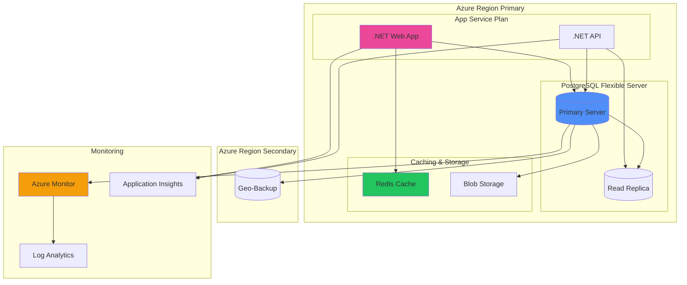

# Contexto y Propósito

## ¿Qué es?
PostgreSQL es una base de datos relacional open source con soporte avanzado de tipos de datos, JSON, arrays y extensiones como PostGIS. En Azure se ofrece como servicio gestionado (Single Server, Flexible Server, Hyperscale) con integración nativa para .NET usando Npgsql:contentReference[oaicite:0]{index=0}.

## ¿Por qué?
Porque PostgreSQL combina la robustez de un motor relacional con la flexibilidad de NoSQL. En mi experiencia, adoptarlo en Azure redujo costos de licenciamiento frente a SQL Server y habilitó features avanzadas como JSONB y consultas espaciales con PostGIS.

## ¿Para qué?
- **Migrar aplicaciones .NET** de SQL Server a PostgreSQL usando EF Core.  
- **Aprovechar JSONB y arrays** para modelos de datos flexibles.  
- **Implementar datos geoespaciales** con PostGIS en tracking y delivery.  
- **Automatizar despliegues** con Bicep/Terraform en Azure.  

## Valor agregado desde la experiencia
- **Flexible Server en Azure** nos dio alta disponibilidad con mínimo esfuerzo de gestión.  
- Con **GIN indexes en JSONB**, consultas que tomaban segundos se redujeron a milisegundos.  
- **NetTopologySuite** integró PostGIS con EF Core para sistemas municipales de georreferenciación.  
- **IaC con Terraform** permitió desplegar PostgreSQL multi-región en minutos.  

# PostgreSQL con .NET y Azure

**Guía completa de PostgreSQL enfocada en desarrollo .NET y deployment en Azure con PostGIS, Infrastructure as Code y mejores prácticas.**
Esta referencia cubre desde configuración básica hasta arquitecturas enterprise con datos geoespaciales y automatización de deployment.
Esencial para desarrolladores .NET que migran de SQL Server o implementan soluciones PostgreSQL en Azure con alta disponibilidad.

## 💡 Tips para Entrevistas Técnicas PostgreSQL en proyectos .NET existentes.

| **Aspecto**          | **SQL Server**                            | **PostgreSQL**                           | **Consideraciones .NET**               |
| -------------------- | ----------------------------------------- | ---------------------------------------- | -------------------------------------- |
| **Provider .NET**    | `System.Data.SqlClient`                   | `Npgsql`                                 | Npgsql es robusto y bien mantenido     |
| **Entity Framework** | `Microsoft.EntityFrameworkCore.SqlServer` | `Npgsql.EntityFrameworkCore.PostgreSQL`  | Soporte completo EF Core               |
| **Tipos de Datos**   | `NVARCHAR(MAX)`, `UNIQUEIDENTIFIER`       | `TEXT`, `UUID`                           | Mapping automático con Npgsql          |
| **Identity Columns** | `IDENTITY(1,1)`                           | `SERIAL`, `GENERATED ALWAYS AS IDENTITY` | EF Core maneja ambos transparentemente |
| **JSON Support**     | `NVARCHAR(MAX)` + JSON functions          | Native `JSON`, `JSONB`                   | PostgreSQL superior para JSON          |
| **Arrays**           | No nativo                                 | Native array support                     | `List‹T›` mapping automático           |
| **Full-Text Search** | Built-in                                  | Built-in + extensiones                   | PostgreSQL más flexible                |
| **Licensing**        | Comercial                                 | Open Source                              | PostgreSQL sin costos de licencia      |

## Azure Database for PostgreSQL

**Configuración y opciones de deployment de PostgreSQL en Azure con diferentes tiers de servicio.**
Esta tabla presenta las opciones disponibles en Azure con características, limitaciones y casos de uso recomendados.
Crítica para arquitectos que diseñan soluciones PostgreSQL en Azure con requerimientos específicos de performance y disponibilidad.

| **Opción de Deploy**   | **Características**                   | **Casos de Uso**                  | **Limitaciones**                    | **Pricing Tier**                             |
| ---------------------- | ------------------------------------- | --------------------------------- | ----------------------------------- | -------------------------------------------- |
| **Single Server**      | Managed service básico                | Desarrollo, aplicaciones pequeñas | Versiones limitadas, menos control  | Basic, General Purpose                       |
| **Flexible Server**    | Control granular, alta disponibilidad | Producción, microservicios        | Más costoso                         | Burstable, General Purpose, Memory Optimized |
| **Hyperscale (Citus)** | Distributed PostgreSQL                | Big data, analytics               | Complejidad adicional               | Per node                                     |
| **PostgreSQL on VMs**  | Control completo del SO               | Custom configurations, compliance | Gestión completa de infraestructura | VM pricing                                   |

## Entity Framework con PostgreSQL

**Configuración completa de Entity Framework Core con Npgsql para desarrollo .NET con PostgreSQL.**
Esta tabla cubre desde setup inicial hasta casos avanzados como migrations y optimizaciones específicas de PostgreSQL.
Esencial para desarrolladores .NET que implementan PostgreSQL como backend de datos en aplicaciones enterprise.

| **Aspecto**              | **Configuración**              | **Ejemplo**                                                                                                                         | **Notas**                            |
| ------------------------ | ------------------------------ | ----------------------------------------------------------------------------------------------------------------------------------- | ------------------------------------ |
| **Package Installation** | Install Npgsql EF provider     | `Npgsql.EntityFrameworkCore.PostgreSQL`                                                                                             | Versión compatible con EF Core       |
| **Connection String**    | Azure PostgreSQL connection    | `Server=myserver.postgres.database.azure.com;Database=mydb;Port=5432;User Id=myuser@myserver;Password=mypassword;Ssl Mode=Require;` | SSL requerido en Azure               |
| **DbContext Config**     | Configure provider             | `options.UseNpgsql(connectionString)`                                                                                               | En Startup.cs o Program.cs           |
| **Migrations**           | PostgreSQL-specific migrations | `Add-Migration InitialCreate`                                                                                                       | Genera SQL compatible con PostgreSQL |
| **Data Annotations**     | PostgreSQL column types        | `[Column(TypeName = "jsonb")]`                                                                                                      | Tipos específicos de PostgreSQL      |
| **Indexing**             | PostgreSQL index types         | `HasIndex().HasMethod("gin")`                                                                                                       | GIN, GiST, BRIN indexes              |

## Connection Strings y Configuración

**Configuraciones de connection string para diferentes entornos y escenarios de PostgreSQL en Azure.**
Esta tabla presenta configuraciones optimizadas para desarrollo, staging y producción con parámetros de performance.
Fundamental para configurar conexiones seguras y eficientes en diferentes ambientes de deployment.

| **Entorno**      | **Connection String**                                                                                                               | **Parámetros Adicionales**                                            | **Consideraciones**                 |
| ---------------- | ----------------------------------------------------------------------------------------------------------------------------------- | --------------------------------------------------------------------- | ----------------------------------- |
| **Development**  | `Server=localhost;Database=dev_db;User Id=dev_user;Password=dev_pass;`                                                              | `Pooling=true;MinPoolSize=0;MaxPoolSize=10;`                          | Pool pequeño, timeouts relajados    |
| **Staging**      | `Server=staging.postgres.database.azure.com;Database=staging_db;User Id=staging_user@staging;Password={password};Ssl Mode=Require;` | `Connection Lifetime=300;Connection Timeout=30;`                      | SSL obligatorio, timeouts moderados |
| **Production**   | `Server=prod.postgres.database.azure.com;Database=prod_db;User Id=prod_user@prod;Password={password};Ssl Mode=Require;`             | `Pooling=true;MinPoolSize=5;MaxPoolSize=100;Connection Lifetime=600;` | Pool grande, SSL, monitoring        |
| **Read Replica** | Connection string a read replica                                                                                                    | `ApplicationName=ReadOnlyQueries;`                                    | Solo queries SELECT                 |

## Tipos de Datos PostgreSQL vs .NET

**Mapping entre tipos de datos PostgreSQL y tipos .NET con consideraciones para Entity Framework.**
Esta tabla facilita el desarrollo mostrando equivalencias directas y casos especiales de conversión de tipos.
Esencial para desarrolladores que diseñan modelos de datos y entities que funcionen eficientemente con PostgreSQL.

| **PostgreSQL Type** | **.NET Type**                          | **EF Core Mapping**                  | **Notas**                   |
| ------------------- | -------------------------------------- | ------------------------------------ | --------------------------- |
| `INTEGER`           | `int`                                  | Automático                           | 32-bit signed integer       |
| `BIGINT`            | `long`                                 | Automático                           | 64-bit signed integer       |
| `VARCHAR(n)`        | `string`                               | `[MaxLength(n)]`                     | Variable length string      |
| `TEXT`              | `string`                               | Automático                           | Unlimited length            |
| `BOOLEAN`           | `bool`                                 | Automático                           | True/false values           |
| `TIMESTAMP`         | `DateTime`                             | Automático                           | Sin timezone info           |
| `TIMESTAMPTZ`       | `DateTimeOffset`                       | `[Column(TypeName = "timestamptz")]` | Con timezone info           |
| `UUID`              | `Guid`                                 | Automático                           | 128-bit identifier          |
| `JSON`              | `string` o custom class                | `[Column(TypeName = "json")]`        | JSON text                   |
| `JSONB`             | `string` o custom class                | `[Column(TypeName = "jsonb")]`       | Binary JSON (más eficiente) |
| `ARRAY`             | `List‹T›`, `T[]`                       | Automático                           | Native array support        |
| `GEOMETRY`          | `NetTopologySuite.Geometries.Geometry` | `[Column(TypeName = "geometry")]`    | Requiere PostGIS            |

## PostGIS para Datos Geoespaciales

**Implementación de PostGIS con .NET para manejo de datos geoespaciales usando NetTopologySuite.**
Esta tabla cubre desde setup hasta consultas espaciales complejas con ejemplos prácticos para aplicaciones de mapas.
Fundamental para desarrollar aplicaciones con componentes geográficos como delivery, tracking o análisis territorial.

| **Operación**            | **PostGIS Function**          | **.NET/EF Core**                                | **Caso de Uso**                     |
| ------------------------ | ----------------------------- | ----------------------------------------------- | ----------------------------------- |
| **Setup PostGIS**        | `CREATE EXTENSION postgis;`   | `modelBuilder.HasPostgresExtension("postgis");` | Habilitar funciones espaciales      |
| **Create Point**         | `ST_MakePoint(lng, lat)`      | `new Point(lng, lat) { SRID = 4326 }`           | Ubicaciones de tiendas              |
| **Distance Calculation** | `ST_Distance(geom1, geom2)`   | `location1.Distance(location2)`                 | Delivery radius                     |
| **Within Polygon**       | `ST_Contains(polygon, point)` | `deliveryZone.Contains(customerLocation)`       | Service area validation             |
| **Buffer Zone**          | `ST_Buffer(point, radius)`    | `store.Location.Buffer(5000)`                   | 5km delivery zone                   |
| **Spatial Index**        | `CREATE INDEX USING GIST`     | `HasIndex().HasMethod("gist")`                  | Performance para queries espaciales |

## Infrastructure as Code para PostgreSQL

**Templates y scripts para automatizar deployment de PostgreSQL en Azure usando ARM, Bicep y Terraform.**
Esta tabla presenta diferentes herramientas de IaC con ejemplos específicos para PostgreSQL configuration.
Crítica para equipos DevOps que implementan CI/CD pipelines con databases como código.

| **Herramienta**  | **Sintaxis**              | **Ventajas**                 | **Ejemplo de Uso**                  |
| ---------------- | ------------------------- | ---------------------------- | ----------------------------------- |
| **ARM Template** | JSON declarativo          | Integración nativa Azure     | Templates empresariales complejos   |
| **Bicep**        | DSL simplificado para ARM | Sintaxis limpia, type safety | Infraestructura moderna Azure       |
| **Terraform**    | HCL (HashiCorp Language)  | Multi-cloud, ecosystem rico  | Hybrid cloud, proveedores múltiples |
| **Azure CLI**    | Scripts imperativos       | Simplicidad, debugging fácil | Automation scripts, testing         |

### Ejemplo Bicep para PostgreSQL Flexible Server

```bicep
param serverName string
param administratorLogin string
@secure()
param administratorPassword string
param location string = resourceGroup().location

resource postgreSQLServer 'Microsoft.DBforPostgreSQL/flexibleServers@2022-12-01' = {
  name: serverName
  location: location
  sku: {
    name: 'Standard_D2s_v3'
    tier: 'GeneralPurpose'
  }
  properties: {
    administratorLogin: administratorLogin
    administratorLoginPassword: administratorPassword
    version: '14'
    storage: {
      storageSizeGB: 32
    }
    backup: {
      backupRetentionDays: 7
      geoRedundantBackup: 'Enabled'
    }
    highAvailability: {
      mode: 'ZoneRedundant'
    }
  }
}

resource postgreSQLDatabase 'Microsoft.DBforPostgreSQL/flexibleServers/databases@2022-12-01' = {
  parent: postgreSQLServer
  name: 'myappdb'
  properties: {
    charset: 'utf8'
    collation: 'en_US.utf8'
  }
}
```

## Teoría de Conjuntos en PostgreSQL

**Operadores de conjuntos en PostgreSQL para combinar resultados de múltiples consultas siguiendo principios matemáticos.**
Esta sección cubre UNION, INTERSECT, EXCEPT con ejemplos prácticos y implementación en .NET usando Entity Framework Core.
Fundamental para consultas complejas que requieren combinación de datasets y análisis de diferencias entre conjuntos de datos.

### 🔗 Operadores de Conjuntos PostgreSQL

| **Operador**  | **Descripción**                                                     | **Sintaxis**                      | **Reglas**                         |
| ------------- | ------------------------------------------------------------------- | --------------------------------- | ---------------------------------- |
| **UNION**     | Combina todos los registros únicos de ambas consultas               | `SELECT ... UNION SELECT ...`     | Elimina duplicados automáticamente |
| **UNION ALL** | Combina todos los registros incluyendo duplicados                   | `SELECT ... UNION ALL SELECT ...` | Más rápido, mantiene duplicados    |
| **INTERSECT** | Retorna solo registros que aparecen en ambas consultas              | `SELECT ... INTERSECT SELECT ...` | Equivale a un JOIN inner           |
| **EXCEPT**    | Retorna registros de la primera consulta que NO están en la segunda | `SELECT ... EXCEPT SELECT ...`    | Equivale a LEFT JOIN WHERE NULL    |

### 🎯 Ejemplos Prácticos con Casos de Uso

**Implementaciones reales de teoría de conjuntos en PostgreSQL y .NET para casos de negocio comunes.**
Esta sección muestra ejemplos prácticos que aparecen frecuentemente en entrevistas técnicas y proyectos reales.
Fundamental para demostrar expertise en consultas complejas y análisis de datos empresariales.

| **Caso de Uso**                           | **Query PostgreSQL**                                                                                                                                                                                                                                                                                                                                                                                        | **Implementación .NET**                                                                                                                                                                                                                                                                                                                                                                                             | **Aplicación de Negocio**                                        |
| ------------------------------------------ | ------------------------------------------------------------------------------------------------------------------------------------------------------------------------------------------------------------------------------------------------------------------------------------------------------------------------------------------------------------------------------------------------------- | ------------------------------------------------------------------------------------------------------------------------------------------------------------------------------------------------------------------------------------------------------------------------------------------------------------------------------------------------------------------------------------------------------------------- | ---------------------------------------------------------------- |
| **UNION - Lista Unificada de Contactos**  |                                                                                                                                                                                                                                                                                                                                                                                                         |                                                                                                                                                                                                                                                                                                                                                                                                                     |                                                                  |
|                                            | `SELECT 'Cliente' as tipo, nombre, email, telefono FROM clientes WHERE activo = true UNION SELECT 'Proveedor' as tipo, nombre_empresa, email_contacto, telefono_contacto FROM proveedores WHERE estado = 'ACTIVO';`                                                                                                                                                                                      | `var clientes = context.Clientes.Where(c =＞ c.Activo).Select(c =＞ new ContactoUnificado { Tipo = "Cliente", Nombre = c.Nombre, Email = c.Email, Telefono = c.Telefono }); var proveedores = context.Proveedores.Where(p =＞ p.Estado == "ACTIVO").Select(p =＞ new ContactoUnificado { Tipo = "Proveedor", Nombre = p.NombreEmpresa, Email = p.EmailContacto, Telefono = p.TelefonoContacto }); var contactos = clientes.Union(proveedores).ToList();` | Directorio unificado de contactos eliminando duplicados         |
| **UNION ALL - Log de Transacciones**      |                                                                                                                                                                                                                                                                                                                                                                                                         |                                                                                                                                                                                                                                                                                                                                                                                                                     |                                                                  |
|                                            | `SELECT fecha, usuario_id, 'VENTA' as tipo, monto, descripcion FROM ventas WHERE fecha ＞= '2024-01-01' UNION ALL SELECT fecha_devolucion, usuario_id, 'DEVOLUCION' as tipo, -monto, CONCAT('Devolución: ', motivo) FROM devoluciones WHERE fecha_devolucion ＞= '2024-01-01';`                                                                                                                             | `var ventas = context.Ventas.Where(v =＞ v.Fecha ＞= fechaInicio).Select(v =＞ new TransaccionLog { Fecha = v.Fecha, UsuarioId = v.UsuarioId, Tipo = "VENTA", Monto = v.Monto, Descripcion = v.Descripcion }); var devoluciones = context.Devoluciones.Where(d =＞ d.FechaDevolucion ＞= fechaInicio).Select(d =＞ new TransaccionLog { Fecha = d.FechaDevolucion, UsuarioId = d.UsuarioId, Tipo = "DEVOLUCION", Monto = -d.Monto, Descripcion = $"Devolución: {d.Motivo}" }); var log = ventas.Concat(devoluciones).OrderBy(t =＞ t.Fecha).ToList();` | Auditoría completa manteniendo todos los registros              |
| **INTERSECT - Productos Temporadas**      |                                                                                                                                                                                                                                                                                                                                                                                                         |                                                                                                                                                                                                                                                                                                                                                                                                                     |                                                                  |
|                                            | `SELECT producto_id, nombre_producto FROM ventas v JOIN productos p ON v.producto_id = p.id WHERE v.fecha BETWEEN '2024-06-01' AND '2024-08-31' INTERSECT SELECT producto_id, nombre_producto FROM ventas v JOIN productos p ON v.producto_id = p.id WHERE v.fecha BETWEEN '2024-12-01' AND '2024-02-28';`                                                                                             | `var ventasVerano = context.Ventas.Where(v =＞ v.Fecha ＞= new DateTime(2024, 6, 1) && v.Fecha ＜= new DateTime(2024, 8, 31)).Select(v =＞ new { v.ProductoId, v.Producto.NombreProducto }); var ventasInvierno = context.Ventas.Where(v =＞ v.Fecha ＞= new DateTime(2024, 12, 1) && v.Fecha ＜= new DateTime(2024, 2, 28)).Select(v =＞ new { v.ProductoId, v.Producto.NombreProducto }); var productosPopulares = ventasVerano.Intersect(ventasInvierno).ToList();` | Productos que se venden bien en ambas temporadas                |
| **EXCEPT - Clientes Perdidos**            |                                                                                                                                                                                                                                                                                                                                                                                                         |                                                                                                                                                                                                                                                                                                                                                                                                                     |                                                                  |
|                                            | `SELECT DISTINCT cliente_id, nombre, email FROM ventas v JOIN clientes c ON v.cliente_id = c.id WHERE EXTRACT(YEAR FROM v.fecha) = 2023 EXCEPT SELECT DISTINCT cliente_id, nombre, email FROM ventas v JOIN clientes c ON v.cliente_id = c.id WHERE EXTRACT(YEAR FROM v.fecha) = 2024;`                                                                                                                  | `var clientes2023 = context.Ventas.Where(v =＞ v.Fecha.Year == 2023).Select(v =＞ new { v.ClienteId, v.Cliente.Nombre, v.Cliente.Email }).Distinct(); var clientes2024 = context.Ventas.Where(v =＞ v.Fecha.Year == 2024).Select(v =＞ new { v.ClienteId, v.Cliente.Nombre, v.Cliente.Email }).Distinct(); var clientesPerdidos = clientes2023.Except(clientes2024).ToList();`                                                    | Identificar clientes que dejaron de comprar para re-engagement  |
| **Análisis Complejo - Preferencias**      |                                                                                                                                                                                                                                                                                                                                                                                                         |                                                                                                                                                                                                                                                                                                                                                                                                                     |                                                                  |
|                                            | `(SELECT DISTINCT categoria_id, nombre_categoria FROM ventas v JOIN productos p ON v.producto_id = p.id JOIN categorias c ON p.categoria_id = c.id JOIN clientes cl ON v.cliente_id = cl.id WHERE cl.region = 'Norte' EXCEPT SELECT DISTINCT categoria_id, nombre_categoria FROM ventas v JOIN productos p ON v.producto_id = p.id JOIN categorias c ON p.categoria_id = c.id JOIN clientes cl ON v.cliente_id = cl.id WHERE cl.region = 'Sur') UNION (SELECT DISTINCT categoria_id, nombre_categoria FROM ventas v JOIN productos p ON v.producto_id = p.id JOIN categorias c ON p.categoria_id = c.id JOIN clientes cl ON v.cliente_id = cl.id WHERE cl.region = 'Norte' INTERSECT SELECT DISTINCT categoria_id, nombre_categoria FROM ventas v JOIN productos p ON v.producto_id = p.id JOIN categorias c ON p.categoria_id = c.id JOIN clientes cl ON v.cliente_id = cl.id WHERE cl.region = 'Sur');` | `var categoriasNorte = context.Ventas.Where(v =＞ v.Cliente.Region == "Norte").Select(v =＞ new { v.Producto.CategoriaId, v.Producto.Categoria.NombreCategoria }).Distinct(); var categoriasSur = context.Ventas.Where(v =＞ v.Cliente.Region == "Sur").Select(v =＞ new { v.Producto.CategoriaId, v.Producto.Categoria.NombreCategoria }).Distinct(); var exclusivasNorte = categoriasNorte.Except(categoriasSur); var comunes = categoriasNorte.Intersect(categoriasSur); var analisis = exclusivasNorte.Union(comunes).ToList();` | Análisis de mercado y segmentación geográfica de preferencias   |

### 🎯 Reglas y Consideraciones Importantes

| **Aspecto**                    | **Regla**                               | **Ejemplo**                                                                                        |
| ------------------------------ | --------------------------------------- | -------------------------------------------------------------------------------------------------- |
| **Compatibilidad de Columnas** | Mismo número y tipos compatibles        | `SELECT id, nombre` debe coincidir en ambas queries                                                |
| **Orden de Columnas**          | Debe ser idéntico en ambas consultas    | Primera columna de ambas queries debe ser del mismo tipo                                           |
| **Nomenclatura**               | Se usa el nombre de la primera consulta | `SELECT id, nombre UNION SELECT cliente_id, nombre_cliente` → resultado tiene columnas: id, nombre |
| **ORDER BY**                   | Solo al final de toda la operación      | `(SELECT ...) UNION (SELECT ...) ORDER BY columna`                                                 |
| **Performance**                | UNION ALL ＞ UNION ＞ INTERSECT ＞ EXCEPT  | UNION ALL es más rápido porque no elimina duplicados                                               |

### 💡 Tips para Entrevistas Técnicas

- **Explicar diferencia entre UNION y UNION ALL**: UNION elimina duplicados, UNION ALL es más rápido
- **Mencionar equivalencias**: INTERSECT ≈ INNER JOIN, EXCEPT ≈ LEFT JOIN WHERE NULL
- **Considerar índices**: Operaciones de conjuntos se benefician de índices en columnas de JOIN
- **Performance**: Para datasets grandes, considerar materialized views para operaciones frecuentes
- **Casos de uso reales**: Análisis de churn, segmentación de clientes, reports comparativos

## Performance Optimization PostgreSQL

**Estrategias específicas de optimización para PostgreSQL con enfoque en aplicaciones .NET de alto tráfico.**
Esta tabla presenta técnicas avanzadas desde indexing hasta connection pooling para maximizar throughput.
Esencial para aplicaciones enterprise que requieren performance consistente bajo carga variable.

| **Técnica**            | **Implementación**            | **Beneficio**                    | **Consideraciones**                   |
| ---------------------- | ----------------------------- | -------------------------------- | ------------------------------------- |
| **Connection Pooling** | PgBouncer o Npgsql pooling    | Reduce connection overhead       | Configurar max connections            |
| **Partial Indexes**    | `WHERE` clause en index       | Indexes más pequeños y rápidos   | Solo para queries con WHERE constante |
| **JSONB Indexing**     | GIN indexes en columnas JSONB | Queries JSON rápidas             | Aumenta storage, slower writes        |
| **Table Partitioning** | Partition por fecha/rango     | Mejora queries en tablas grandes | Complejidad en maintenance            |
| **Vacuum Strategy**    | Autovacuum tuning             | Mantiene performance consistente | Monitorear bloat regularmente         |
| **Materialized Views** | Pre-computed aggregations     | Queries complejas muy rápidas    | Refresh strategy requerida            |

## Monitoring y Alerting PostgreSQL

**Métricas clave y herramientas de monitoring para PostgreSQL en Azure con integración Azure Monitor.**
Esta tabla define qué monitorear para mantener performance óptimo y detectar problemas proactivamente.
Fundamental para equipos de operaciones que mantienen sistemas PostgreSQL críticos en producción.

| **Métrica**            | **Descripción**                 | **Threshold Típico**        | **Herramienta**                 |
| ---------------------- | ------------------------------- | --------------------------- | ------------------------------- |
| **Connection Count**   | Número de conexiones activas    | ＜ 80% del max_connections   | Azure Monitor, pg_stat_activity |
| **Cache Hit Ratio**    | % de reads desde buffer cache   | ＞ 95%                       | pg_stat_database                |
| **Lock Waits**         | Queries esperando locks         | ＜ 5% del tiempo total       | pg_stat_activity, pg_locks      |
| **Vacuum Performance** | Frecuencia y duración de vacuum | Vacuum lag ＜ 1000           | pg_stat_user_tables             |
| **Query Performance**  | Slow query detection            | ＞ 1 segundo para investigar | pg_stat_statements              |
| **Disk Space**         | Uso de almacenamiento           | ＜ 85% full                  | Azure Monitor                   |

## Arquitectura PostgreSQL en Azure

**Arquitectura de referencia para PostgreSQL en Azure con alta disponibilidad, backup y disaster recovery.**
Este diagrama muestra la configuración enterprise típica con read replicas, backup automation y monitoring.
Esencial para arquitectos que diseñan sistemas mission-critical con PostgreSQL en Azure.



## Security Best Practices PostgreSQL

**Configuraciones de seguridad esenciales para PostgreSQL en Azure con Azure AD integration y encryption.**
Esta tabla cubre desde network security hasta encryption at rest para proteger datos sensibles en producción.
Crítica para aplicaciones que manejan PII, financial data o están sujetas a compliance requirements.

| **Área de Seguridad**     | **Configuración**                   | **Implementación**                      | **Beneficio**                     |
| ------------------------- | ----------------------------------- | --------------------------------------- | --------------------------------- |
| **Network Security**      | Private endpoints, VNet integration | Azure Private Link                      | Traffic no sale de Azure backbone |
| **Authentication**        | Azure AD integration                | Azure AD admin, managed identity        | Centralized identity management   |
| **Encryption in Transit** | TLS 1.2 forced                      | `Ssl Mode=Require` en connection string | Data encrypted over network       |
| **Encryption at Rest**    | Azure Storage Service Encryption    | Automático en Azure Database            | Data encrypted on disk            |
| **Access Control**        | Row Level Security (RLS)            | PostgreSQL RLS policies                 | Fine-grained data access          |
| **Audit Logging**         | pgAudit extension                   | Log all data access                     | Compliance y forensics            |

## Backup y Disaster Recovery

**Estrategias de backup y recovery para PostgreSQL en Azure con RPO/RTO targets empresariales.**
Esta tabla presenta diferentes opciones de backup desde automated hasta custom solutions con consideraciones de costo.
Fundamental para business continuity planning y compliance con data retention requirements.

| **Tipo de Backup**        | **RPO**   | **RTO**      | **Método**                        | **Costo**        |
| ------------------------- | --------- | ------------ | --------------------------------- | ---------------- |
| **Automated Backup**      | 5 minutos | ＜ 1 hora     | Azure automatic backup            | Incluido         |
| **Point-in-Time Restore** | 1 segundo | ＜ 2 horas    | Transaction log replay            | Incluido         |
| **Geo-Restore**           | 1 hora    | ＜ 4 horas    | Restore from geo-redundant backup | Incluido         |
| **Read Replica**          | Near zero | ＜ 15 minutos | Promote replica to primary        | Costo de replica |
| **Custom pg_dump**        | Variable  | Variable     | Scripted backups to Blob Storage  | Storage cost     |

## Migration Strategies a PostgreSQL

**Estrategias para migrar desde SQL Server hacia PostgreSQL con mínimo downtime y validación de datos.**
Esta tabla presenta diferentes enfoques según el tamaño del sistema y tolerance al downtime.
Esencial para equipos que planean migration projects desde SQL Server hacia PostgreSQL en Azure.

| **Estrategia**          | **Downtime** | **Complejidad** | **Herramientas**                 | **Casos de Uso**              |
| ----------------------- | ------------ | --------------- | -------------------------------- | ----------------------------- |
| **Azure DMS**           | Mínimo       | Media           | Azure Database Migration Service | Databases pequeños a medianos |
| **pg_dump/restore**     | Alto         | Baja            | PostgreSQL native tools          | Maintenance windows largos    |
| **Logical Replication** | Muy bajo     | Alta            | PostgreSQL + custom CDC          | Zero-downtime migrations      |
| **Application-Level**   | Bajo         | Alta            | Dual-write pattern               | Complex business logic        |
| **ETL Pipeline**        | Medio        | Media           | Azure Data Factory               | Data transformation needed    |

## PostGIS Spatial Queries Avanzadas

**Ejemplos de consultas geoespaciales complejas con PostGIS para casos de uso empresariales.**
Esta tabla presenta queries específicas para logistics, real estate y análisis territorial con performance tips.
Crítica para desarrollar funcionalidades avanzadas de mapping y análisis geográfico en aplicaciones .NET.

| **Caso de Uso**    | **PostGIS Query**                                 | **.NET Implementation**                                          | **Performance Tips**                   |
| ------------------ | ------------------------------------------------- | ---------------------------------------------------------------- | -------------------------------------- |
| **Nearest Store**  | `ORDER BY location ＜-＞ ST_Point(lng,lat) LIMIT 5` | `stores.OrderBy(s =＞ s.Location.Distance(userLocation)).Take(5)` | Use GiST index on location             |
| **Delivery Zones** | `ST_Contains(zone_polygon, customer_point)`       | `deliveryZones.Where(z =＞ z.Polygon.Contains(customerLocation))` | Index both polygon and points          |
| **Route Planning** | `ST_ShortestLine(start_point, end_point)`         | Custom routing logic with OSM data                               | Pre-compute common routes              |
| **Area Analysis**  | `ST_Area(ST_Intersection(polygon1, polygon2))`    | Business logic for territory overlap                             | Use projected coordinates for accuracy |
| **Heat Maps**      | `ST_HexagonGrid() + ST_Intersects()`              | Aggregate data by hexagonal grid                                 | Materialized views for performance     |

## Ejemplo de Configuración Completa .NET

```csharp
// Startup.cs o Program.cs
public void ConfigureServices(IServiceCollection services)
{
    // PostgreSQL connection
    services.AddDbContext＜ApplicationDbContext＞(options =＞
        options.UseNpgsql(
            connectionString,
            x =＞ x.UseNetTopologySuite() // Para PostGIS
        ));

    // Connection pooling configuration
    services.AddNpgsqlDataSource(connectionString, builder =＞
    {
        builder.EnableParameterLogging();
        builder.UseNetTopologySuite();
    });

    // Health checks
    services.AddHealthChecks()
        .AddNpgSql(connectionString);

    // Background services para maintenance
    services.AddHostedService＜VacuumMaintenanceService＞();
}

// DbContext example
public class ApplicationDbContext : DbContext
{
    public DbSet＜Store＞ Stores { get; set; }
    public DbSet＜Customer＞ Customers { get; set; }

    protected override void OnModelCreating(ModelBuilder modelBuilder)
    {
        // PostGIS extension
        modelBuilder.HasPostgresExtension("postgis");

        // Spatial indexes
        modelBuilder.Entity＜Store＞()
            .HasIndex(s =＞ s.Location)
            .HasMethod("gist");

        // JSONB configuration
        modelBuilder.Entity＜Customer＞()
            .Property(c =＞ c.Preferences)
            .HasColumnType("jsonb");

        // Array configuration
        modelBuilder.Entity＜Store＞()
            .Property(s =＞ s.Categories)
            .HasColumnType("text[]");
    }
}

// Entity with spatial data
public class Store
{
    public int Id { get; set; }
    public string Name { get; set; }
    public Point Location { get; set; } // PostGIS geometry
    public string[] Categories { get; set; } // PostgreSQL array
    public Dictionary＜string, object＞ Metadata { get; set; } // JSONB
}
```

## Cost Optimization PostgreSQL Azure

**Estrategias para optimizar costos de PostgreSQL en Azure sin comprometer performance o disponibilidad.**
Esta tabla analiza diferentes opciones de pricing y configuración para maximizar value for money.
Fundamental para equipos que gestionan presupuestos cloud y necesitan optimizar TCO de databases.

| **Estrategia**           | **Implementación**                    | **Savings Potencial**         | **Trade-offs**                    |
| ------------------------ | ------------------------------------- | ----------------------------- | --------------------------------- |
| **Reserved Instances**   | 1-3 year commitments                  | 20-65% vs pay-as-you-go       | Less flexibility                  |
| **Burstable Tiers**      | B1ms, B2s para dev/test               | 50-80% vs General Purpose     | CPU burstable, not for production |
| **Storage Optimization** | Right-size storage + automated growth | 20-40% storage costs          | Monitoring overhead               |
| **Backup Retention**     | Optimize retention period             | 10-30% backup costs           | Compliance requirements           |
| **Read Replicas**        | Use for read-only workloads           | Better performance per dollar | Additional complexity             |
| **Scheduled Scaling**    | Scale down during off-hours           | 30-50% compute costs          | Automation required               |

## Troubleshooting Common Issues

**Problemas comunes de PostgreSQL en Azure con .NET y sus soluciones específicas para el ecosistema.**
Esta tabla presenta issues frecuentes en producción con diagnóstico y resolution steps.
Crítica para equipos de soporte que mantienen aplicaciones .NET con PostgreSQL en Azure.

| **Problema**                   | **Síntomas**                        | **Diagnóstico**                 | **Solución**                               |
| ------------------------------ | ----------------------------------- | ------------------------------- | ------------------------------------------ |
| **Connection Pool Exhaustion** | TimeoutException, connection errors | Monitor active connections      | Increase pool size, check connection leaks |
| **Slow Queries**               | High response times                 | pg_stat_statements analysis     | Add indexes, optimize queries              |
| **Lock Contention**            | Queries hanging                     | Check pg_locks table            | Optimize transaction scope                 |
| **Memory Issues**              | OOM errors                          | Monitor PostgreSQL memory usage | Tune shared_buffers, work_mem              |
| **SSL Connection Issues**      | Certificate errors                  | Verify SSL configuration        | Update connection string, certificates     |
| **Migration Failures**         | EF migration errors                 | Check PostgreSQL logs           | Fix schema differences, data types         |

---

## 🔍 20 Queries PostgreSQL Esenciales para Entrevistas

**Queries PostgreSQL más comunes en entrevistas técnicas con implementación .NET usando Npgsql y Entity Framework.**
Esta sección cubre desde consultas básicas hasta optimizaciones avanzadas que demuestran conocimiento profundo de PostgreSQL.
Fundamental para preparar entrevistas senior y demostrar expertise en desarrollo .NET con PostgreSQL.

| **#**  | **Query PostgreSQL**                                                                                                                                                                                                                  | **Implementación .NET**                                                                                                                                                                                                                                           | **Descripción**                                                                       |
| ------ | ------------------------------------------------------------------------------------------------------------------------------------------------------------------------------------------------------------------------------------- | ----------------------------------------------------------------------------------------------------------------------------------------------------------------------------------------------------------------------------------------------------------------- | ------------------------------------------------------------------------------------- |
| **1**  | **SELECT con LIMIT y OFFSET**                                                                                                                                                                                                         |                                                                                                                                                                                                                                                                   |                                                                                       |
|        | `SELECT * FROM users ORDER BY created_at DESC LIMIT 10 OFFSET 20;`                                                                                                                                                                    | `context.Users.OrderByDescending(u =＞ u.CreatedAt).Skip(20).Take(10).ToListAsync()`                                                                                                                                                                               | Paginación básica para mostrar registros de la página 3 con 10 elementos por página   |
| **2**  | **JOIN con agregaciones**                                                                                                                                                                                                             |                                                                                                                                                                                                                                                                   |                                                                                       |
|        | `SELECT u.name, COUNT(o.id) as order_count FROM users u LEFT JOIN orders o ON u.id = o.user_id GROUP BY u.id, u.name;`                                                                                                                | `context.Users.Select(u =＞ new { u.Name, OrderCount = u.Orders.Count() }).ToListAsync()`                                                                                                                                                                          | Obtener usuarios con el total de órdenes de cada uno, incluyendo usuarios sin órdenes |
| **3**  | **Window Functions - ROW_NUMBER()**                                                                                                                                                                                                   |                                                                                                                                                                                                                                                                   |                                                                                       |
|        | `SELECT *, ROW_NUMBER() OVER (PARTITION BY category_id ORDER BY price DESC) as rank FROM products;`                                                                                                                                   | `context.Products.Select(p =＞ new { Product = p, Rank = context.Products.Where(x =＞ x.CategoryId == p.CategoryId).Where(x =＞ x.Price ＞= p.Price).Count() })`                                                                                                      | Ranking de productos por precio dentro de cada categoría                              |
| **4**  | **CTE (Common Table Expression)**                                                                                                                                                                                                     |                                                                                                                                                                                                                                                                   |                                                                                       |
|        | `WITH monthly_sales AS (SELECT DATE_TRUNC('month', created_at) as month, SUM(total) as sales FROM orders GROUP BY month) SELECT * FROM monthly_sales WHERE sales ＞ 10000;`                                                            | `var monthlySales = context.Orders.GroupBy(o =＞ new { o.CreatedAt.Year, o.CreatedAt.Month }).Select(g =＞ new { Month = g.Key, Sales = g.Sum(o =＞ o.Total) }); var result = monthlySales.Where(m =＞ m.Sales ＞ 10000);`                                             | Ventas mensuales agregadas con filtro de umbral mínimo                                |
| **5**  | **EXISTS vs IN**                                                                                                                                                                                                                      |                                                                                                                                                                                                                                                                   |                                                                                       |
|        | `SELECT * FROM users u WHERE EXISTS (SELECT 1 FROM orders o WHERE o.user_id = u.id AND o.status = 'completed');`                                                                                                                      | `context.Users.Where(u =＞ u.Orders.Any(o =＞ o.Status == "completed")).ToListAsync()`                                                                                                                                                                              | Usuarios que tienen al menos una orden completada (más eficiente que IN)              |
| **6**  | **JSONB Query**                                                                                                                                                                                                                       |                                                                                                                                                                                                                                                                   |                                                                                       |
|        | `SELECT * FROM products WHERE metadata-＞＞'brand' = 'Apple' AND (metadata-＞'features'-＞＞0) = 'wireless';`                                                                                                                              | `context.Products.Where(p =＞ p.Metadata.RootElement.GetProperty("brand").GetString() == "Apple").ToListAsync()`                                                                                                                                                   | Búsqueda en campos JSON por marca y primera característica                            |
| **7**  | **Array Operations**                                                                                                                                                                                                                  |                                                                                                                                                                                                                                                                   |                                                                                       |
|        | `SELECT * FROM products WHERE 'electronics' = ANY(categories) AND array_length(categories, 1) ＞ 2;`                                                                                                                                   | `context.Products.Where(p =＞ p.Categories.Contains("electronics") && p.Categories.Length ＞ 2).ToListAsync()`                                                                                                                                                      | Productos en categoría específica con múltiples categorías                            |
| **8**  | **UPSERT con ON CONFLICT**                                                                                                                                                                                                            |                                                                                                                                                                                                                                                                   |                                                                                       |
|        | `INSERT INTO user_stats (user_id, login_count) VALUES ($1, 1) ON CONFLICT (user_id) DO UPDATE SET login_count = user_stats.login_count + 1;`                                                                                          | `var userStat = await context.UserStats.FirstOrDefaultAsync(us =＞ us.UserId == userId); if (userStat == null) { context.UserStats.Add(new UserStat { UserId = userId, LoginCount = 1 }); } else { userStat.LoginCount++; }`                                       | Incrementar contador de logins o crear registro si no existe                          |
| **9**  | **Recursive CTE**                                                                                                                                                                                                                     |                                                                                                                                                                                                                                                                   |                                                                                       |
|        | `WITH RECURSIVE subordinates AS (SELECT id, name, manager_id FROM employees WHERE id = $1 UNION ALL SELECT e.id, e.name, e.manager_id FROM employees e INNER JOIN subordinates s ON s.id = e.manager_id) SELECT * FROM subordinates;` | `// Usar función personalizada o múltiples queries`                                                                                                                                                                                                               | Obtener todos los subordinados de un manager (jerarquía organizacional)               |
| **10** | **Date Range con Index**                                                                                                                                                                                                              |                                                                                                                                                                                                                                                                   |                                                                                       |
|        | `SELECT * FROM orders WHERE created_at ＞= '2024-01-01' AND created_at ＜ '2024-02-01' ORDER BY created_at;`                                                                                                                            | `context.Orders.Where(o =＞ o.CreatedAt ＞= new DateTime(2024, 1, 1) && o.CreatedAt ＜ new DateTime(2024, 2, 1)).OrderBy(o =＞ o.CreatedAt).ToListAsync()`                                                                                                            | Órdenes del mes de enero 2024 con orden cronológico                                   |
| **11** | **Subquery Correlacionada**                                                                                                                                                                                                           |                                                                                                                                                                                                                                                                   |                                                                                       |
|        | `SELECT * FROM products p WHERE p.price ＞ (SELECT AVG(price) FROM products p2 WHERE p2.category_id = p.category_id);`                                                                                                                 | `context.Products.Where(p =＞ p.Price ＞ context.Products.Where(p2 =＞ p2.CategoryId == p.CategoryId).Average(p2 =＞ p2.Price)).ToListAsync()`                                                                                                                        | Productos con precio superior al promedio de su categoría                             |
| **12** | **CASE WHEN**                                                                                                                                                                                                                         |                                                                                                                                                                                                                                                                   |                                                                                       |
|        | `SELECT name, CASE WHEN age ＜ 18 THEN 'Minor' WHEN age ＜ 65 THEN 'Adult' ELSE 'Senior' END as age_group FROM users;`                                                                                                                  | `context.Users.Select(u =＞ new { u.Name, AgeGroup = u.Age ＜ 18 ? "Minor" : u.Age ＜ 65 ? "Adult" : "Senior" }).ToListAsync()`                                                                                                                                      | Clasificación de usuarios por grupos de edad                                          |
| **13** | **DISTINCT ON**                                                                                                                                                                                                                       |                                                                                                                                                                                                                                                                   |                                                                                       |
|        | `SELECT DISTINCT ON (user_id) * FROM orders ORDER BY user_id, created_at DESC;`                                                                                                                                                       | `context.Orders.GroupBy(o =＞ o.UserId).Select(g =＞ g.OrderByDescending(o =＞ o.CreatedAt).First()).ToListAsync()`                                                                                                                                                  | Última orden de cada usuario                                                          |
| **14** | **String Functions**                                                                                                                                                                                                                  |                                                                                                                                                                                                                                                                   |                                                                                       |
|        | `SELECT * FROM users WHERE LOWER(email) LIKE '%@gmail.com' AND LENGTH(name) ＞ 5;`                                                                                                                                                     | `context.Users.Where(u =＞ u.Email.ToLower().Contains("@gmail.com") && u.Name.Length ＞ 5).ToListAsync()`                                                                                                                                                           | Usuarios Gmail con nombres largos                                                     |
| **15** | **NULL Handling**                                                                                                                                                                                                                     |                                                                                                                                                                                                                                                                   |                                                                                       |
|        | `SELECT name, COALESCE(phone, 'No phone') as contact FROM users WHERE email IS NOT NULL;`                                                                                                                                             | `context.Users.Where(u =＞ u.Email != null).Select(u =＞ new { u.Name, Contact = u.Phone ?? "No phone" }).ToListAsync()`                                                                                                                                            | Usuarios con email válido y manejo de teléfono opcional                               |
| **16** | **Performance - Index Hint**                                                                                                                                                                                                          |                                                                                                                                                                                                                                                                   |                                                                                       |
|        | `SELECT * FROM orders WHERE customer_id = $1 AND status = 'pending' ORDER BY created_at DESC;`                                                                                                                                        | `context.Orders.Where(o =＞ o.CustomerId == customerId && o.Status == "pending").OrderByDescending(o =＞ o.CreatedAt).ToListAsync()`                                                                                                                                | Query optimizada que debe usar índice compuesto (customer_id, status, created_at)     |
| **17** | **HAVING con GROUP BY**                                                                                                                                                                                                               |                                                                                                                                                                                                                                                                   |                                                                                       |
|        | `SELECT category_id, COUNT(*) as product_count, AVG(price) as avg_price FROM products GROUP BY category_id HAVING COUNT(*) ＞ 5 AND AVG(price) ＞ 100;`                                                                                 | `context.Products.GroupBy(p =＞ p.CategoryId).Where(g =＞ g.Count() ＞ 5 && g.Average(p =＞ p.Price) ＞ 100).Select(g =＞ new { CategoryId = g.Key, ProductCount = g.Count(), AvgPrice = g.Average(p =＞ p.Price) }).ToListAsync()`                                      | Categorías con muchos productos y precio promedio alto                                |
| **18** | **Union y Except**                                                                                                                                                                                                                    |                                                                                                                                                                                                                                                                   |                                                                                       |
|        | `(SELECT name FROM active_users) UNION (SELECT name FROM premium_users) EXCEPT (SELECT name FROM banned_users);`                                                                                                                      | `var active = context.ActiveUsers.Select(u =＞ u.Name); var premium = context.PremiumUsers.Select(u =＞ u.Name); var banned = context.BannedUsers.Select(u =＞ u.Name); var result = active.Union(premium).Except(banned).ToListAsync()`                             | Usuarios activos o premium pero no baneados                                           |
| **19** | **Transacciones y Locks**                                                                                                                                                                                                             |                                                                                                                                                                                                                                                                   |                                                                                       |
|        | `BEGIN; SELECT * FROM products WHERE id = $1 FOR UPDATE; UPDATE products SET stock = stock - $2 WHERE id = $1; COMMIT;`                                                                                                               | `using var transaction = await context.Database.BeginTransactionAsync(); var product = await context.Products.Where(p =＞ p.Id == productId).FirstOrDefaultAsync(); product.Stock -= quantity; await context.SaveChangesAsync(); await transaction.CommitAsync();` | Reducción de stock con lock para evitar condiciones de carrera                        |
| **20** | **EXPLAIN ANALYZE**                                                                                                                                                                                                                   |                                                                                                                                                                                                                                                                   |                                                                                       |
|        | `EXPLAIN (ANALYZE, BUFFERS) SELECT * FROM orders o JOIN customers c ON o.customer_id = c.id WHERE c.country = 'USA' AND o.total ＞ 1000;`                                                                                              | `// Usar logging de EF Core o herramientas como MiniProfiler`                                                                                                                                                                                                     | Análisis de plan de ejecución para optimización de queries costosas                   |

## 🗺️ 20 Queries PostGIS Esenciales para Entrevistas

**Queries PostGIS más demandadas en entrevistas con datos geoespaciales usando NetTopologySuite en .NET.**
Esta sección cubre consultas espaciales desde básicas hasta análisis geográfico complejo para aplicaciones de mapas y geolocalización.
Esencial para roles que involucran GIS, delivery, real estate, logistics o cualquier aplicación con componente geográfico.

| **#**  | **Query PostGIS**                                                                                                                                                                                       | **Implementación .NET**                                                                                                                                                                                                                                               | **Descripción**                                              |
| ------ | ------------------------------------------------------------------------------------------------------------------------------------------------------------------------------------------------------- | --------------------------------------------------------------------------------------------------------------------------------------------------------------------------------------------------------------------------------------------------------------------- | ------------------------------------------------------------ |
| **1**  | **Crear Point**                                                                                                                                                                                         |                                                                                                                                                                                                                                                                       |                                                              |
|        | `SELECT ST_MakePoint(-74.006, 40.7128);`                                                                                                                                                                | `var point = new Point(-74.006, 40.7128) { SRID = 4326 };`                                                                                                                                                                                                            | Crear punto geográfico (Nueva York) con coordenadas lat/lng  |
| **2**  | **Distancia entre puntos**                                                                                                                                                                              |                                                                                                                                                                                                                                                                       |                                                              |
|        | `SELECT ST_Distance(ST_MakePoint(-74.006, 40.7128), ST_MakePoint(-118.2437, 34.0522));`                                                                                                                 | `var nyc = new Point(-74.006, 40.7128) { SRID = 4326 }; var la = new Point(-118.2437, 34.0522) { SRID = 4326 }; var distance = nyc.Distance(la);`                                                                                                                     | Distancia en metros entre Nueva York y Los Ángeles           |
| **3**  | **Puntos dentro de radio**                                                                                                                                                                              |                                                                                                                                                                                                                                                                       |                                                              |
|        | `SELECT * FROM stores WHERE ST_DWithin(location, ST_MakePoint($1, $2), 5000);`                                                                                                                          | `var userLocation = new Point(lng, lat) { SRID = 4326 }; var nearbyStores = context.Stores.Where(s =＞ s.Location.IsWithinDistance(userLocation, 5000)).ToListAsync();`                                                                                                | Tiendas dentro de 5km del usuario                            |
| **4**  | **Punto dentro de polígono**                                                                                                                                                                            |                                                                                                                                                                                                                                                                       |                                                              |
|        | `SELECT * FROM deliveries WHERE ST_Contains(delivery_zone, customer_location);`                                                                                                                         | `context.Deliveries.Where(d =＞ d.DeliveryZone.Contains(d.CustomerLocation)).ToListAsync()`                                                                                                                                                                            | Entregas donde el cliente está dentro de la zona de delivery |
| **5**  | **Crear buffer/zona circular**                                                                                                                                                                          |                                                                                                                                                                                                                                                                       |                                                              |
|        | `SELECT ST_Buffer(ST_MakePoint($1, $2), 1000);`                                                                                                                                                         | `var storeLocation = new Point(lng, lat) { SRID = 4326 }; var deliveryZone = storeLocation.Buffer(1000);`                                                                                                                                                             | Crear zona de 1km alrededor de una tienda                    |
| **6**  | **Área de polígono**                                                                                                                                                                                    |                                                                                                                                                                                                                                                                       |                                                              |
|        | `SELECT ST_Area(ST_Transform(polygon, 3857)) FROM zones WHERE id = $1;`                                                                                                                                 | `var zone = await context.Zones.FindAsync(zoneId); var area = zone.Polygon.Area;`                                                                                                                                                                                     | Calcular área en metros cuadrados de una zona                |
| **7**  | **Punto más cercano**                                                                                                                                                                                   |                                                                                                                                                                                                                                                                       |                                                              |
|        | `SELECT *, ST_Distance(location, ST_MakePoint($1, $2)) as distance FROM restaurants ORDER BY distance LIMIT 1;`                                                                                         | `var userLocation = new Point(lng, lat) { SRID = 4326 }; var nearest = await context.Restaurants.OrderBy(r =＞ r.Location.Distance(userLocation)).FirstOrDefaultAsync();`                                                                                              | Restaurante más cercano al usuario                           |
| **8**  | **Intersección de polígonos**                                                                                                                                                                           |                                                                                                                                                                                                                                                                       |                                                              |
|        | `SELECT ST_Intersection(a.polygon, b.polygon) FROM area_a a, area_b b WHERE ST_Intersects(a.polygon, b.polygon);`                                                                                       | `context.AreaA.Join(context.AreaB, a =＞ true, b =＞ true, (a, b) =＞ new { a, b }).Where(x =＞ x.a.Polygon.Intersects(x.b.Polygon)).Select(x =＞ x.a.Polygon.Intersection(x.b.Polygon))`                                                                                  | Área de intersección entre dos zonas                         |
| **9**  | **Geocoding inverso**                                                                                                                                                                                   |                                                                                                                                                                                                                                                                       |                                                              |
|        | `SELECT address FROM addresses ORDER BY location ＜-＞ ST_MakePoint($1, $2) LIMIT 1;`                                                                                                                     | `var location = new Point(lng, lat) { SRID = 4326 }; var address = await context.Addresses.OrderBy(a =＞ a.Location.Distance(location)).Select(a =＞ a.AddressText).FirstOrDefaultAsync();`                                                                             | Dirección más cercana a una coordenada                       |
| **10** | **Ruta/línea entre puntos**                                                                                                                                                                             |                                                                                                                                                                                                                                                                       |                                                              |
|        | `SELECT ST_MakeLine(ARRAY[ST_MakePoint(-74, 40), ST_MakePoint(-118, 34)]);`                                                                                                                             | `var points = new[] { new Point(-74, 40), new Point(-118, 34) }; var route = new LineString(points);`                                                                                                                                                                 | Crear línea de ruta entre múltiples puntos                   |
| **11** | **Bounding Box**                                                                                                                                                                                        |                                                                                                                                                                                                                                                                       |                                                              |
|        | `SELECT * FROM locations WHERE location && ST_MakeEnvelope($1, $2, $3, $4, 4326);`                                                                                                                      | `var bbox = new Polygon(new LinearRing(new[] { new Coordinate(x1, y1), new Coordinate(x2, y1), new Coordinate(x2, y2), new Coordinate(x1, y2), new Coordinate(x1, y1) })); var results = context.Locations.Where(l =＞ bbox.Intersects(l.Location));`                  | Puntos dentro de un rectángulo geográfico                    |
| **12** | **Centroide de polígono**                                                                                                                                                                               |                                                                                                                                                                                                                                                                       |                                                              |
|        | `SELECT ST_Centroid(polygon) FROM districts WHERE name = $1;`                                                                                                                                           | `var district = await context.Districts.Where(d =＞ d.Name == districtName).Select(d =＞ d.Polygon.Centroid).FirstOrDefaultAsync();`                                                                                                                                    | Centro geográfico de un distrito                             |
| **13** | **Densidad de puntos**                                                                                                                                                                                  |                                                                                                                                                                                                                                                                       |                                                              |
|        | `SELECT ST_X(location) as lng, ST_Y(location) as lat, COUNT(*) as density FROM events WHERE created_at ＞ NOW() - INTERVAL '1 day' GROUP BY ST_SnapToGrid(location, 0.01);`                              | `var yesterday = DateTime.Now.AddDays(-1); var density = context.Events.Where(e =＞ e.CreatedAt ＞ yesterday).GroupBy(e =＞ new { Lng = Math.Round(e.Location.X, 2), Lat = Math.Round(e.Location.Y, 2) }).Select(g =＞ new { g.Key.Lng, g.Key.Lat, Count = g.Count() });` | Mapa de calor agrupando eventos por grid                     |
| **14** | **Validar geometría**                                                                                                                                                                                   |                                                                                                                                                                                                                                                                       |                                                              |
|        | `SELECT id, ST_IsValid(polygon), ST_IsValidReason(polygon) FROM zones WHERE NOT ST_IsValid(polygon);`                                                                                                   | `var invalidZones = context.Zones.Where(z =＞ !z.Polygon.IsValid).Select(z =＞ new { z.Id, IsValid = z.Polygon.IsValid });`                                                                                                                                             | Encontrar polígonos con geometría inválida                   |
| **15** | **Simplificar geometría**                                                                                                                                                                               |                                                                                                                                                                                                                                                                       |                                                              |
|        | `UPDATE zones SET simplified_polygon = ST_Simplify(polygon, 0.001) WHERE ST_NPoints(polygon) ＞ 1000;`                                                                                                   | `var complexZones = context.Zones.Where(z =＞ z.Polygon.NumPoints ＞ 1000); foreach(var zone in complexZones) { zone.SimplifiedPolygon = zone.Polygon.Simplify(0.001); }`                                                                                               | Simplificar polígonos complejos para mejor performance       |
| **16** | **Línea más cercana**                                                                                                                                                                                   |                                                                                                                                                                                                                                                                       |                                                              |
|        | `SELECT *, ST_Distance(location, road_geometry) as distance FROM buildings ORDER BY distance LIMIT 5;`                                                                                                  | `context.Buildings.OrderBy(b =＞ b.Location.Distance(context.Roads.Select(r =＞ r.Geometry).FirstOrDefault())).Take(5)`                                                                                                                                                 | Edificios más cercanos a cualquier carretera                 |
| **17** | **Análisis de cobertura**                                                                                                                                                                               |                                                                                                                                                                                                                                                                       |                                                              |
|        | `SELECT zone_id, COUNT(*) as coverage FROM customers c JOIN service_zones sz ON ST_Contains(sz.polygon, c.location) GROUP BY zone_id;`                                                                  | `var coverage = context.ServiceZones.Select(sz =＞ new { sz.ZoneId, Coverage = context.Customers.Count(c =＞ sz.Polygon.Contains(c.Location)) });`                                                                                                                      | Cuántos clientes cubre cada zona de servicio                 |
| **18** | **Conversión de coordenadas**                                                                                                                                                                           |                                                                                                                                                                                                                                                                       |                                                              |
|        | `SELECT ST_Transform(ST_SetSRID(ST_MakePoint($1, $2), 4326), 3857);`                                                                                                                                    | `var wgs84Point = new Point(lng, lat) { SRID = 4326 }; var webMercator = wgs84Point.Copy(); webMercator.SRID = 3857;`                                                                                                                                                 | Convertir de WGS84 (lat/lng) a Web Mercator para mapas       |
| **19** | **Cluster espacial**                                                                                                                                                                                    |                                                                                                                                                                                                                                                                       |                                                              |
|        | `SELECT cluster_id, COUNT(*), ST_Centroid(ST_Collect(location)) as center FROM (SELECT *, ST_ClusterDBSCAN(location, 1000, 5) OVER () as cluster_id FROM events) clustered GROUP BY cluster_id;`        | `// Requiere procesamiento custom o usar algoritmos de clustering en .NET`                                                                                                                                                                                            | Agrupar eventos cercanos en clusters geográficos             |
| **20** | **Ruta óptima (TSP básico)**                                                                                                                                                                            |                                                                                                                                                                                                                                                                       |                                                              |
|        | `SELECT ST_MakeLine(location ORDER BY sequence) FROM (SELECT location, ROW_NUMBER() OVER (ORDER BY ST_Distance(location, LAG(location) OVER (ORDER BY random()))) as sequence FROM waypoints) ordered;` | `// Usar algoritmos de routing como Google Directions API integrado con PostGIS`                                                                                                                                                                                      | Ordenar puntos para crear ruta más eficiente                 |

## 💡 Tips para Entrevistas Técnicas

**Consejos específicos para demostrar expertise en PostgreSQL y PostGIS durante entrevistas técnicas.**
Esta sección ayuda a prepararse para preguntas avanzadas y demostrar conocimiento profundo del ecosistema.
Fundamental para destacar en entrevistas senior y posiciones de arquitecto de datos.

### 🎯 **Temas Clave a Dominar:**

| **Categoría**         | **Conceptos Importantes**                     | **Preguntas Típicas**                                    |
| --------------------- | --------------------------------------------- | -------------------------------------------------------- |
| **Performance**       | Índices GIN/GiST, EXPLAIN, connection pooling | "¿Cómo optimizarías una query lenta?"                    |
| **Transacciones**     | ACID, isolation levels, deadlocks             | "¿Cómo manejas concurrencia en PostgreSQL?"              |
| **Tipos de Datos**    | JSONB vs JSON, Arrays, UUID vs SERIAL         | "¿Cuándo usarías JSONB en lugar de tablas relacionales?" |
| **Spatial**           | SRID, proyecciones, índices espaciales        | "¿Cómo calcularías entregas dentro de un radio?"         |
| **Azure Integration** | Managed services, backup strategies           | "¿Cómo migrarías PostgreSQL a Azure?"                    |
| **EF Core**           | Migrations, DbContext optimization            | "¿Cómo mapeas tipos PostgreSQL específicos?"             |

### 🏆 **Demonstrar Expertise:**

- **Explica trade-offs** entre diferentes approaches
- **Menciona consideraciones de performance** para cada query
- **Discute índices apropiados** para optimizar consultas
- **Considera implicaciones de escalabilidad** en cada solución
- **Relaciona con casos de uso reales** de tu experiencia

🎓 Esta sección de queries cubre los aspectos más importantes que se evalúan en entrevistas técnicas para roles que involucran PostgreSQL y datos geoespaciales con .NET.