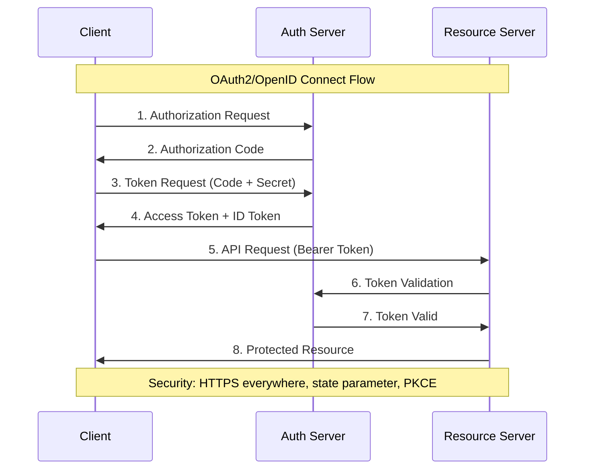

# Security for .NET Applications

## OWASP Top 10 for .NET Applications

| **Vulnerabilidad**            | **Descripción**               | **Impacto**                 | **Mitigación en .NET**                      |
| ----------------------------- | ----------------------------- | --------------------------- | ------------------------------------------- |
| **Injection**                 | SQL, NoSQL, LDAP injection    | Data breach, data loss      | Parameterized queries, ORM                  |
| **Broken Authentication**     | Session management flaws      | Account takeover            | ASP.NET Identity, JWT proper implementation |
| **Sensitive Data Exposure**   | Inadequate protection         | Privacy violation           | Data Protection API, encryption             |
| **XML External Entities**     | XXE attacks                   | Server-side request forgery | Disable DTD processing                      |
| **Broken Access Control**     | Authorization failures        | Privilege escalation        | `[Authorize]` attributes, policies          |
| **Security Misconfiguration** | Default/weak configurations   | Various attacks             | Secure defaults, configuration review       |
| **Cross-Site Scripting**      | XSS vulnerabilities           | Session hijacking           | Input validation, output encoding           |
| **Insecure Deserialization**  | Unsafe object deserialization | Remote code execution       | Avoid BinaryFormatter, use safe serializers |
| **Known Vulnerabilities**     | Outdated components           | Various exploits            | NuGet package updates, security scanning    |
| **Insufficient Logging**      | Poor monitoring               | Delayed breach detection    | Structured logging, SIEM integration        |

## Authentication Methods

| **Método**                 | **Caso de Uso**         | **Implementación** | **Seguridad**                 | **Complejidad** |
| -------------------------- | ----------------------- | ------------------ | ----------------------------- | --------------- |
| **Cookies**                | Web applications        | `AddCookie()`      | Media (HTTPS required)        | Baja            |
| **JWT Bearer**             | APIs, SPAs              | `AddJwtBearer()`   | Alta (with proper validation) | Media           |
| **OAuth2/OpenID**          | Third-party integration | `AddOAuth()`       | Muy alta                      | Alta            |
| **Windows Authentication** | Intranet apps           | `AddNegotiate()`   | Alta (domain-based)           | Baja            |
| **Certificate**            | Service-to-service      | `AddCertificate()` | Muy alta                      | Alta            |

## Authorization Patterns

| **Patrón**                 | **Granularidad** | **Flexibilidad** | **Performance** | **Implementación**                |
| -------------------------- | ---------------- | ---------------- | --------------- | --------------------------------- |
| **Role-based (RBAC)**      | Media            | Media            | Alta            | `[Authorize(Roles = "Admin")]`    |
| **Claims-based**           | Alta             | Alta             | Alta            | `[Authorize(Policy = "CanEdit")]` |
| **Resource-based**         | Muy alta         | Muy alta         | Media           | `IAuthorizationService`           |
| **Attribute-based (ABAC)** | Muy alta         | Muy alta         | Baja            | Custom authorization handlers     |

## Secure Configuration Practices

| **Configuración**      | **Inseguro**       | **Seguro**                    | **Justificación**                 |
| ---------------------- | ------------------ | ----------------------------- | --------------------------------- |
| **Connection Strings** | Hard-coded         | Azure Key Vault, User Secrets | Avoid source control exposure     |
| **API Keys**           | appsettings.json   | Environment variables         | Runtime-only access               |
| **HTTPS**              | Optional           | Required                      | `app.UseHttpsRedirection()`       |
| **CORS**               | `AllowAnyOrigin()` | Specific origins              | Prevent unauthorized access       |
| **Error Details**      | Full stack traces  | Generic messages              | Information disclosure prevention |

## Input Validation & Sanitization

| **Tipo de Input**     | **Vulnerabilidad**      | **Validación**                     | **Sanitización**    |
| --------------------- | ----------------------- | ---------------------------------- | ------------------- |
| **User Registration** | Mass assignment         | Data Annotations, FluentValidation | HTML encoding       |
| **Search Queries**    | SQL injection           | Parameterized queries              | Input length limits |
| **File Uploads**      | Malicious files         | File type validation               | Virus scanning      |
| **JSON Payloads**     | Deserialization attacks | Schema validation                  | Safe deserializers  |
| **URL Parameters**    | Path traversal          | Route constraints                  | URL encoding        |

## Cryptography in .NET

| **Uso**                   | **Algoritmo**     | **Implementación**                              | **Key Management**         |
| ------------------------- | ----------------- | ----------------------------------------------- | -------------------------- |
| **Hashing Passwords**     | BCrypt, Argon2    | `BCrypt.Net`, `Konscious.Security.Cryptography` | Salt automatically handled |
| **Symmetric Encryption**  | AES-256-GCM       | `AesGcm` class                                  | Azure Key Vault            |
| **Asymmetric Encryption** | RSA-2048, ECDSA   | `RSA`, `ECDsa` classes                          | Certificate stores         |
| **Digital Signatures**    | RSA-SHA256, ECDSA | `RSACryptoServiceProvider`                      | Code signing certificates  |
| **Data Protection**       | Platform-specific | `IDataProtectionProvider`                       | Automatic key rotation     |

## Security Headers Implementation

```csharp
app.Use(async (context, next) =>
{
    // Prevent clickjacking
    context.Response.Headers.Add("X-Frame-Options", "DENY");

    // Prevent MIME type sniffing
    context.Response.Headers.Add("X-Content-Type-Options", "nosniff");

    // XSS protection
    context.Response.Headers.Add("X-XSS-Protection", "1; mode=block");

    // HTTPS enforcement
    context.Response.Headers.Add("Strict-Transport-Security",
        "max-age=31536000; includeSubDomains");

    // Content Security Policy
    context.Response.Headers.Add("Content-Security-Policy",
        "default-src 'self'; script-src 'self' 'unsafe-inline'");

    // Referrer policy
    context.Response.Headers.Add("Referrer-Policy", "strict-origin-when-cross-origin");

    await next();
});
```

## JWT Security Best Practices

| **Aspecto**    | **Inseguro**           | **Seguro**             | **Implementación**                  |
| -------------- | ---------------------- | ---------------------- | ----------------------------------- |
| **Algorithm**  | HS256 with weak secret | RS256 with proper keys | Asymmetric signing                  |
| **Expiration** | Long-lived tokens      | Short TTL + refresh    | 15-30 min access token              |
| **Storage**    | localStorage           | httpOnly cookies       | Automatic CSRF protection           |
| **Claims**     | Sensitive data         | Minimal claims         | Reference tokens for sensitive data |
| **Validation** | Client-side only       | Server-side validation | Full signature verification         |

## SQL Injection Prevention

```csharp
// ❌ Vulnerable
string sql = $"SELECT * FROM Users WHERE Id = {userId}";
var user = context.Database.ExecuteSqlRaw(sql);

// ✅ Safe - Parameterized
var user = context.Users.FirstOrDefault(u => u.Id == userId);

// ✅ Safe - Raw SQL with parameters
var users = context.Users
    .FromSqlRaw("SELECT * FROM Users WHERE City = {0}", city)
    .ToList();

// ✅ Safe - Stored procedure
var result = context.Database
    .ExecuteSqlRaw("EXEC GetUsersByCity @city",
        new SqlParameter("@city", city));
```

## Cross-Site Scripting (XSS) Prevention

| **Contexto**        | **Método**          | **Implementación**                  | **Ejemplo**           |
| ------------------- | ------------------- | ----------------------------------- | --------------------- |
| **HTML Content**    | HTML encoding       | `HttpUtility.HtmlEncode()`          | `&lt;script&gt;`      |
| **HTML Attributes** | Attribute encoding  | `HttpUtility.HtmlAttributeEncode()` | Safe attribute values |
| **JavaScript**      | JavaScript encoding | Custom encoding                     | Escape special chars  |
| **CSS**             | CSS encoding        | Validation + encoding               | Prevent CSS injection |
| **URL**             | URL encoding        | `HttpUtility.UrlEncode()`           | Safe URL parameters   |

## CORS Security Configuration

```csharp
// ❌ Inseguro
services.AddCors(options =>
{
    options.AddDefaultPolicy(builder =>
    {
        builder.AllowAnyOrigin()
               .AllowAnyMethod()
               .AllowAnyHeader();
    });
});

// ✅ Seguro
services.AddCors(options =>
{
    options.AddPolicy("ProductionPolicy", builder =>
    {
        builder.WithOrigins("https://myapp.com", "https://admin.myapp.com")
               .WithMethods("GET", "POST", "PUT", "DELETE")
               .WithHeaders("Content-Type", "Authorization")
               .AllowCredentials();
    });
});
```

## Secrets Management

| **Método**                | **Desarrollo**   | **Producción** | **Pros**             | **Contras**             |
| ------------------------- | ---------------- | -------------- | -------------------- | ----------------------- |
| **User Secrets**          | ✅ Recomendado   | ❌ No usar     | No en source control | Solo desarrollo         |
| **Environment Variables** | ✅ Aceptable     | ✅ Básico      | Simple setup         | Visible en proceso      |
| **Azure Key Vault**       | ✅ Para empresas | ✅ Recomendado | Auditoría, rotación  | Complejidad, costo      |
| **HashiCorp Vault**       | ✅ Para empresas | ✅ Enterprise  | Muy flexible         | Self-hosted             |
| **appsettings.json**      | ❌ Nunca         | ❌ Nunca       | N/A                  | Source control exposure |

## Authentication Flow Security

**Flujo completo de autenticación OAuth2/OpenID Connect mostrando la interacción segura entre client, servidor de autorización y API.**
Este diagrama secuencial ilustra el intercambio seguro de tokens, incluyendo authorization code flow y validación de tokens.
Esencial para implementar autenticación enterprise-grade con Identity Server, Azure AD, o Auth0 en aplicaciones .NET.



## Rate Limiting Implementation

```csharp
// Basic rate limiting
services.AddRateLimiter(options =>
{
    options.AddFixedWindowLimiter("api", limiterOptions =>
    {
        limiterOptions.PermitLimit = 100;
        limiterOptions.Window = TimeSpan.FromMinutes(1);
        limiterOptions.QueueProcessingOrder = QueueProcessingOrder.OldestFirst;
        limiterOptions.QueueLimit = 10;
    });
});

// Per-user rate limiting
services.AddRateLimiter(options =>
{
    options.AddPolicy("perUser", httpContext =>
        RateLimitPartition.CreateFixedWindowLimiter(
            partitionKey: httpContext.User.Identity?.Name ?? "anonymous",
            factory: _ => new FixedWindowRateLimiterOptions
            {
                PermitLimit = 10,
                Window = TimeSpan.FromMinutes(1)
            }));
});
```

## Data Protection Configuration

```csharp
services.AddDataProtection()
    .SetApplicationName("MyApp")
    .PersistKeysToAzureBlobStorage(connectionString, "keys", "keys.xml")
    .ProtectKeysWithAzureKeyVault(keyIdentifier, credential)
    .SetDefaultKeyLifetime(TimeSpan.FromDays(90));

// Usage
public class SecureService
{
    private readonly IDataProtector _protector;

    public SecureService(IDataProtectionProvider provider)
    {
        _protector = provider.CreateProtector("SecureService.v1");
    }

    public string Protect(string plaintext)
    {
        return _protector.Protect(plaintext);
    }

    public string Unprotect(string ciphertext)
    {
        return _protector.Unprotect(ciphertext);
    }
}
```

## Security Testing Checklist

| **Categoría**           | **Test**                | **Herramienta**        | **Frecuencia** |
| ----------------------- | ----------------------- | ---------------------- | -------------- |
| **Static Analysis**     | Code vulnerabilities    | SonarQube, CodeQL      | Cada build     |
| **Dependency Scanning** | Known vulnerabilities   | OWASP Dependency Check | Semanal        |
| **Dynamic Testing**     | Runtime vulnerabilities | OWASP ZAP              | Pre-release    |
| **Penetration Testing** | Manual security testing | Professional pentest   | Anual          |

## Logging Security Events

```csharp
public class SecurityEventLogger
{
    private readonly ILogger<SecurityEventLogger> _logger;

    public void LogSuccessfulLogin(string userId, string ipAddress)
    {
        _logger.LogInformation("Successful login for user {UserId} from IP {IpAddress}",
            userId, ipAddress);
    }

    public void LogFailedLogin(string username, string ipAddress, string reason)
    {
        _logger.LogWarning("Failed login attempt for {Username} from IP {IpAddress}: {Reason}",
            username, ipAddress, reason);
    }

    public void LogSuspiciousActivity(string userId, string activity, string details)
    {
        _logger.LogError("Suspicious activity detected for user {UserId}: {Activity}. Details: {Details}",
            userId, activity, details);
    }
}
```

## Compliance & Standards

| **Standard**  | **Aplicabilidad**    | **Requisitos Clave**                         | **Implementación .NET**                   |
| ------------- | -------------------- | -------------------------------------------- | ----------------------------------------- |
| **GDPR**      | Apps con usuarios EU | Consent, data portability, right to deletion | Privacy APIs, data anonymization          |
| **HIPAA**     | Healthcare apps      | Encryption, audit logs, access control       | Comprehensive logging, encryption at rest |
| **SOC 2**     | SaaS providers       | Security controls documentation              | Security policies, monitoring             |
| **ISO 27001** | Enterprise           | Information security management              | Risk assessment, controls framework       |

## Security Monitoring Metrics

| **Métrica**               | **Threshold**     | **Acción**        | **Herramienta**      |
| ------------------------- | ----------------- | ----------------- | -------------------- |
| **Failed Logins**         | > 5 per user/hour | Account lockout   | Application Insights |
| **Privilege Escalation**  | Any attempt       | Immediate alert   | Custom logging       |
| **Data Access Anomalies** | Unusual patterns  | Investigation     | Behavioral analytics |
| **API Rate Limits**       | > 80% of limit    | Scale or throttle | Rate limiter metrics |
