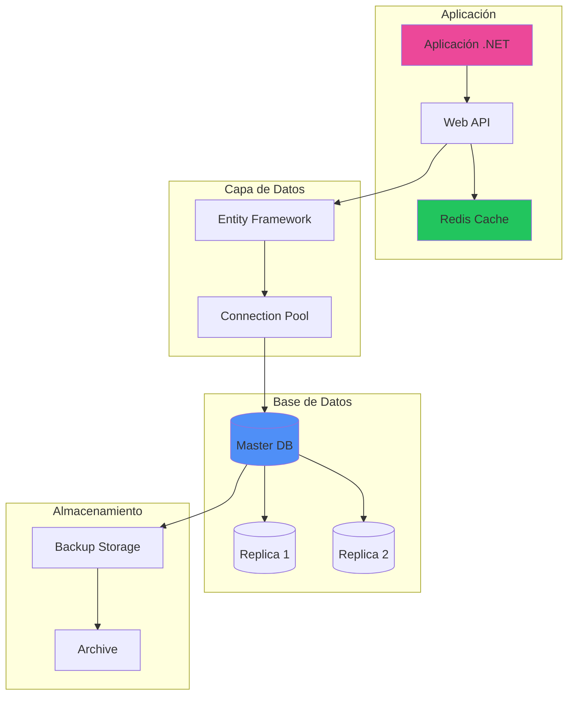
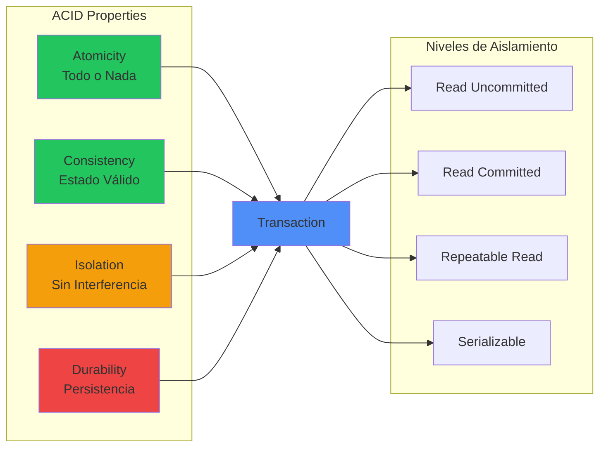

# Comandos SQL Esenciales

**Referencia completa de comandos SQL fundamentales organizados por categoría con ejemplos prácticos y casos de uso.**
Esta guía cubre desde DDL y DML hasta optimización de queries y mejores prácticas para bases de datos relacionales.
Esencial para desarrolladores .NET que trabajan con Entity Framework, Dapper, o ADO.NET directo.

## Comandos DDL (Data Definition Language)

**Comandos para definir y modificar la estructura de bases de datos y tablas con ejemplos prácticos de sintaxis.**
Esta tabla presenta los comandos fundamentales para crear, modificar y eliminar objetos de base de datos.
Fundamental para gestionar schemas de base de datos y realizar cambios estructurales durante el desarrollo.

| **Comando**       | **Propósito**       | **Ejemplo**                                                       | **Descripción**                     |
| ----------------- | ------------------- | ----------------------------------------------------------------- | ----------------------------------- |
| `CREATE DATABASE` | Crear base de datos | `CREATE DATABASE ecommerce;`                                      | Crea una nueva base de datos        |
| `CREATE TABLE`    | Crear tabla         | `CREATE TABLE usuarios (id INT PRIMARY KEY, nombre VARCHAR(50));` | Define nueva estructura de tabla    |
| `ALTER TABLE`     | Modificar tabla     | `ALTER TABLE usuarios ADD email VARCHAR(100);`                    | Agrega, modifica o elimina columnas |
| `DROP TABLE`      | Eliminar tabla      | `DROP TABLE usuarios;`                                            | Elimina tabla y todos sus datos     |
| `DROP DATABASE`   | Eliminar BD         | `DROP DATABASE ecommerce;`                                        | Elimina base de datos completa      |

## Comandos DML (Data Manipulation Language)

**Comandos para manipular datos dentro de las tablas incluyendo inserción, actualización, eliminación y consulta.**
Esta tabla muestra la sintaxis esencial para operaciones CRUD con ejemplos que cubren los casos más comunes.
Crítica para desarrolladores que necesitan dominar la manipulación de datos en aplicaciones .NET.

| **Comando** | **Propósito**    | **Ejemplo**                                                               | **Descripción**                       |
| ----------- | ---------------- | ------------------------------------------------------------------------- | ------------------------------------- |
| `INSERT`    | Insertar datos   | `INSERT INTO usuarios (nombre, email) VALUES ('Juan', 'juan@email.com');` | Agrega nuevos registros               |
| `SELECT`    | Consultar datos  | `SELECT * FROM usuarios WHERE activo = 1;`                                | Recupera datos con filtros opcionales |
| `UPDATE`    | Actualizar datos | `UPDATE usuarios SET email = 'nuevo@email.com' WHERE id = 1;`             | Modifica registros existentes         |
| `DELETE`    | Eliminar datos   | `DELETE FROM usuarios WHERE activo = 0;`                                  | Elimina registros específicos         |

## Tipos de JOIN

| **Tipo**          | **Descripción**                              | **Ejemplo**                                                                                | **Cuándo usar**                             |
| ----------------- | -------------------------------------------- | ------------------------------------------------------------------------------------------ | ------------------------------------------- |
| `INNER JOIN`      | Solo registros que coinciden en ambas tablas | `SELECT u.nombre, p.titulo FROM usuarios u INNER JOIN posts p ON u.id = p.usuario_id`      | Cuando necesitas solo datos relacionados    |
| `LEFT JOIN`       | Todos los registros de la tabla izquierda    | `SELECT u.nombre, p.titulo FROM usuarios u LEFT JOIN posts p ON u.id = p.usuario_id`       | Mostrar todos los usuarios, con o sin posts |
| `RIGHT JOIN`      | Todos los registros de la tabla derecha      | `SELECT u.nombre, p.titulo FROM usuarios u RIGHT JOIN posts p ON u.id = p.usuario_id`      | Menos común, mostrar todos los posts        |
| `FULL OUTER JOIN` | Todos los registros de ambas tablas          | `SELECT u.nombre, p.titulo FROM usuarios u FULL OUTER JOIN posts p ON u.id = p.usuario_id` | Datos de ambas tablas, relacionados o no    |

## Funciones de Agregación

| **Función**      | **Propósito**      | **Ejemplo**                                  | **Resultado**                       |
| ---------------- | ------------------ | -------------------------------------------- | ----------------------------------- |
| `COUNT()`        | Contar registros   | `SELECT COUNT(*) FROM usuarios;`             | Número total de usuarios            |
| `SUM()`          | Sumar valores      | `SELECT SUM(precio) FROM productos;`         | Suma total de precios               |
| `AVG()`          | Promedio           | `SELECT AVG(edad) FROM usuarios;`            | Edad promedio                       |
| `MAX()`          | Valor máximo       | `SELECT MAX(precio) FROM productos;`         | Precio más alto                     |
| `MIN()`          | Valor mínimo       | `SELECT MIN(precio) FROM productos;`         | Precio más bajo                     |
| `GROUP_CONCAT()` | Concatenar valores | `SELECT GROUP_CONCAT(nombre) FROM usuarios;` | Lista de nombres separados por coma |

## Cláusulas de Consulta

| **Cláusula** | **Propósito**      | **Ejemplo**                                                                  | **Orden de Ejecución** |
| ------------ | ------------------ | ---------------------------------------------------------------------------- | ---------------------- |
| `WHERE`      | Filtrar filas      | `SELECT * FROM usuarios WHERE edad > 18;`                                    | 2°                     |
| `GROUP BY`   | Agrupar resultados | `SELECT ciudad, COUNT(*) FROM usuarios GROUP BY ciudad;`                     | 3°                     |
| `HAVING`     | Filtrar grupos     | `SELECT ciudad, COUNT(*) FROM usuarios GROUP BY ciudad HAVING COUNT(*) > 5;` | 4°                     |
| `ORDER BY`   | Ordenar resultados | `SELECT * FROM usuarios ORDER BY nombre ASC;`                                | 5°                     |
| `LIMIT`      | Limitar cantidad   | `SELECT * FROM usuarios LIMIT 10;`                                           | 6°                     |

## Índices y Performance

| **Tipo de Índice** | **Cuándo usar**      | **Ejemplo**                                                   | **Ventajas**                            |
| ------------------ | -------------------- | ------------------------------------------------------------- | --------------------------------------- |
| `PRIMARY KEY`      | Identificador único  | `id INT PRIMARY KEY`                                          | Búsqueda más rápida, integridad         |
| `UNIQUE INDEX`     | Valores únicos       | `CREATE UNIQUE INDEX idx_email ON usuarios(email);`           | Previene duplicados                     |
| `COMPOSITE INDEX`  | Búsquedas múltiples  | `CREATE INDEX idx_nombre_ciudad ON usuarios(nombre, ciudad);` | Optimiza consultas con múltiples campos |
| `PARTIAL INDEX`    | Subconjunto de datos | `CREATE INDEX idx_activos ON usuarios(id) WHERE activo = 1;`  | Menor tamaño, más específico            |

## Diagrama de Arquitectura de Base de Datos

**Arquitectura típica de acceso a datos en aplicaciones .NET mostrando las capas desde la aplicación hasta la base de datos.**
Este diagrama ilustra cómo Entity Framework, connection pooling y caching se integran para optimizar el acceso a datos.
Fundamental para entender el flujo de datos y los puntos de optimización en aplicaciones que requieren alto rendimiento de base de datos.



## Estrategias de Optimización

| **Estrategia**         | **Descripción**                    | **Ejemplo**                                     | **Impacto** |
| ---------------------- | ---------------------------------- | ----------------------------------------------- | ----------- |
| **Índices**            | Acelerar búsquedas                 | `CREATE INDEX idx_lastname ON users(lastname);` | 🚀 Alto     |
| **Particionamiento**   | Dividir tablas grandes             | `PARTITION BY RANGE (fecha)`                    | 🚀 Alto     |
| **Normalización**      | Eliminar redundancia               | Separar tablas relacionadas                     | 📊 Medio    |
| **Desnormalización**   | Agregar redundancia para velocidad | Tablas de resumen                               | 📊 Medio    |
| **Connection Pooling** | Reusar conexiones                  | Pool de 50-100 conexiones                       | ⚡ Medio    |
| **Query Optimization** | Reescribir consultas               | Usar EXISTS en vez de IN                        | ⚡ Variable |

## Transacciones ACID

**Las transacciones ACID son un conjunto de cuatro propiedades—Atomicidad, Consistencia, Aislamiento y Durabilidad—que garantizan la integridad, fiabilidad y consistencia de las transacciones en bases de datos, asegurando que una transacción se complete en su totalidad o no se realice en absoluto. Estas propiedades son fundamentales para sistemas donde la precisión de los datos es crucial, como en las operaciones bancarias y el comercio electrónico.**

**Diagrama de las propiedades ACID y los niveles de aislamiento de transacciones en bases de datos SQL.**
Este diagrama conceptual muestra cómo cada propiedad ACID contribuye a la integridad transaccional y los diferentes niveles de aislamiento disponibles.
Esencial para diseñar aplicaciones que manejan datos críticos donde la consistencia y concurrencia son fundamentales.



## Ejemplo de Consulta Compleja

```sql
-- Reporte de ventas por categoría en el último trimestre
WITH ventas_trimestre AS (
    SELECT
        p.categoria_id,
        c.nombre as categoria,
        SUM(vd.cantidad * vd.precio_unitario) as total_ventas,
        COUNT(DISTINCT v.id) as num_ordenes,
        AVG(vd.cantidad * vd.precio_unitario) as promedio_orden
    FROM ventas v
    INNER JOIN ventas_detalle vd ON v.id = vd.venta_id
    INNER JOIN productos p ON vd.producto_id = p.id
    INNER JOIN categorias c ON p.categoria_id = c.id
    WHERE v.fecha >= DATE_SUB(CURDATE(), INTERVAL 3 MONTH)
    GROUP BY p.categoria_id, c.nombre
)
SELECT
    categoria,
    FORMAT(total_ventas, 2) as total_ventas,
    num_ordenes,
    FORMAT(promedio_orden, 2) as promedio_orden,
    ROUND((total_ventas / SUM(total_ventas) OVER()) * 100, 2) as porcentaje_total
FROM ventas_trimestre
ORDER BY total_ventas DESC;
```
