# Contexto y Propósito

## ¿Qué es?
SQL (Structured Query Language / Lenguaje de Consulta Estructurado) es el lenguaje estándar para manipular bases de datos relacionales. Incluye dos subconjuntos principales:  
- **DDL (Data Definition Language / Lenguaje de Definición de Datos):** define y modifica la **estructura** de la base de datos.  
  - `CREATE` → crear bases de datos, tablas, vistas.  
  - `ALTER` → modificar estructuras existentes.  
  - `DROP` → eliminar objetos.  
  - `TRUNCATE` → vaciar una tabla rápidamente.  
- **DML (Data Manipulation Language / Lenguaje de Manipulación de Datos):** manipula el **contenido** de las tablas.  
  - `SELECT` → consultar datos.  
  - `INSERT` → agregar registros.  
  - `UPDATE` → modificar registros existentes.  
  - `DELETE` → eliminar registros específicos.  

👉 En resumen: **DDL define la forma, DML maneja los datos dentro de esa forma**:contentReference[oaicite:0]{index=0}.  
SQL también cubre transacciones ACID, joins, índices y estrategias de optimización que son fundamentales en aplicaciones .NET.

## ¿Por qué?
Porque dominar SQL es esencial para cualquier desarrollador .NET. En mi experiencia, optimizar queries y diseñar índices correctos resolvió problemas de rendimiento críticos en banca y retail.

## ¿Para qué?
- **Definir y modificar estructuras** con DDL.  
- **Manipular datos** con DML y transacciones ACID.  
- **Relacionar entidades** con JOINs eficientes.  
- **Optimizar consultas** con índices, particiones y pooling.  

## Valor agregado desde la experiencia
- Con **índices compuestos**, queries en retail bajaron de minutos a milisegundos.  
- **Particionamiento por fecha** mejoró performance en reportes masivos.  
- **Connection pooling** en .NET evitó saturación de bases en municipalidades.  
- Estrategias de **desnormalización** redujeron latencia en dashboards analíticos.  

# Comandos SQL Esenciales

**Referencia completa de comandos SQL fundamentales organizados por categoría con ejemplos prácticos y casos de uso.**
Esta guía cubre desde DDL y DML hasta optimización de queries y mejores prácticas para bases de datos relacionales.
Esencial para desarrolladores .NET que trabajan con Entity Framework, Dapper, o ADO.NET directo.

## Comandos DDL (Data Definition Language)

**Comandos para definir y modificar la estructura de bases de datos y tablas con ejemplos prácticos de sintaxis.**
Esta tabla presenta los comandos fundamentales para crear, modificar y eliminar objetos de base de datos.
Fundamental para gestionar schemas de base de datos y realizar cambios estructurales durante el desarrollo.

| **Comando**       | **Propósito**       | **Ejemplo**                                                       | **Descripción**                     |
| ----------------- | ------------------- | ----------------------------------------------------------------- | ----------------------------------- |
| `CREATE DATABASE` | Crear base de datos | `CREATE DATABASE ecommerce;`                                      | Crea una nueva base de datos        |
| `CREATE TABLE`    | Crear tabla         | `CREATE TABLE usuarios (id INT PRIMARY KEY, nombre VARCHAR(50));` | Define nueva estructura de tabla    |
| `ALTER TABLE`     | Modificar tabla     | `ALTER TABLE usuarios ADD email VARCHAR(100);`                    | Agrega, modifica o elimina columnas |
| `DROP TABLE`      | Eliminar tabla      | `DROP TABLE usuarios;`                                            | Elimina tabla y todos sus datos     |
| `DROP DATABASE`   | Eliminar BD         | `DROP DATABASE ecommerce;`                                        | Elimina base de datos completa      |

## Comandos DML (Data Manipulation Language)

**Comandos para manipular datos dentro de las tablas incluyendo inserción, actualización, eliminación y consulta.**
Esta tabla muestra la sintaxis esencial para operaciones CRUD con ejemplos que cubren los casos más comunes.
Crítica para desarrolladores que necesitan dominar la manipulación de datos en aplicaciones .NET.

| **Comando** | **Propósito**    | **Ejemplo**                                                               | **Descripción**                       |
| ----------- | ---------------- | ------------------------------------------------------------------------- | ------------------------------------- |
| `INSERT`    | Insertar datos   | `INSERT INTO usuarios (nombre, email) VALUES ('Juan', 'juan@email.com');` | Agrega nuevos registros               |
| `SELECT`    | Consultar datos  | `SELECT * FROM usuarios WHERE activo = 1;`                                | Recupera datos con filtros opcionales |
| `UPDATE`    | Actualizar datos | `UPDATE usuarios SET email = 'nuevo@email.com' WHERE id = 1;`             | Modifica registros existentes         |
| `DELETE`    | Eliminar datos   | `DELETE FROM usuarios WHERE activo = 0;`                                  | Elimina registros específicos         |

## Tipos de JOIN

| **Tipo**          | **Descripción**                              | **Ejemplo**                                                                                | **Cuándo usar**                             |
| ----------------- | -------------------------------------------- | ------------------------------------------------------------------------------------------ | ------------------------------------------- |
| `INNER JOIN`      | Solo registros que coinciden en ambas tablas | `SELECT u.nombre, p.titulo FROM usuarios u INNER JOIN posts p ON u.id = p.usuario_id`      | Cuando necesitas solo datos relacionados    |
| `LEFT JOIN`       | Todos los registros de la tabla izquierda    | `SELECT u.nombre, p.titulo FROM usuarios u LEFT JOIN posts p ON u.id = p.usuario_id`       | Mostrar todos los usuarios, con o sin posts |
| `RIGHT JOIN`      | Todos los registros de la tabla derecha      | `SELECT u.nombre, p.titulo FROM usuarios u RIGHT JOIN posts p ON u.id = p.usuario_id`      | Menos común, mostrar todos los posts        |
| `FULL OUTER JOIN` | Todos los registros de ambas tablas          | `SELECT u.nombre, p.titulo FROM usuarios u FULL OUTER JOIN posts p ON u.id = p.usuario_id` | Datos de ambas tablas, relacionados o no    |

## Funciones de Agregación

| **Función**      | **Propósito**      | **Ejemplo**                                  | **Resultado**                       |
| ---------------- | ------------------ | -------------------------------------------- | ----------------------------------- |
| `COUNT()`        | Contar registros   | `SELECT COUNT(*) FROM usuarios;`             | Número total de usuarios            |
| `SUM()`          | Sumar valores      | `SELECT SUM(precio) FROM productos;`         | Suma total de precios               |
| `AVG()`          | Promedio           | `SELECT AVG(edad) FROM usuarios;`            | Edad promedio                       |
| `MAX()`          | Valor máximo       | `SELECT MAX(precio) FROM productos;`         | Precio más alto                     |
| `MIN()`          | Valor mínimo       | `SELECT MIN(precio) FROM productos;`         | Precio más bajo                     |
| `GROUP_CONCAT()` | Concatenar valores | `SELECT GROUP_CONCAT(nombre) FROM usuarios;` | Lista de nombres separados por coma |

## Cláusulas de Consulta

| **Cláusula** | **Propósito**      | **Ejemplo**                                                                  | **Orden de Ejecución** |
| ------------ | ------------------ | ---------------------------------------------------------------------------- | ---------------------- |
| `WHERE`      | Filtrar filas      | `SELECT * FROM usuarios WHERE edad > 18;`                                    | 2°                     |
| `GROUP BY`   | Agrupar resultados | `SELECT ciudad, COUNT(*) FROM usuarios GROUP BY ciudad;`                     | 3°                     |
| `HAVING`     | Filtrar grupos     | `SELECT ciudad, COUNT(*) FROM usuarios GROUP BY ciudad HAVING COUNT(*) > 5;` | 4°                     |
| `ORDER BY`   | Ordenar resultados | `SELECT * FROM usuarios ORDER BY nombre ASC;`                                | 5°                     |
| `LIMIT`      | Limitar cantidad   | `SELECT * FROM usuarios LIMIT 10;`                                           | 6°                     |

## Índices y Performance

| **Tipo de Índice** | **Cuándo usar**      | **Ejemplo**                                                   | **Ventajas**                            |
| ------------------ | -------------------- | ------------------------------------------------------------- | --------------------------------------- |
| `PRIMARY KEY`      | Identificador único  | `id INT PRIMARY KEY`                                          | Búsqueda más rápida, integridad         |
| `UNIQUE INDEX`     | Valores únicos       | `CREATE UNIQUE INDEX idx_email ON usuarios(email);`           | Previene duplicados                     |
| `COMPOSITE INDEX`  | Búsquedas múltiples  | `CREATE INDEX idx_nombre_ciudad ON usuarios(nombre, ciudad);` | Optimiza consultas con múltiples campos |
| `PARTIAL INDEX`    | Subconjunto de datos | `CREATE INDEX idx_activos ON usuarios(id) WHERE activo = 1;`  | Menor tamaño, más específico            |

## Diagrama de Arquitectura de Base de Datos

**Arquitectura típica de acceso a datos en aplicaciones .NET mostrando las capas desde la aplicación hasta la base de datos.**
Este diagrama ilustra cómo Entity Framework, connection pooling y caching se integran para optimizar el acceso a datos.
Fundamental para entender el flujo de datos y los puntos de optimización en aplicaciones que requieren alto rendimiento de base de datos.


## Estrategias de Optimización

| **Estrategia**         | **Descripción**                    | **Ejemplo**                                     | **Impacto** |
| ---------------------- | ---------------------------------- | ----------------------------------------------- | ----------- |
| **Índices**            | Acelerar búsquedas                 | `CREATE INDEX idx_lastname ON users(lastname);` | 🚀 Alto     |
| **Particionamiento**   | Dividir tablas grandes             | `PARTITION BY RANGE (fecha)`                    | 🚀 Alto     |
| **Normalización**      | Eliminar redundancia               | Separar tablas relacionadas                     | 📊 Medio    |
| **Desnormalización**   | Agregar redundancia para velocidad | Tablas de resumen                               | 📊 Medio    |
| **Connection Pooling** | Reusar conexiones                  | Pool de 50-100 conexiones                       | ⚡ Medio    |
| **Query Optimization** | Reescribir consultas               | Usar EXISTS en vez de IN                        | ⚡ Variable |

## Transacciones ACID

**Las transacciones ACID son un conjunto de cuatro propiedades—Atomicidad, Consistencia, Aislamiento y Durabilidad—que garantizan la integridad, fiabilidad y consistencia de las transacciones en bases de datos, asegurando que una transacción se complete en su totalidad o no se realice en absoluto. Estas propiedades son fundamentales para sistemas donde la precisión de los datos es crucial, como en las operaciones bancarias y el comercio electrónico.**

**Diagrama de las propiedades ACID y los niveles de aislamiento de transacciones en bases de datos SQL.**
Este diagrama conceptual muestra cómo cada propiedad ACID contribuye a la integridad transaccional y los diferentes niveles de aislamiento disponibles.
Esencial para diseñar aplicaciones que manejan datos críticos donde la consistencia y concurrencia son fundamentales.

```mermaid
flowchart LR
    subgraph "ACID Properties"
        A[Atomicity<br/>Todo o Nada]
        C[Consistency<br/>Estado Válido]
        I[Isolation<br/>Sin Interferencia]
        D[Durability<br/>Persistencia]
    end

    subgraph "Niveles de Aislamiento"
        RU[Read Uncommitted]
        RC[Read Committed]
        RR[Repeatable Read]
        S[Serializable]
    end

    A --> Transaction[Transaction]
    C --> Transaction
    I --> Transaction
    D --> Transaction

    Transaction --> RU
    Transaction --> RC
    Transaction --> RR
    Transaction --> S

    classDef transaction fill:#1e3a8a,stroke:#60a5fa,stroke-width:3px,color:#ffffff
    classDef atomicity fill:#14532d,stroke:#4ade80,stroke-width:3px,color:#ffffff
    classDef consistency fill:#14532d,stroke:#4ade80,stroke-width:3px,color:#ffffff
    classDef isolation fill:#c2410c,stroke:#fb923c,stroke-width:3px,color:#ffffff
    classDef durability fill:#991b1b,stroke:#f87171,stroke-width:3px,color:#ffffff
    classDef isolationLevel fill:#581c87,stroke:#c084fc,stroke-width:3px,color:#ffffff
    
    class Transaction transaction
    class A atomicity
    class C consistency
    class I isolation
    class D durability
    class RU,RC,RR,S isolationLevel
```



## Ejemplo de Consulta Compleja

```sql
-- Reporte de ventas por categoría en el último trimestre
WITH ventas_trimestre AS (
    SELECT
        p.categoria_id,
        c.nombre as categoria,
        SUM(vd.cantidad * vd.precio_unitario) as total_ventas,
        COUNT(DISTINCT v.id) as num_ordenes,
        AVG(vd.cantidad * vd.precio_unitario) as promedio_orden
    FROM ventas v
    INNER JOIN ventas_detalle vd ON v.id = vd.venta_id
    INNER JOIN productos p ON vd.producto_id = p.id
    INNER JOIN categorias c ON p.categoria_id = c.id
    WHERE v.fecha >= DATE_SUB(CURDATE(), INTERVAL 3 MONTH)
    GROUP BY p.categoria_id, c.nombre
)
SELECT
    categoria,
    FORMAT(total_ventas, 2) as total_ventas,
    num_ordenes,
    FORMAT(promedio_orden, 2) as promedio_orden,
    ROUND((total_ventas / SUM(total_ventas) OVER()) * 100, 2) as porcentaje_total
FROM ventas_trimestre
ORDER BY total_ventas DESC;
```

## Tipos de Bases de Datos según Requerimientos

**Comparación de diferentes tipos de bases de datos y cuándo usar cada una según patrones de acceso y requerimientos.**
Esta tabla ayuda a elegir la tecnología de persistencia más apropiada para cada caso de uso específico.
Fundamental para arquitectos y desarrolladores que diseñan sistemas con múltiples tipos de datos y patrones de acceso.

| **Tipo**             | **Tecnologías**               | **Casos de Uso**                        | **Ventajas**                            | **Desventajas**                   | **.NET Integration**       |
| -------------------- | ----------------------------- | --------------------------------------- | --------------------------------------- | --------------------------------- | -------------------------- |
| **SQL (Relacional)** | SQL Server, PostgreSQL, MySQL | Transacciones ACID, datos estructurados | Consistencia fuerte, ACID, SQL familiar | Escalabilidad horizontal limitada | Entity Framework, Dapper   |
| **Document NoSQL**   | MongoDB, CosmosDB             | Datos semi-estructurados, JSON          | Flexible schema, escalabilidad          | Eventual consistency              | MongoDB.Driver, Cosmos SDK |
| **Key-Value Cache**  | Redis, Memcached              | Cache, sesiones, rate limiting          | Muy rápido, simple                      | Solo in-memory, volatilidad       | StackExchange.Redis        |
| **Graph Database**   | Neo4j, CosmosDB Graph         | Relaciones complejas, redes sociales    | Queries de grafos eficientes            | Curva de aprendizaje              | Neo4j.Driver               |
| **Time Series**      | InfluxDB, TimeScale           | Métricas, IoT, monitoring               | Optimizado para time-based data         | Casos de uso específicos          | InfluxDB.Client            |
| **Search Engine**    | Elasticsearch, Azure Search   | Full-text search, analytics             | Búsquedas complejas, análisis           | Overhead operacional              | Elasticsearch.Net          |

## Patrones de Persistencia Híbrida

**Estrategias para combinar múltiples tipos de bases de datos en una misma solución según diferentes necesidades.**
Esta tabla presenta patrones comunes de arquitectura polyglot persistence con ejemplos de implementación.
Esencial para diseñar sistemas que optimicen cada tipo de dato con la tecnología más apropiada.

| **Patrón**                | **Combinación**                 | **Caso de Uso**                    | **Beneficios**                    | **Complejidad** |
| ------------------------- | ------------------------------- | ---------------------------------- | --------------------------------- | --------------- |
| **SQL + Redis Cache**     | SQL Server + Redis              | E-commerce con cache de productos  | Performance + ACID transactions   | Media           |
| **SQL + Document Store**  | PostgreSQL + MongoDB            | CRM con datos estructurados y docs | Flexibilidad + consistencia       | Media-Alta      |
| **Event Sourcing**        | SQL + Event Store + Read Models | Banking, audit trails              | Auditabilidad completa            | Alta            |
| **CQRS + Multiple DBs**   | Write SQL + Read NoSQL          | Reporting con alta concurrencia    | Optimización por patrón de acceso | Alta            |
| **Microservices Pattern** | Cada servicio su BD             | Architecture distribuida           | Independencia de servicios        | Muy Alta        |

## Optimización según Patrones de Acceso

**Selección de tecnología de base de datos basada en patrones específicos de lectura y escritura.**
Esta tabla analiza diferentes patrones de acceso y recomienda la tecnología más eficiente para cada uno.
Crítica para optimizar performance y costos según el comportamiento real de la aplicación.

| **Patrón de Acceso**    | **Características**          | **Tecnología Recomendada**  | **Ejemplo de Uso**               | **Consideraciones**         |
| ----------------------- | ---------------------------- | --------------------------- | -------------------------------- | --------------------------- |
| **Read-Heavy**          | 90% lecturas, 10% escrituras | SQL + Redis Cache           | Catálogo de productos            | Cache invalidation strategy |
| **Write-Heavy**         | 70% escrituras, 30% lecturas | Document DB + Time Series   | Logging, IoT data                | Eventual consistency        |
| **Complex Queries**     | JOINs complejos, analytics   | SQL (PostgreSQL/SQL Server) | Reporting, BI                    | Indexes, query optimization |
| **Simple Key-Value**    | Acceso directo por ID        | Redis, DynamoDB             | User sessions, feature flags     | Memory limits, persistence  |
| **Full-Text Search**    | Búsquedas de texto, filtros  | Elasticsearch + SQL         | Product search, documentation    | Index maintenance           |
| **Real-time Analytics** | Aggregaciones en tiempo real | InfluxDB, TimeStream        | Monitoring dashboards            | Data retention policies     |
| **Graph Relationships** | Navegación de relaciones     | Neo4j, CosmosDB Graph       | Social networks, recommendations | Query complexity            |

## Estrategias de Migración de Datos

**Enfoques para migrar entre diferentes tipos de bases de datos con mínimo downtime.**
Esta tabla presenta estrategias de migración desde sistemas legacy hacia arquitecturas modernas polyglot.
Fundamental para evolucionar sistemas existentes sin disrumpir operaciones críticas del negocio.

| **Estrategia**             | **Enfoque**                         | **Downtime** | **Complejidad** | **Casos de Uso**                             |
| -------------------------- | ----------------------------------- | ------------ | --------------- | -------------------------------------------- |
| **Big Bang Migration**     | Migración completa en un evento     | Alto         | Media           | Sistemas pequeños, ventanas de mantenimiento |
| **Strangler Fig Pattern**  | Migración gradual por funcionalidad | Mínimo       | Alta            | Sistemas legacy complejos                    |
| **Database Replication**   | Sync continuo durante transición    | Muy bajo     | Media           | Datos críticos, zero-downtime                |
| **Event-Driven Migration** | CDC (Change Data Capture) + Events  | Muy bajo     | Alta            | Sistemas distribuidos                        |
| **Dual Write Pattern**     | Escribir a ambos sistemas           | Zero         | Media-Alta      | Validación gradual de nuevo sistema          |

## Monitoreo y Observabilidad por Tipo de BD

**Métricas clave a monitorear según el tipo de base de datos para mantener performance óptimo.**
Esta tabla define qué métricas son críticas para cada tecnología y herramientas de monitoreo recomendadas.
Esencial para mantener systems de persistencia saludables y detectar problemas antes de que afecten usuarios.

| **Tipo de BD**    | **Métricas Críticas**                    | **Herramientas**                 | **Alertas Importantes**           |
| ----------------- | ---------------------------------------- | -------------------------------- | --------------------------------- |
| **SQL Server**    | CPU, Memory, Disk I/O, Lock waits        | SQL Server Profiler, PerfMon     | Blocking processes, deadlocks     |
| **Redis**         | Memory usage, Hit ratio, Connections     | Redis INFO, Application Insights | Memory eviction, connection limit |
| **MongoDB**       | Query performance, Replica lag, Sharding | MongoDB Compass, Ops Manager     | Slow queries, replica set issues  |
| **Elasticsearch** | Heap usage, Search latency, Index size   | Kibana, Elastic APM              | Heap pressure, cluster health     |
| **CosmosDB**      | RU consumption, Throttling, Latency      | Azure Monitor, Cosmos insights   | RU limits, geo-replication lag    |
